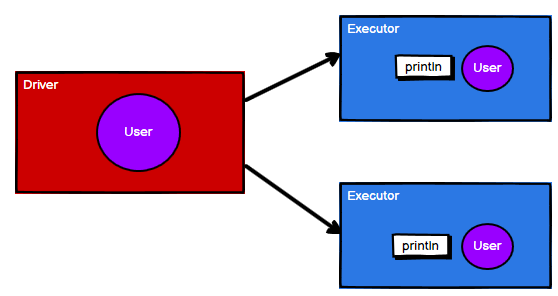
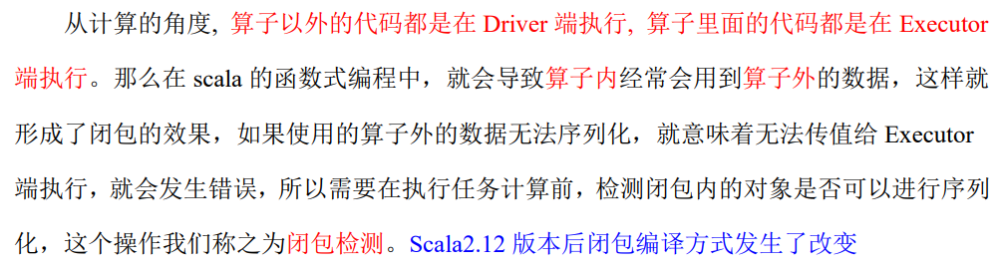

在开始序列化之前先看一个案例，在这个案例中有一个User类，但是我们不创建与它相关联的RDD，就一个简单的RDD去遍历它，在遍历的时候再打印User类的相关信息：

```scala
package com.wzq.bigdata.spark.core.rdd.operator.action

import org.apache.spark.rdd.RDD
import org.apache.spark.{SparkConf, SparkContext}

object Spark02_action {
  def main(args: Array[String]): Unit = {
    // 1、建立连接
    val sc: SparkContext = new SparkContext(new SparkConf().setMaster("local[*]").setAppName("action"))

    // 2、业务逻辑
    val user = new User
    val rdd: RDD[Int] = sc.makeRDD(List(1, 2, 3, 4))
    rdd.foreach(
      num => {
        println("age = " + user.age + num)
      }
    )

    // 3、关闭连接
    sc.stop()
  }

  class User {
    var age:Int = 30
  }
}
```

ok，运行它，可以发现运行之后报错了：


关键的报错信息：

```scala
Task not serializable
Caused by: java.io.NotSerializableException: com.wzq.bigdata.spark.core.rdd.operator.action.Spark02_action$User
```

原因是`User`类没有进行序列化，我们说一个RDD在`Executor`执行，`Executor`又分布在不同的主机，在这个案例中，将会分布式打印那个List，即在每个Executor里面打印。打印的时候用了User类的age属性，所以User需要进行网络传输，所以需要进行序列化：



于是，上面的`User`类必须要实现`Serializable`接口或者做成样例类：

```scala
// 第一种方案：实现Serializable接口
class User extends Serializable {
  var age:Int = 30
}

// 第二种方案：样例类，样例类在编译时会自动混入序列化特质（实现序列化接口）
case class User() {
  var age:Int = 30
}
```


## 一、闭包检测



## 二、序列化方法和属性

从计算的角度, 算子以外的代码都是在 Driver 端执行, 算子里面的代码都是在 Executor 端执行


如下代码，有个查询对象，传递一个参数进行，这个参数是要过滤的一个关键字，如果调用`getMatch1`方法，传递一个RDD进行会报错，因为query是类的属性，会进行闭包检测，当没有序列化的时候就会报错；但调用`getMatch2`方法的时候，因为我们把`query`字段赋值给了`s`，那么就不会报错，因为赋值的时候是在Driver端操作的，没有进行网络传输，因此不需要序列化

```scala
package com.wzq.bigdata.spark.core.rdd.operator.serial

import org.apache.spark.rdd.RDD
import org.apache.spark.{SparkConf, SparkContext}

object Spark01 {
  def main(args: Array[String]): Unit = {

    val sc: SparkContext = new SparkContext(new SparkConf().setMaster("local[*]").setAppName("serial"))

    val rdd: RDD[String] = sc.makeRDD(Array("hello world", "hello spark", "hive", "wzq"))

    val search = new Search("h")

//    search.getMatch1(rdd).collect().foreach(println)
    search.getMatch2(rdd).collect().foreach(println)

    sc.stop()
  }

  // 查询对象
  // 类的构造参数其实是类的属性，构造参数需要进行闭包检测，其实就等同于类进行闭包检测
  class Search(query: String) {

    def isMatch(s: String): Boolean = {
      s.contains(query)
    }

    // 函数序列化案例
    def getMatch1(rdd: RDD[String]): RDD[String] = {
      rdd.filter(isMatch)
    }

    // 属性序列化案例
    def getMatch2(rdd: RDD[String]): RDD[String] = {
      val s = query     // 赋值操作在Driver端执行
      rdd.filter(x => x.contains(s))
    }
  }
}
```


## 三、Kryo 序列化框架

Java的序列化能够序列化任何类，但是比较重（字节多），序列化之后，对象的提交也比较大，增大了分布式计算间网络传输的压力。Spark处于性能的考虑，在`Spark 2.0`后开始支持`Kryo`序列化机制。Kryo的速度是Java序列化的十倍。当RDD在shuffle数据的时候，简单的数据类型、数组和字符串类型已经在Spark内部使用Kryo序列化好了


kryo github：[GitHub - EsotericSoftware/kryo: Java binary serialization and cloning: fast, efficient, automatic](https://github.com/EsotericSoftware/kryo)


## 参考资料

- [尚硅谷Spark 3.0.0 学习视频](https://www.bilibili.com/video/BV11A411L7CK)
- [Spark 3.0.0 官方文档](https://spark.apache.org/docs/3.0.0/)

