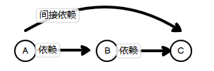
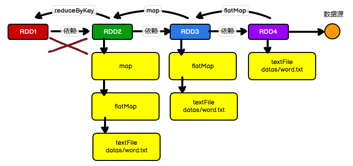
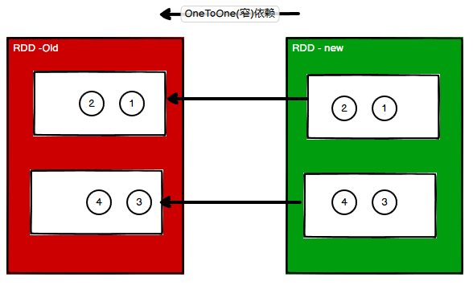
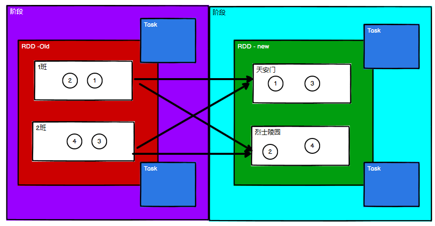
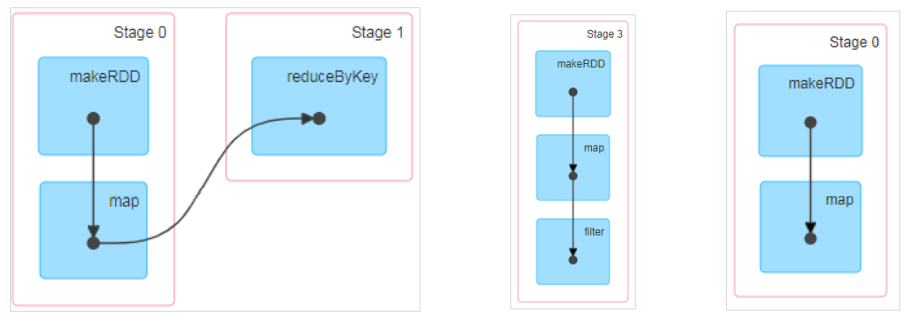
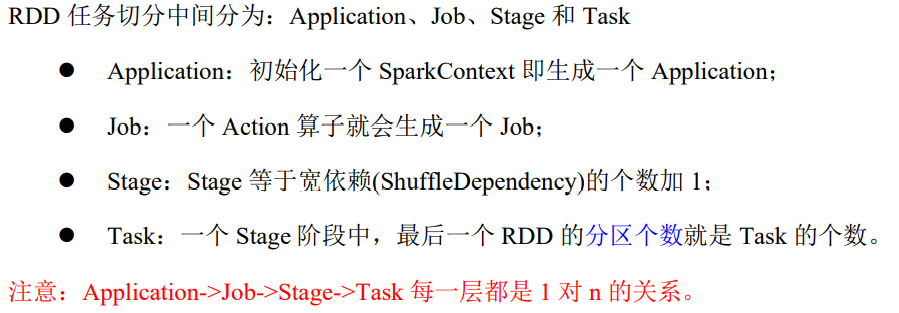

## 一、什么是RDD依赖？

在开始之前，应该先了解什么是依赖，如下图所示：



A功能依赖于B功能，B功能又依赖于C功能，A功能就间接依赖于C功能，啥意思呢？其实很好理解，我要实现一个功能A，在这个功能里面有个JSON的操作，那我们又不想自己写原生的JSON，所以就引入了其他关于JSON的包，这个包就是功能A的依赖，也就是功能B，这就是A功能依赖于B功能。后面的B依赖C，A间接依赖C就好理解了。


那么什么是RDD依赖呢？如下图所示：


RDD本身并不保存数据，但是RDD之间有依赖，这样做是为了保存每个RDD之间的一个关系，新的RDD依赖于旧的RDD，比如说：



如上图所示，反着看，从右到左是从旧的RDD到新的RDD的关系。

- RDD4负责从数据源中读取数据
- RDD3拿RDD4中的数据进行一个faltMap的操作
- RDD2再用RDD3中的数据进行一个map转换操作
- 但是到了RDD1，RDD1需要用到RDD2，但是在这里出错了，**RDD本身不会保存数据！**出于容错性的考虑，就需要保存RDD之间的关系，一旦出现错误，就可以根据这些个依赖关系从到头，重新读取数据进行计算

> **相邻的两个RDD的关系称之为依赖关系；多个连续的RDD的依赖关系，称之为血缘关系**

## 二、血缘关系 toDebugString

RDD可以使用`toDebugString`方法打印当前RDD的血缘关系，比如说上图的案例：

```scala
package com.wzq.bigdata.spark.core.rdd.dep

import org.apache.spark.rdd.RDD
import org.apache.spark.{SparkConf, SparkContext}

object Spark01_RDD_Dep {
  def main(args: Array[String]): Unit = {
    val conf: SparkConf = new SparkConf().setMaster("local[*]").setAppName("dep")
    val sc: SparkContext = new SparkContext(conf)

    val rdd: RDD[String] = sc.textFile("datas/2.txt")
    // 打印血缘关系
    println(rdd.toDebugString)
    println("***********************************")

    val words: RDD[String] = rdd.flatMap(_.split(" "))
    // 打印血缘关系
    println(words.toDebugString)
    println("***********************************")

    val wordToOne: RDD[(String, Int)] = words.map((word) => (word, 1))
    // 打印血缘关系
    println(wordToOne.toDebugString)
    println("***********************************")

    val wordToSum: RDD[(String, Int)] = wordToOne.reduceByKey(_ + _)
    // 打印血缘关系
    println(wordToSum.toDebugString)
    println("***********************************")

    val array: Array[(String, Int)] = wordToSum.collect()

    array.foreach(println)

    sc.stop()
  }
}
```

输出结果如下：

```
(2) datas/2.txt MapPartitionsRDD[1] at textFile at Spark01_RDD_Dep.scala:11 []
 |  datas/2.txt HadoopRDD[0] at textFile at Spark01_RDD_Dep.scala:11 []
***********************************
(2) MapPartitionsRDD[2] at flatMap at Spark01_RDD_Dep.scala:16 []
 |  datas/2.txt MapPartitionsRDD[1] at textFile at Spark01_RDD_Dep.scala:11 []
 |  datas/2.txt HadoopRDD[0] at textFile at Spark01_RDD_Dep.scala:11 []
***********************************
(2) MapPartitionsRDD[3] at map at Spark01_RDD_Dep.scala:21 []
 |  MapPartitionsRDD[2] at flatMap at Spark01_RDD_Dep.scala:16 []
 |  datas/2.txt MapPartitionsRDD[1] at textFile at Spark01_RDD_Dep.scala:11 []
 |  datas/2.txt HadoopRDD[0] at textFile at Spark01_RDD_Dep.scala:11 []
***********************************
(2) ShuffledRDD[4] at reduceByKey at Spark01_RDD_Dep.scala:26 []
 +-(2) MapPartitionsRDD[3] at map at Spark01_RDD_Dep.scala:21 []
    |  MapPartitionsRDD[2] at flatMap at Spark01_RDD_Dep.scala:16 []
    |  datas/2.txt MapPartitionsRDD[1] at textFile at Spark01_RDD_Dep.scala:11 []
    |  datas/2.txt HadoopRDD[0] at textFile at Spark01_RDD_Dep.scala:11 []
***********************************
```

和画的图是一模一样的，其中最后面的这个`+-`表示存在`shuffle`


## 三、依赖关系 dependencies

RDD可以使用`dependencies`查看两个RDD之间的依赖关系：

```scala
package com.wzq.bigdata.spark.core.rdd.dep

import org.apache.spark.rdd.RDD
import org.apache.spark.{SparkConf, SparkContext}

object Spark01_RDD_Dep {
  def main(args: Array[String]): Unit = {
    val conf: SparkConf = new SparkConf().setMaster("local[*]").setAppName("dep")
    val sc: SparkContext = new SparkContext(conf)

    val rdd: RDD[String] = sc.textFile("datas/2.txt")
    // 打印依赖关系
    println(rdd.toDebugString)
    println("***********************************")

    val words: RDD[String] = rdd.flatMap(_.split(" "))
    // 打印依赖关系
    println(words.toDebugString)
    println("***********************************")

    val wordToOne: RDD[(String, Int)] = words.map((word) => (word, 1))
    // 打印依赖关系
    println(wordToOne.toDebugString)
    println("***********************************")

    val wordToSum: RDD[(String, Int)] = wordToOne.reduceByKey(_ + _)
    // 打印依赖关系
    println(wordToSum.toDebugString)
    println("***********************************")

    val array: Array[(String, Int)] = wordToSum.collect()

    array.foreach(println)

    sc.stop()
  }
}
```

结果如下：

```
List(org.apache.spark.OneToOneDependency@26cb5207)
***********************************
List(org.apache.spark.OneToOneDependency@1a2bcd56)
***********************************
List(org.apache.spark.OneToOneDependency@3ee0b4f7)
***********************************
List(org.apache.spark.ShuffleDependency@6342ff7f)
***********************************
```

从这个结果中发现有两个东西：`OneToOneDependency`和`ShuffleDependency`

### 3.1 窄依赖 OneToOneDependency

所谓的窄依赖就是一个旧的RDD的分区数据最多被新的RDD的一个分区使用，如下图所示：



看上图的箭头，新的RDD的一个分区依赖于旧的RDD的一个分区的数据，这个依赖就是OneToOne窄依赖

### 3.2 宽依赖 ShuffleDependency

相对于窄依赖，那肯定有宽依赖，但Spark中是没有宽的这个概念的，这里只是形象的比喻一下

所谓宽依赖就是新的RDD的一个分区依赖于旧的RDD的多个分区的数据


## 四、阶段划分

窄依赖新的RDD只依赖于旧的RDD的一个依赖，所以不需要等其他分区的数据处理完成，但是宽依赖依赖于多个分区数据，就需要等待前面的所有分区数据处理完成才可以进行下一步的操作，于是有了`阶段`的概念，如下图所示：



必须等待前面的阶段执行完成，才可以进入下一个阶段，所以就有了阶段划分的概念

Spark的阶段是一种DAG（有向无环图），具有方向，但不会闭环，DAG就负责记录了RDD的转换过程和任务的阶段




那是怎么进行阶段划分的呢？给出公式：

```
当RDD中存在shuffle依赖时，阶段就会自动增加一个
阶段的数量 = shuffle依赖的数量 + 1
ResultStage只有一个，最后需要执行的阶段
```


## 五、任务划分




## 参考资料

- [尚硅谷Spark 3.0.0 学习视频](https://www.bilibili.com/video/BV11A411L7CK)
- [Spark 3.0.0 官方文档](https://spark.apache.org/docs/3.0.0/)

