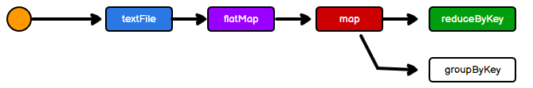
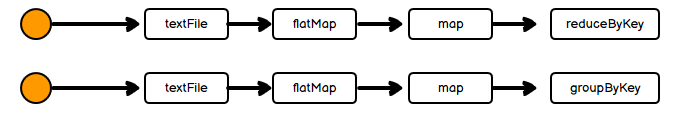
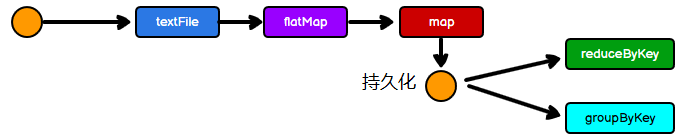
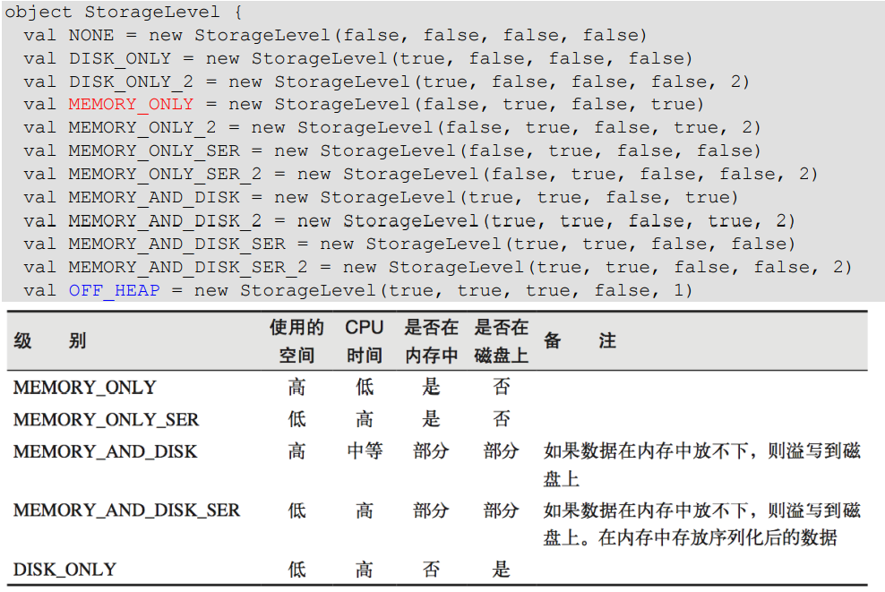
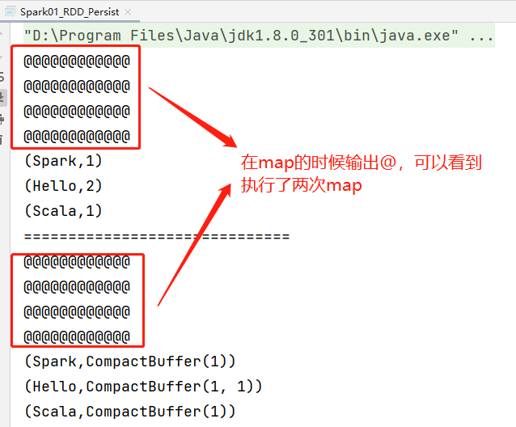
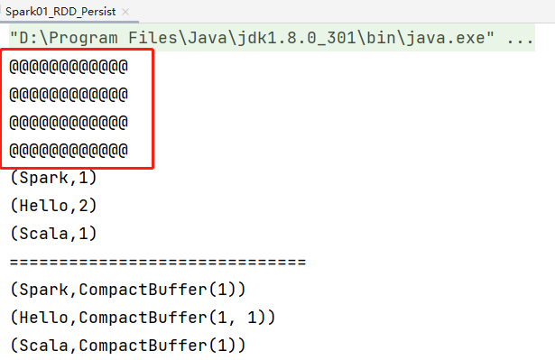
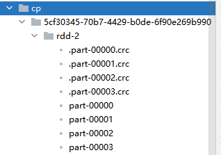

在开始之前，先做一个案例，还是`WordCount`的案例，但是期望输出wordcount结果还有每个word的分组，那么就可以这样写代码：

```scala
package com.wzq.bigdata.spark.core.rdd.persist

import org.apache.spark.rdd.RDD
import org.apache.spark.{SparkConf, SparkContext}

object Spark01_RDD_Persist {
  def main(args: Array[String]): Unit = {
    val conf: SparkConf = new SparkConf().setMaster("local[*]").setAppName("persist")
    val sc: SparkContext = new SparkContext(conf)

    val list: List[String] = List("Hello Spark", "Hello Scala")

    val rdd: RDD[String] = sc.makeRDD(list)

    val flatRDD: RDD[String] = rdd.flatMap(_.split(" "))

    val mapRDD: RDD[(String, Int)] = flatRDD.map((_, 1))

    val groupRDD: RDD[(String, Iterable[Int])] = mapRDD.groupByKey()
    val reduceRDD: RDD[(String, Int)] = mapRDD.reduceByKey(_ + _)

    reduceRDD.collect().foreach(println)
    println("==============================")
    groupRDD.collect().foreach(println)

    sc.stop()
  }
}
```

在上面的代码中，是这样操作的，后面的`groupByKey`和`reduceByKey`共享了前面的一步`map`操作



这样看着好像是直接使用了map的结果，然后做下面的两个操作，其实是错误的。因为**RDD本身并不存储数据**，也就是说在使用两次`map`，他就从头开始一步一步的调用了，真实的执行过程是这样的：



也就是说：**如果一个RDD需要重复使用，那么需要从头再次执行来获取数据。RDD对象可以复用，但数据无法复用！**所以这样的写法执行效率并没有提高。


那么为了提高效率，其实我们可以在`map`操作后面加一步**存储数据**的，这样再次用到这个RDD之后，就不会再从头执行一遍了：



这个操作就叫做**持久化**


## 一、RDD 缓存 Cache Persist

这个持久化的操作可以使用`cache()`方法或者`persist(级别)`方法进行调用，`persist`方法可以设置缓存的级别，比如存到内存、硬盘或者保留副本等操作，实际上`cache()`方法底层调用的就是`persist`方法，级别是保存到内存当中

关于缓存的级别：



有了缓存的手段，就可以给上面的案例的map算子加一个缓存了：

```scala
package com.wzq.bigdata.spark.core.rdd.persist

import org.apache.spark.rdd.RDD
import org.apache.spark.{SparkConf, SparkContext}

object Spark01_RDD_Persist {
  def main(args: Array[String]): Unit = {
    val conf: SparkConf = new SparkConf().setMaster("local[*]").setAppName("persist")
    val sc: SparkContext = new SparkContext(conf)

    val list: List[String] = List("Hello Spark", "Hello Scala")

    val rdd: RDD[String] = sc.makeRDD(list)

    val flatRDD: RDD[String] = rdd.flatMap(_.split(" "))

    val mapRDD: RDD[(String, Int)] = flatRDD.map(
      word => {
        println("@@@@@@@@@@@@")
        (word,1)
      }
    )

    // cache底层调用persist，级别是内存
    mapRDD.cache()
    // 也可以使用persist方法设置级别，效果等同于cache
    // mapRDD.persist(StorageLevel.MEMORY_ONLY)

    val groupRDD: RDD[(String, Iterable[Int])] = mapRDD.groupByKey()
    val reduceRDD: RDD[(String, Int)] = mapRDD.reduceByKey(_ + _)

    reduceRDD.collect().foreach(println)
    println("==============================")
    groupRDD.collect().foreach(println)

    sc.stop()
  }
}
```

没有缓存时候的输出结果：



有缓存的时候可以发现，前面的map操作只执行了一次：



> 当执行行动算子的时候，缓存操作才会执行！

## 二、检查点 CheckPoint

 所谓的检查点就是将RDD中间结果写入磁盘，中间结果会长久保存在磁盘当中，对RDD进行checkpoint操作并不会马上进行，必须执行行动算子才会执行。


所以上面的案例，也可以使用`checkpoint`：

```scala
package com.wzq.bigdata.spark.core.rdd.persist

import org.apache.spark.rdd.RDD
import org.apache.spark.{SparkConf, SparkContext}

object Spark01_RDD_Persist {
  def main(args: Array[String]): Unit = {
    val conf: SparkConf = new SparkConf().setMaster("local[*]").setAppName("persist")
    val sc: SparkContext = new SparkContext(conf)

    // 设置checkpoint中间结果保存位置
    sc.setCheckpointDir("cp")

    val list: List[String] = List("Hello Spark", "Hello Scala")

    val rdd: RDD[String] = sc.makeRDD(list)

    val flatRDD: RDD[String] = rdd.flatMap(_.split(" "))

    val mapRDD: RDD[(String, Int)] = flatRDD.map(
      word => {
        println("@@@@@@@@@@@@")
        (word,1)
      }
    )
    
    // 一般情况下，为了提高效率可以联合使用
    mapRDD.cache()
    // 针对mapRDD做检查点计算
    mapRDD.checkpoint()

    val groupRDD: RDD[(String, Iterable[Int])] = mapRDD.groupByKey()
    val reduceRDD: RDD[(String, Int)] = mapRDD.reduceByKey(_ + _)

    reduceRDD.collect().foreach(println)
    println("==============================")
    groupRDD.collect().foreach(println)

    sc.stop()
  }
}
```

结果就是中间结果被永久存在了磁盘里面：



## 三、检查点和缓存的区别

- `cache`：将数据临时存储在内存中进行数据重用，会在血缘关系中添加新的依赖，一旦出现问题，可以从头读取数据
- `persist`：将数据临时存储在磁盘文件中进行数据充裕，涉及到磁盘IO，性能较低，但是数据安全。如果作业执行完毕，临时保存的数据文件就会丢失
- `checkpoint`：将数据长久的保存在磁盘文件中进行数据重用。涉及到磁盘IO，性能较低，但是数据安全。为了保证数据安全，一般情况下会独立执行作业。为了能够提高效率，一般情况下和cache联合使用。执行过程中它会切断血缘关系，重新建立新的血缘关系。checkpoint等同于改变数据源

## 参考资料

- [尚硅谷Spark 3.0.0 学习视频](https://www.bilibili.com/video/BV11A411L7CK)
- [Spark 3.0.0 官方文档](https://spark.apache.org/docs/3.0.0/)

