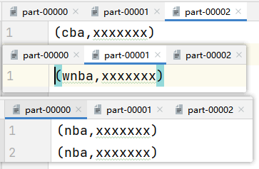

RDD目前有`Hash`和`Range`分区，同时Spark也运行用户自定义分区，自定义分区器的步骤很简单：

- 继承`Partitioner`抽象类
- 实现`numPartitions`和`getPartition`方法

如果要使用自定义的分区器，就需要`rdd.partitionBy`把自定义的Partitioner作为参数传递进去就好了


ok，比较简单，直接上案例，把RDD中的`nba`分到0号分区，`wnba`分到1号分区，其他的分到2号分区：

```scala
package com.wzq.bigdata.spark.core.rdd.part

import org.apache.spark.rdd.RDD
import org.apache.spark.{Partitioner, SparkConf, SparkContext}

object Spark01_RDD_part {
  def main(args: Array[String]): Unit = {
    val conf: SparkConf = new SparkConf().setMaster("local[*]").setAppName("partitioner")
    val sc: SparkContext = new SparkContext(conf)

    val rdd = sc.makeRDD(List(
      ("nba", "xxxxxxx"),
      ("cba", "xxxxxxx"),
      ("wnba", "xxxxxxx"),
      ("nba", "xxxxxxx"),
    ))

    val partRDD: RDD[(String, String)] = rdd.partitionBy(new MyPartitioner)

    partRDD.saveAsTextFile("output")

    sc.stop()
  }

  /**
   * 自定义分区器
   */
  class MyPartitioner extends Partitioner {

    // 分区数量
    override def numPartitions: Int = 3

    // 返回数据的key值返回数据所在的分区索引（从0开始）
    override def getPartition(key: Any): Int = {
      key match {
        case "nba" => 0
        case "wnba" => 1
        case _ => 2
      }
    }
  }

}
```

结果如下：



## 参考资料

- [尚硅谷Spark 3.0.0 学习视频](https://www.bilibili.com/video/BV11A411L7CK)
- [Spark 3.0.0 官方文档](https://spark.apache.org/docs/3.0.0/)

