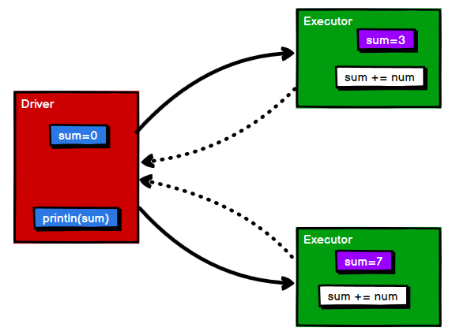
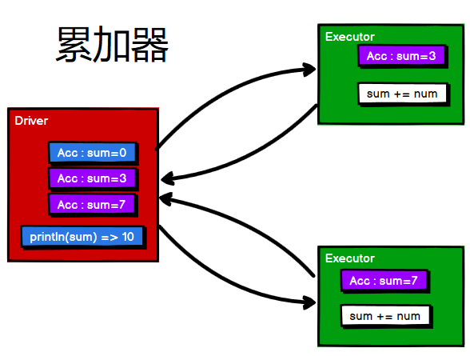
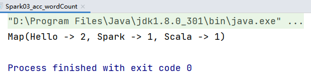

Spark计算框架为了能够高并发和高吞吐的进行数据处理，封装了三大数据结构：

- `RDD`：弹性分布式数据集
- `累加器`：分布式共享**只写**变量
- `广播变量`：分布式共享**只读**变量

RDD这部分前面的好几篇博客已经记录过了，这篇`blog`主要记录这个累加器与广播变量


## 一、累加器

### 1、实现原理

现在有一个案例，就是有一个RDD对象，里面都是Int型数值，现在对里面所有的数据进行求和，不能使用`reduce`算子，我们很快就能想到在外部定义一个`sum=0`，再使用`foreach`进行遍历，然后求和：

```scala
package com.wzq.bigdata.spark.core.acc

import org.apache.spark.rdd.RDD
import org.apache.spark.{SparkConf, SparkContext}

object Spark01_acc {
  def main(args: Array[String]): Unit = {
    val conf: SparkConf = new SparkConf().setMaster("local[*]").setAppName("acc")
    val sc: SparkContext = new SparkContext(conf)

    val rdd: RDD[Int] = sc.makeRDD(List(1, 2, 3, 4), 2)

    var sum = 0
    rdd.foreach(num => {
      sum += num
    })
      
    println(sum)
    sc.stop()
  }
}
```

运行这个程序，预期返回的结果是`10`；但是结果却是`0`，这是什么原因造成的呢？是因为使用的`foreach`是分布式遍历，`Driver`首先会给`Executor`发送分区数据，然后在每个`Executor`里面执行累加的操作，最后再把结果返回。但是问题是：我们在`Driver`端定义的`sum`传递到`Executor`里面执行累加，但是`Executor`并没有把`sum`的结果返回回来，所以最后的结果就变成了`0`，如下图所示：




为了解决这样的一个问题，我们就需要定义一个累加器，把这个累加器从`Driver`端传递到`Executor`端，然后`Executor`端也会返回累加器累加的结果：




所以咱们就可以把这个`sum`定义为累加器了：

```scala
package com.wzq.bigdata.spark.core.acc

import org.apache.spark.rdd.RDD
import org.apache.spark.{SparkConf, SparkContext}

object Spark02_acc {
  def main(args: Array[String]): Unit = {
    val conf: SparkConf = new SparkConf().setMaster("local[*]").setAppName("acc")
    val sc: SparkContext = new SparkContext(conf)

    val rdd: RDD[Int] = sc.makeRDD(List(1, 2, 3, 4), 2)

    // 获取系统的累加器
    // Spark默认提供了简单数据聚合的累加器
    val sumAcc = sc.longAccumulator("sum")

    rdd.foreach(
      num => {
        // 使用累加器
        sumAcc.add(num)
      }
    )

    // 获取累加器的值
    println(sumAcc.value)
    sc.stop()
  }
}
```

这里是使用了一个`LongAccumulator`累加器，共分为三步走：

- `sc.longAccumulator(name)`：创建一个累加器
- `sumAcc.add(num)`：使用累加器
- `sumAcc.value`：获取累加器的值

除了这个`Long`类型的累加器，还包含`Double`、`collection`类型的累加器，可以根据不同的场合使用

> 需要注意的是：
>
> - 少加：转换算子中调用累加器，如果没有行动算子的话，那么不会执行
> - 多加：如果有多个行动算子，累加器可能会被执行多次
> - 一般情况下，累加器会放置在行动算子中进行操作


### 2、自定义累加器

可以对比已有的累加器看一下怎么自定义累加器，拿`LongAccumulator`为例：

```scala
// 实现了AccumulatorV2[]抽象类
class LongAccumulator extends AccumulatorV2[jl.Long, jl.Long] {
  // 判断累加器是否为初始状态
  override def isZero: Boolean = _sum == 0L && _count == 0
  // 复制一份累加器
  override def copy(): LongAccumulator 
  // 重置累加器
  override def reset(): Unit 
  // 获取累加器需要计算的值
  override def add(v: jl.Long): Unit  
  // Driver端合并多个累加器
  override def merge(other: AccumulatorV2[jl.Long, jl.Long]): Unit 
  // 累加器的结果
  override def value: jl.Long 
}
```

从这个Spark官方已经实现的类来看，我们如果想自定义累加器需要先实现`AccumulatorV2`抽象类，然后重写里面的六个方法，其中实现`AccumulatorV2`需要传递两个参数`[IN,OUT]`，其实`IN`代表输入到累加器的数据类型，`OUT`代表累加器输出结果的数据类型

在调用累加器方面，new出来累加器以后需要调用spark的`register`方法注册

以`WordCount`为例，实现一下累加器：

```scala
package com.wzq.bigdata.spark.core.acc

import org.apache.spark.util.AccumulatorV2
import org.apache.spark.{SparkConf, SparkContext}
import scala.collection.mutable

object Spark03_acc_wordCount {
  def main(args: Array[String]): Unit = {
    val conf: SparkConf = new SparkConf().setMaster("local[*]").setAppName("acc")
    val sc: SparkContext = new SparkContext(conf)

    val rdd = sc.makeRDD(List("Hello Spark", "Hello Scala"))

    // 累加器
    // 创建累加器对象
    val wcACC = new MyAccumulator
    // 向Spark进行注册
    sc.register(wcACC, "wordCountAcc")

    rdd.flatMap(_.split(" ")).foreach(
      word => {
        // 数据的累加（使用累加器）
        wcACC.add(word)
      }
    )

    // 获取累加的结果
    println(wcACC.value)

    sc.stop()
  }

  // 自定义数据累加器
  /*
    1、继承AccumulatorV2抽象类
      IN : 累加器输入的数据类型 String
      OUT : 累加器返回的数据类型 mutable.Map[String,Long]
    2、重写方法
   */
  class MyAccumulator extends AccumulatorV2[String, mutable.Map[String, Long]] {

    private var wcMap = mutable.Map[String, Long]()

    // 判断是否为初始状态
    override def isZero: Boolean = {
      wcMap.isEmpty
    }

    override def copy(): AccumulatorV2[String, mutable.Map[String, Long]] = {
      new MyAccumulator
    }

    // 重置累加器
    override def reset(): Unit = {
      wcMap.clear()
    }

    // 获取累加器需要计算的值
    override def add(word: String): Unit = {
      val newCnt = wcMap.getOrElse(word, 0L) + 1
      wcMap.update(word, newCnt)
    }

    // Driver合并多个累加器
    override def merge(other: AccumulatorV2[String, mutable.Map[String, Long]]): Unit = {
      val map1 = this.wcMap
      val map2 = other.value

      map2.foreach {
        case (word, count) => {
          val newCount = map1.getOrElse(word, 0L) + count
          map1.update(word, newCount)
        }
      }
    }

    // 累加器结果
    override def value: mutable.Map[String, Long] = {
      wcMap
    }
  }
}
```

最后输出的结果：



## 二、广播变量

如果多个Task都需要用到一个对象，那么把这个对象分发给每个Task显然是不合理的，重复的数据造成了不必要的内存开销。所以广播变量：分布式共享只读变量应运而生，多个Task都使用这一个变量，就不会造成多余的内存开销。如下图所示：


简单使用：

```scala
package com.wzq.bigdata.spark.core.acc

import org.apache.spark.broadcast.Broadcast
import org.apache.spark.rdd.RDD
import org.apache.spark.{SparkConf, SparkContext}

object Spark05_bc {
  def main(args: Array[String]): Unit = {
    val conf: SparkConf = new SparkConf().setMaster("local[*]").setAppName("acc")
    val sc: SparkContext = new SparkContext(conf)

    val rdd1 = sc.makeRDD(List(("a", 1), ("b", 2), ("c", 3), ("d", 4)), 4)
    val list = List(("a", 4), ("b", 5), ("c", 6), ("d", 7))
    // 声明广播变量
    val broadcast: Broadcast[List[(String, Int)]] = sc.broadcast(list)
    val resultRDD: RDD[(String, (Int, Int))] = rdd1.map {
      case (key, num) => {
        var num2 = 0
        // 使用广播变量
        for ((k, v) <- broadcast.value) {
          if (k == key) {
            num2 = v
          }
        }
        (key, (num, num2))
      }
    }

    sc.stop()
  }
}
```

- Executor其实就一个JVM，所以在启动时，会自动分配内存，完全可以将任务中的闭包数据放置在Executor的内存中，达到共享的目的
- Spark中的广播变量就可以将闭包的数据保存到Executor的内存中
- Spark中的广播变量不能够更改 ： 分布式共享只读变量

## 参考资料

- [尚硅谷Spark 3.0.0 学习视频](https://www.bilibili.com/video/BV11A411L7CK)
- [Spark 3.0.0 官方文档](https://spark.apache.org/docs/3.0.0/)

