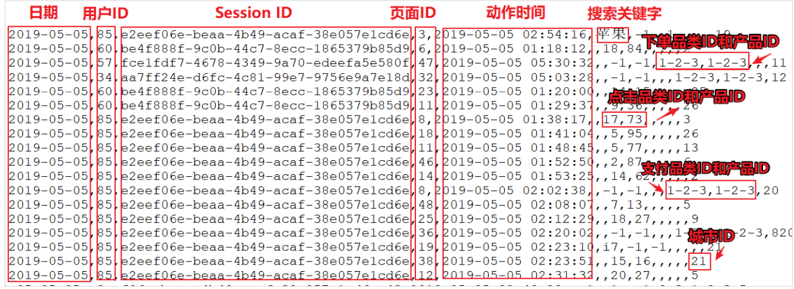
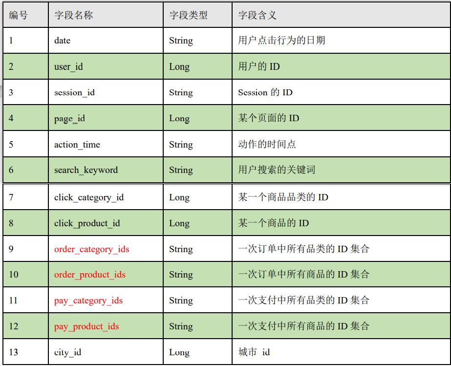
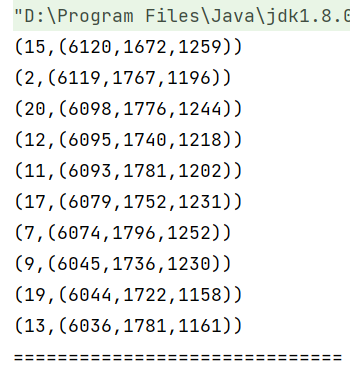
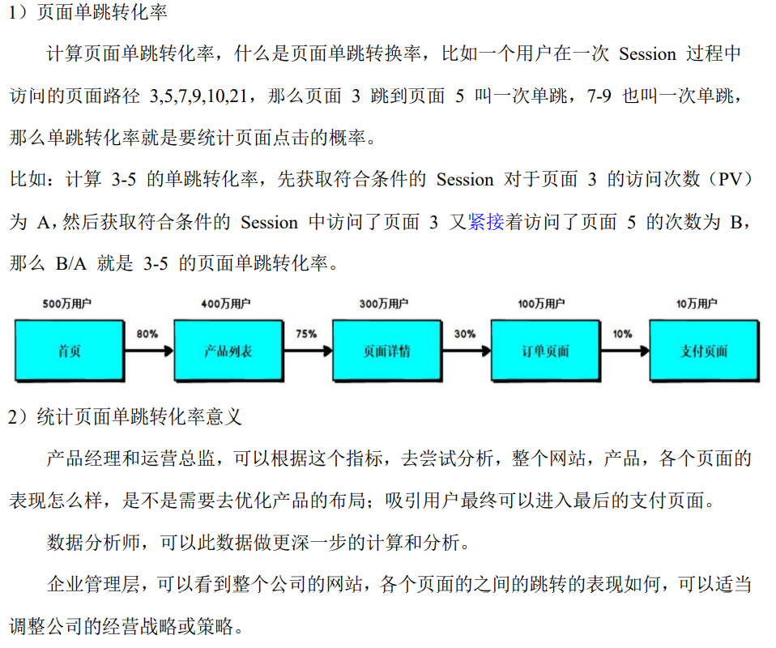
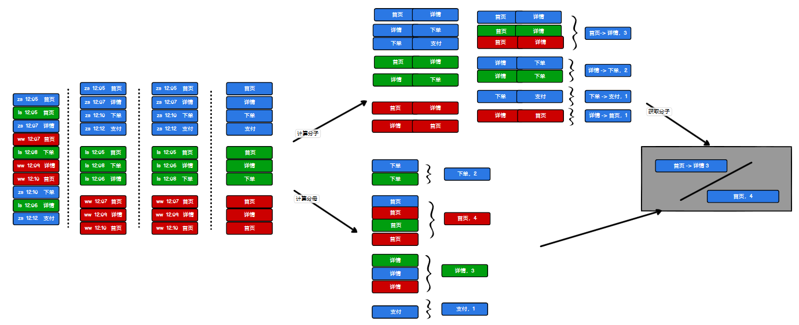

> 这篇blog是Spark Core的案例实操

## 准备数据

数据是电商网站的用户行为数据，具体如下图所示：



数据主要包括用户的4种行为：搜索、点击、下单、支付，数据规则如下：

- 数据文件中每行数据采用下划线分割数据
- 每一行数据表示用户的一次行为，这个行为只能是四种行为的一种
- 如果搜索关键字为null，表示数据不是搜索数据
- 如果点击的品类ID和产品ID为-1，表示数据不是点击数据
- 针对于下单行为，一次可以下单多个商品，所以品类ID和产品ID可以是多个，id之间用逗号分隔，如果本次不是下单行为，则数据采用null表示
- 支付行为和下单行为类似

详细字段说明：




## 需求一：Top10热门品类

**对于热门品类的定义：先按照点击数排名，靠前的就排名高；如果点击数相同，再比较下单数；下单数再相同，就比较支付数。**

### 1、实现方案一

分别统计点击数，下单数和支付数 => (品类,点击数)，(品类,下单数)，(品类,支付数)

然后对于相同的key做连接`cogroup`，接着就是处理迭代器数据类型为Int类型，形成（品类数,(点击数,下单数,支付数)）

最后根据元组降序排列即可

```scala
package com.wzq.bigdata.spark.core.req

import org.apache.spark.rdd.RDD
import org.apache.spark.{SparkConf, SparkContext}

object Spark01_Req1_HotCategoryTop10Analysi {
  def main(args: Array[String]): Unit = {
    // TODO: Top10热门品类
    val conf: SparkConf = new SparkConf().setMaster("local[*]").setAppName("req")
    val sc: SparkContext = new SparkContext(conf)

    // 1、读取原始日志数据
    val actionRDD: RDD[String] = sc.textFile("datas/user_visit_action.txt")

    // 2、统计品类的点击数量：（品类ID，点击数量）
    val clickActionRDD: RDD[String] = actionRDD.filter(
      action => {
        val datas: Array[String] = action.split("_")
        datas(6) != "-1"
      }
    )
    val clickCountRDD: RDD[(String, Int)] = clickActionRDD.map(
      action => {
        val datas: Array[String] = action.split("_")
        (datas(6), 1)
      }
    ).reduceByKey(_ + _)

    // 3、统计品类的下单数量：（品类ID，下单数量）
    val orderActionRDD: RDD[String] = actionRDD.filter(
      action => {
        val datas: Array[String] = action.split("_")
        datas(8) != "null"
      }
    )
    // orderId => 1,2,3   【(1,1)，(2,1)，(3,1)】
    val orderCountRDD: RDD[(String, Int)] = orderActionRDD.flatMap(
      action => {
        val datas: Array[String] = action.split("_")
        val cids: Array[String] = datas(8).split(",")
        cids.map(id => (id, 1))
      }
    ).reduceByKey(_ + _)

    // 4、统计品类的支付数量：（品类ID，支付数量）
    val payActionRDD: RDD[String] = actionRDD.filter(
      action => {
        val datas: Array[String] = action.split("_")
        datas(10) != "null"
      }
    )
    // orderId => 1,2,3   【(1,1)，(2,1)，(3,1)】
    val payCountRDD: RDD[(String, Int)] = payActionRDD.flatMap(
      action => {
        val datas: Array[String] = action.split("_")
        val cids: Array[String] = datas(10).split(",")
        cids.map(id => (id, 1))
      }
    ).reduceByKey(_ + _)


    // 5、将品类进行排序，并且取前10名
    //    点击数量排序，下单数量排序，支付数量排序
    //    元组排序：先比较第一个，再比较第二个，最后比较第三个，依次类推
    //    （品类ID，（点击数量，下单数量，支付数量））
    val cogroupRDD: RDD[(String, (Iterable[Int], Iterable[Int], Iterable[Int]))] = clickCountRDD.cogroup(orderCountRDD, payCountRDD)

    val analysisRDD: RDD[(String, (Int, Int, Int))] = cogroupRDD.mapValues {
      case (clickIter, orderIter, payIter) => {
        var clickCount = 0
        if (clickIter.iterator.hasNext) clickCount = clickIter.iterator.next()
        var orderCount = 0
        if (orderIter.iterator.hasNext) orderCount = orderIter.iterator.next()
        var payCount = 0
        if (payIter.iterator.hasNext) payCount = payIter.iterator.next()
        (clickCount, orderCount, payCount)
      }
    }

    val resRDD: Array[(String, (Int, Int, Int))] = analysisRDD.sortBy(_._2, false).take(10)

    // 6、将结果采集到控制台打印出来
    resRDD.foreach(println)
    sc.stop()
  }
}
```

结果如下：




### 2、实现方案二

使用`cogroup`可能会有shuffle，为了避免shuffle，可以使用`map`将每条数据都变为：

```
问题：有可能存在shuffle
(品类ID，点击数量) => (品类ID，(点击数量，0，0))
(品类ID，下单数量) => (品类ID，(0，下单数量，0))
                 => (品类ID，(点击数量，下单数量，0))
(品类ID，支付数量) => (品类ID，(0，0，支付数量))
                 => (品类ID，(点击数量，下单数量，支付数量))
```

最后使用`union`联合所有的数据

还有一个问题就是，多次使用到了原始数据，可以使用`cache`把这部分缓存起来

```scala
package com.wzq.bigdata.spark.core.req

import org.apache.spark.rdd.RDD
import org.apache.spark.{SparkConf, SparkContext}

object Spark02_Req1_HotCategoryTop10Analysi {
  def main(args: Array[String]): Unit = {
    // TODO: Top10热门品类
    val conf: SparkConf = new SparkConf().setMaster("local[*]").setAppName("req")
    val sc: SparkContext = new SparkContext(conf)

    // 1、读取原始日志数据
    val actionRDD: RDD[String] = sc.textFile("datas/user_visit_action.txt")

    // 问题1：actionRDD重复使用
    actionRDD.cache()

    // 2、统计品类的点击数量：（品类ID，点击数量）
    val clickActionRDD: RDD[String] = actionRDD.filter(
      action => {
        val datas: Array[String] = action.split("_")
        datas(6) != "-1"
      }
    )
    val clickCountRDD: RDD[(String, Int)] = clickActionRDD.map(
      action => {
        val datas: Array[String] = action.split("_")
        (datas(6), 1)
      }
    ).reduceByKey(_ + _)

    // 3、统计品类的下单数量：（品类ID，下单数量）
    val orderActionRDD: RDD[String] = actionRDD.filter(
      action => {
        val datas: Array[String] = action.split("_")
        datas(8) != "null"
      }
    )
    // orderId => 1,2,3   【(1,1)，(2,1)，(3,1)】
    val orderCountRDD: RDD[(String, Int)] = orderActionRDD.flatMap(
      action => {
        val datas: Array[String] = action.split("_")
        val cids: Array[String] = datas(8).split(",")
        cids.map(id => (id, 1))
      }
    ).reduceByKey(_ + _)

    // 4、统计品类的支付数量：（品类ID，支付数量）
    val payActionRDD: RDD[String] = actionRDD.filter(
      action => {
        val datas: Array[String] = action.split("_")
        datas(10) != "null"
      }
    )
    // orderId => 1,2,3   【(1,1)，(2,1)，(3,1)】
    val payCountRDD: RDD[(String, Int)] = payActionRDD.flatMap(
      action => {
        val datas: Array[String] = action.split("_")
        val cids: Array[String] = datas(10).split(",")
        cids.map(id => (id, 1))
      }
    ).reduceByKey(_ + _)


    // 5、将品类进行排序，并且取前10名
    //    点击数量排序，下单数量排序，支付数量排序
    //    元组排序：先比较第一个，再比较第二个，最后比较第三个，依次类推
    //    （品类ID，（点击数量，下单数量，支付数量））

    // 问题2：有可能存在shuffle
    // (品类ID，点击数量) => (品类ID，(点击数量，0，0))
    // (品类ID，下单数量) => (品类ID，(0，下单数量，0))
    //                  => (品类ID，(点击数量，下单数量，0))
    // (品类ID，支付数量) => (品类ID，(0，0，支付数量))
    //                  => (品类ID，(点击数量，下单数量，支付数量))

    val rdd1: RDD[(String, (Int, Int, Int))] = clickCountRDD.map {
      case (cid, cnt) => {
        (cid, (cnt, 0, 0))
      }
    }

    val rdd2: RDD[(String, (Int, Int, Int))] = orderCountRDD.map {
      case (cid, cnt) => {
        (cid, (0, cnt, 0))
      }
    }

    val rdd3: RDD[(String, (Int, Int, Int))] = payCountRDD.map {
      case (cid, cnt) => {
        (cid, (0, 0, cnt))
      }
    }

    // 将三个数据源合并在一起，统一进行聚合计算
    val sourceRDD: RDD[(String, (Int, Int, Int))] = rdd1.union(rdd2).union(rdd3)
    val analysisRDD: RDD[(String, (Int, Int, Int))] = sourceRDD.reduceByKey(
      (t1, t2) => {
        (t1._1 + t2._1, t1._2 + t2._2, t1._3 + t2._3)
      }
    )

    val resRDD: Array[(String, (Int, Int, Int))] = analysisRDD.sortBy(_._2, false).take(10)

    // 6、将结果采集到控制台打印出来
    resRDD.foreach(println)
    sc.stop()
  }
}
```


### 3、实现方案三

 把数据从最开始就变成 (品类ID，(点击数量，下单数量，支付数量)) 的样子：

```scala
package com.wzq.bigdata.spark.core.req

import org.apache.spark.rdd.RDD
import org.apache.spark.{SparkConf, SparkContext}

object Spark03_Req1_HotCategoryTop10Analysi {
  def main(args: Array[String]): Unit = {
    // TODO: Top10热门品类
    val conf: SparkConf = new SparkConf().setMaster("local[*]").setAppName("req")
    val sc: SparkContext = new SparkContext(conf)

    // 1、读取原始日志数据
    val actionRDD: RDD[String] = sc.textFile("datas/user_visit_action.txt")

    // 2、将数据转换结构
    //    点击的场合: (品类ID,(1,0,0))
    //    下单的场合: (品类ID,(0,1,0))
    //    支付的场合: (品类ID,(0,0,1))
    val flatRDD: RDD[(String, (Int, Int, Int))] = actionRDD.flatMap(
      action => {
        val datas: Array[String] = action.split("_")
        if (datas(6) != "-1") {
          // 点击的场合
          List((datas(6), (1, 0, 0)))
        } else if (datas(8) != "null") {
          // 下单的场合
          val ids: Array[String] = datas(8).split(",")
          ids.map(id => (id, (0, 1, 0)))
        } else if (datas(10) != "null") {
          // 支付的场合
          val ids: Array[String] = datas(10).split(",")
          ids.map(id => (id, (0, 0, 1)))
        } else {
          Nil
        }
      }
    )

    // 3、将相同品类ID的数据进行分组聚合
    //      (品类ID,(点击数量,下单数量,支付数量))
    val analysisRDD: RDD[(String, (Int, Int, Int))] = flatRDD.reduceByKey(
      (t1, t2) => {
        (t1._1 + t2._1, t1._2 + t2._2, t1._3 + t2._3)
      }
    )

    // 4、统计结果根据规则进行降序排列，取前10名
    analysisRDD.sortBy(_._2,false).take(10).foreach(println)

    sc.stop()
  }

}
```

### 4、实现方案四

但是还有一个`reduceByKey`有`shuffle`操作，第四种实现方案使用累加器去除shuffle

```scala
package com.wzq.bigdata.spark.core.req

import org.apache.spark.rdd.RDD
import org.apache.spark.util.AccumulatorV2
import org.apache.spark.{SparkConf, SparkContext}

import scala.collection.mutable

object Spark04_Req1_HotCategoryTop10Analysi {
  def main(args: Array[String]): Unit = {
    // TODO: Top10热门品类
    val conf: SparkConf = new SparkConf().setMaster("local[*]").setAppName("req")
    val sc: SparkContext = new SparkContext(conf)

    // 1、读取原始日志数据
    val actionRDD: RDD[String] = sc.textFile("datas/user_visit_action.txt")

    // 2、将数据转换结构
    val acc: HotCategoryAccumulator = new HotCategoryAccumulator
    sc.register(acc, "HotCategory")

    actionRDD.foreach(
      action => {
        val datas: Array[String] = action.split("_")
        if (datas(6) != "-1") {
          // 点击的场合
          acc.add(datas(6), "click")
        } else if (datas(8) != "null") {
          // 下单的场合
          val ids: Array[String] = datas(8).split(",")
          ids.foreach(id => acc.add(id, "order"))
        } else if (datas(10) != "null") {
          // 支付的场合
          val ids: Array[String] = datas(10).split(",")
          ids.foreach(id => acc.add(id, "pay"))
        }
      }
    )

    val accVal: mutable.Map[String, HotCategory] = acc.value
    val categories: mutable.Iterable[HotCategory] = accVal.map(_._2)

    // 4、统计结果根据规则进行降序排列，取前10名
    val sort: List[HotCategory] = categories.toList.sortWith(
      (left, right) => {
        if (left.clickCnt > right.clickCnt) {
          true
        } else if (left.clickCnt == right.clickCnt) {
          if (left.orderCnt > right.orderCnt) {
            true
          } else if (left.orderCnt == right.orderCnt) {
            left.payCnt > right.payCnt
          } else {
            false
          }
        } else {
          false
        }
      }
    )

    sort.take(10).foreach(println)

    sc.stop()
  }

  case class HotCategory(cid: String, var clickCnt: Int, var orderCnt: Int, var payCnt: Int)

  /**
   * 自定义累加器
   * 1、继承AccumulatorV2，定义泛型
   * IN: (品类ID,行为类型)
   * OUT: mutable.Map[String,HotCategory]
   * 2、重写六个方法
   */
  class HotCategoryAccumulator extends AccumulatorV2[(String, String), mutable.Map[String, HotCategory]] {
    private val hcMap = mutable.Map[String, HotCategory]()

    override def isZero: Boolean = hcMap.isEmpty

    override def copy(): AccumulatorV2[(String, String), mutable.Map[String, HotCategory]] = new HotCategoryAccumulator

    override def reset(): Unit = hcMap.clear()

    override def add(v: (String, String)): Unit = {
      val cid: String = v._1
      val actionType: String = v._2

      val category: HotCategory = hcMap.getOrElse(cid, HotCategory(cid, 0, 0, 0))
      actionType match {
        case "click" => category.clickCnt += 1
        case "order" => category.orderCnt += 1
        case "pay" => category.payCnt += 1
      }
      hcMap.update(cid, category)
    }

    override def merge(other: AccumulatorV2[(String, String), mutable.Map[String, HotCategory]]): Unit = {
      val map1: mutable.Map[String, HotCategory] = this.hcMap
      val map2: mutable.Map[String, HotCategory] = other.value

      map2.foreach {
        case (cid, hc) => {
          val category: HotCategory = map1.getOrElse(cid, HotCategory(cid, 0, 0, 0))
          category.clickCnt += hc.clickCnt
          category.orderCnt += hc.orderCnt
          category.payCnt += hc.payCnt
          map1.update(cid, category)
        }
      }
    }

    override def value: mutable.Map[String, HotCategory] = hcMap
  }
}
```

## 需求二：Top10热门品类中每个品类的Top10活跃Session统计

在需求一的基础上，增加每个品类用户 session 的点击统计

```scala
package com.wzq.bigdata.spark.core.req

import org.apache.spark.rdd.RDD
import org.apache.spark.{SparkConf, SparkContext}

object Spark05_Req2_HotCategoryTop10SessionAnalysis {
  def main(args: Array[String]): Unit = {
    // TODO: Top10热门品类
    val conf: SparkConf = new SparkConf().setMaster("local[*]").setAppName("req")
    val sc: SparkContext = new SparkContext(conf)

    val actionRDD: RDD[String] = sc.textFile("datas/user_visit_action.txt")
    actionRDD.cache()
    // 获取top10数据
    val top10Ids: Array[String] = top10Category(actionRDD)

    // 过滤原始数据，保留点击和前10品类ID
    val filterActionRDD: RDD[String] = actionRDD.filter(
      action => {
        val datas: Array[String] = action.split("_")
        if (datas(6) != "-1") top10Ids.contains(datas(6))
        else false
      }
    )

    // 根据品类ID和SessionID进行点击量的统计
    val reduceRDD: RDD[((String, String), Int)] = filterActionRDD.map(
      action => {
        val datas: Array[String] = action.split("_")
        ((datas(6), datas(2)), 1)
      }
    ).reduceByKey(_ + _)

    // 将统计的结果进行结构的转换  ((品类ID,sessionID),sum) => (品类ID,(sessionID,sum))
    val mapRDD: RDD[(String, (String, Int))] = reduceRDD.map {
      case ((cid, sessionId), sum) => {
        (cid, (sessionId, sum))
      }
    }

    // 相同的品类进行分组
    val groupRDD: RDD[(String, Iterable[(String, Int)])] = mapRDD.groupByKey()

    // 将分组后的数据进行点击量的排序取前10名
    val res: RDD[(String, List[(String, Int)])] = groupRDD.mapValues(
      iter => {
        iter.toList.sortBy(_._2)(Ordering.Int.reverse).take(10)
      }
    )

    res.collect().foreach(println)

    sc.stop()
  }

  def top10Category(actionRDD: RDD[String]) = {
    val clickActionRDD: RDD[String] = actionRDD.filter(
      action => {
        val datas: Array[String] = action.split("_")
        datas(6) != "-1"
      }
    )
    val clickCountRDD: RDD[(String, Int)] = clickActionRDD.map(
      action => {
        val datas: Array[String] = action.split("_")
        (datas(6), 1)
      }
    ).reduceByKey(_ + _)

    val orderActionRDD: RDD[String] = actionRDD.filter(
      action => {
        val datas: Array[String] = action.split("_")
        datas(8) != "null"
      }
    )

    val orderCountRDD: RDD[(String, Int)] = orderActionRDD.flatMap(
      action => {
        val datas: Array[String] = action.split("_")
        val cids: Array[String] = datas(8).split(",")
        cids.map(id => (id, 1))
      }
    ).reduceByKey(_ + _)

    val payActionRDD: RDD[String] = actionRDD.filter(
      action => {
        val datas: Array[String] = action.split("_")
        datas(10) != "null"
      }
    )

    val payCountRDD: RDD[(String, Int)] = payActionRDD.flatMap(
      action => {
        val datas: Array[String] = action.split("_")
        val cids: Array[String] = datas(10).split(",")
        cids.map(id => (id, 1))
      }
    ).reduceByKey(_ + _)

    val rdd1: RDD[(String, (Int, Int, Int))] = clickCountRDD.map {
      case (cid, cnt) => {
        (cid, (cnt, 0, 0))
      }
    }

    val rdd2: RDD[(String, (Int, Int, Int))] = orderCountRDD.map {
      case (cid, cnt) => {
        (cid, (0, cnt, 0))
      }
    }
    val rdd3: RDD[(String, (Int, Int, Int))] = payCountRDD.map {
      case (cid, cnt) => {
        (cid, (0, 0, cnt))
      }
    }

    val sourceRDD: RDD[(String, (Int, Int, Int))] = rdd1.union(rdd2).union(rdd3)
    val analysisRDD: RDD[(String, (Int, Int, Int))] = sourceRDD.reduceByKey(
      (t1, t2) => {
        (t1._1 + t2._1, t1._2 + t2._2, t1._3 + t2._3)
      }
    )
    analysisRDD.sortBy(_._2, false).take(10).map(_._1)
  }

}
```


## 需求三：页面单跳转换率



具体的过程如下图所示：



```scala
package com.wzq.bigdata.spark.core.req

import org.apache.spark.rdd.RDD
import org.apache.spark.{SparkConf, SparkContext}

object Spark06_Req3_PageflowAnalysis {
  def main(args: Array[String]): Unit = {
    // TODO: Top10热门品类
    val conf: SparkConf = new SparkConf().setMaster("local[*]").setAppName("req")
    val sc: SparkContext = new SparkContext(conf)

    val actionRDD: RDD[String] = sc.textFile("datas/user_visit_action.txt")

    //
    val actionDataRDD: RDD[UserVisitAction] = actionRDD.map(
      action => {
        val datas: Array[String] = action.split("_")
        UserVisitAction(
          datas(0),
          datas(1).toLong,
          datas(2),
          datas(3).toLong,
          datas(4),
          datas(5),
          datas(6).toLong,
          datas(7).toLong,
          datas(8),
          datas(9),
          datas(10),
          datas(11),
          datas(12).toLong
        )
      }
    )
    actionDataRDD.cache()

    // TODO 计算分母
    val pageIdToCountMap: Map[Long, Long] = actionDataRDD.map(
      action => {
        (action.page_id, 1L)
      }
    ).reduceByKey(_ + _).collect().toMap

    // TODO 计算分子
    // 根据session进行分组
    val sessionRDD: RDD[(String, Iterable[UserVisitAction])] = actionDataRDD.groupBy(_.session_id)

    // 分组后根据访问时间进行排序，升序
    val mvRDD: RDD[(String, List[((Long, Long), Int)])] = sessionRDD.mapValues(
      iter => {
        val sortList: List[UserVisitAction] = iter.toList.sortBy(_.action_time)
        val flowIds: List[Long] = sortList.map(_.page_id)
        //[1,2,3,4] => [1-2,2-3,3-4]
        // sliding: 滑动窗口
        val pageflowIds: List[(Long, Long)] = flowIds.zip(flowIds.tail)
        pageflowIds.map(
          t => {
            (t, 1)
          }
        )
      }
    )

    val flatRDD: RDD[((Long, Long), Int)] = mvRDD.flatMap(_._2)
    val dataRDD: RDD[((Long, Long), Int)] = flatRDD.reduceByKey(_ + _)


    // TODO 计算单跳转换率
    // 分子除以分母
    dataRDD.foreach {
      case ((pageId1, pageId2), sum) => {
        val lon: Long = pageIdToCountMap.getOrElse(pageId1, 1L)
        println(s"页面${pageId1}跳转到页面${pageId2}单跳转换率为:" + sum.toDouble/lon)
      }
    }

    sc.stop()
  }

  //用户访问动作表
  case class UserVisitAction(
                              date: String, //用户点击行为的日期
                              user_id: Long, //用户的 ID
                              session_id: String, //Session 的 ID
                              page_id: Long, //某个页面的 ID
                              action_time: String, //动作的时间点
                              search_keyword: String, //用户搜索的关键词
                              click_category_id: Long, //某一个商品品类的 ID
                              click_product_id: Long, //某一个商品的 ID
                              order_category_ids: String, //一次订单中所有品类的 ID 集合
                              order_product_ids: String, //一次订单中所有商品的 ID 集合
                              pay_category_ids: String, //一次支付中所有品类的 ID 集合
                              pay_product_ids: String, //一次支付中所有商品的 ID 集合
                              city_id: Long //城市 id
                            )
}
```


## 参考资料

- [尚硅谷Spark 3.0.0 学习视频](https://www.bilibili.com/video/BV11A411L7CK)
- [Spark 3.0.0 官方文档](https://spark.apache.org/docs/3.0.0/)

