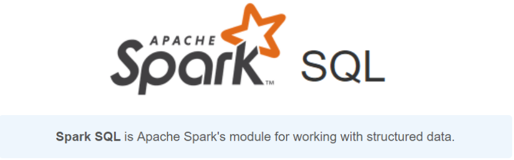
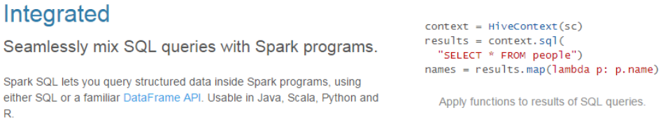
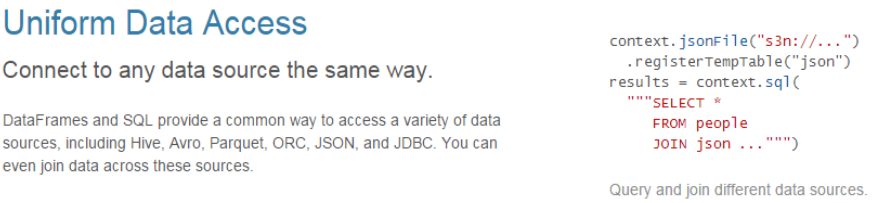
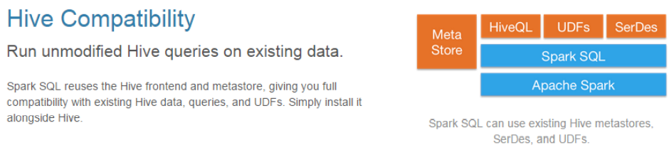
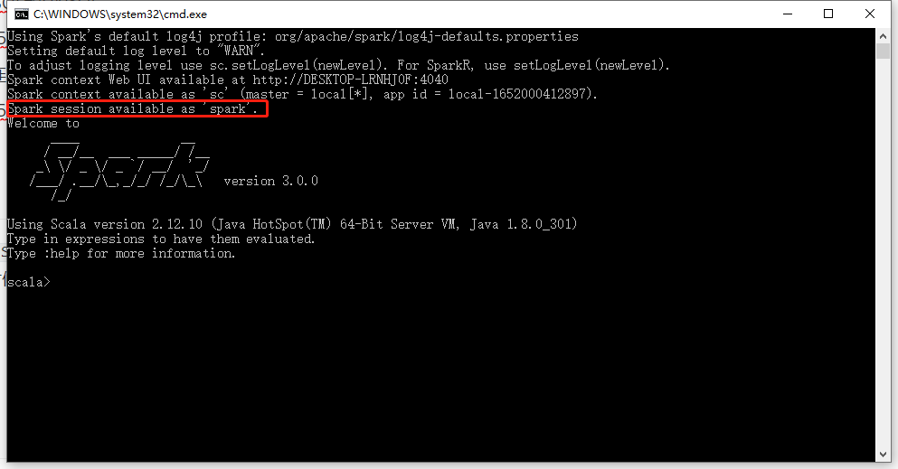
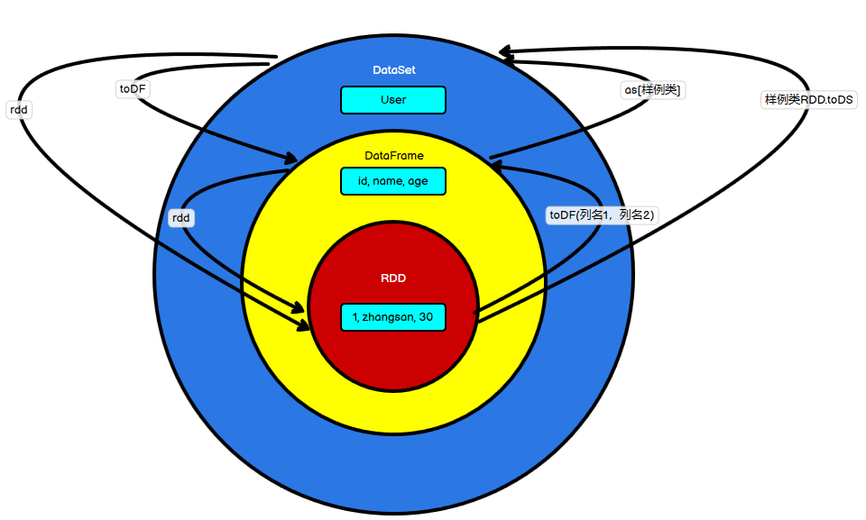

`SparkSQL`是Spark用于**结构化数据**处理的Spark模块



## 一、SparkSQL 概述

### 1、SparkSQL 是什么

SparkSQL就是Spark官方提供的一个操作结构化数据的工具，允许用户写SQL操作数据，它提供了两个编程的抽象：`DataFrame`和`DataSet`，并且作为分布式SQL查询引擎使用

- `DataFrame`：一种以RDD为基础的分布式数据集，类似于传统的二维表格。DataFrame和RDD的主要区别是：`DataFrame`带有表格的元信息（即每列都带有名称和类型），而RDD不关心数据的内部结构。如下图所示：

  

  `DataFrame`也是懒加载的，但性能比RDD要高

- `DataSet`：分布式数据集合，是Spark 1.6版本引入的最新的数据抽象，是强类型的。其中`DataFrame`是`DataSet`的特列，`DataFrame=DataSet[row]`

不同于`Hive`将`HiveQL`转换成`MapReduce`然后提交执行，SparkSQL是将SQL语句转换成RDD然后提交集群执行，执行效率大大提升

### 2、SparkSQL 特点

- **易整合：**无缝的整合了SQL查询和Spark编程

  

- **统一的数据访问：**使用相同的方式可以连接不同的数据源

  

- **兼容Hive：**在已有的仓库上直接运行SQL和HiveQL

  

- **标准数据连接：**通过JDBC和ODBC来连接

  


## 二、SparkSession

想要使用`SparkSQL`，需要事先构建`SparkSession`，`SparkSession`是Spark最新的SQL查询起始点，组合了`SparkContext`和`HiveContext`，当使用`spark-shell`的时候，`spark`框架会自动创建一个`SparkSession`对象`spark`，就像之前的`SparkContext`会自动帮助我们创建一个`sc`一样：



## 三、DataFrame

### 1、创建DataFrame

创建`DataFrame`有三种方式：

- 从Spark的数据源进行创建
- 从一个存在的RDD进行转换
- 从Hive Table进行查询返回

以从Spark的数据源进行创建为例介绍，其中RDD与DataFrame的相互转换后面的章节详细介绍，从Hive创建后期有专门的Blog【留坑】

`Spark`支持创建文件的数据源格式有：

```
csv,format,jdbc,json,load,option,options,orc,parquet,schema,table,text,textFile
```

以`json`为例，在`spark/bin/input`目录下创建一个`user.json`文件，把以下内容放进去：

```json
{"username": "zhangsan","age": 20}
{"username": "lisi","age": 30}
{"username": "wangwu","age": 40}
```

读取该文件创建一个DataFrame：

```bash
scala> val df = spark.read.json("input/user.json")
df: org.apache.spark.sql.DataFrame = [age: bigint, username: string]
# 展示
scala> df.show
+---+--------+
|age|username|
+---+--------+
| 20|zhangsan|
| 30|    lisi|
| 40|  wangwu|
+---+--------+
```

> 以这种方式创建`DataFrame`，由于是从文件中读取，Spark并不能确定是什么类型，如果是数字用`bigint`接收，其他类型就是`String`

### 2、SQL语法

`SparkSQL`支持用户使用SQL进行查询，但是只能查询，不能进行修改、删除、增加等

使用`SQL`首先要创建临时视图或全局视图：

- 读取`JSON`文件创建一个`DataFrame`

  ```bash
  scala> val df = spark.read.json("input/user.json")
  df: org.apache.spark.sql.DataFrame = [age: bigint, username: string]
  
  scala> df.show
  +---+--------+
  |age|username|
  +---+--------+
  | 20|zhangsan|
  | 30|    lisi|
  | 40|  wangwu|
  +---+--------+
  ```

- 对`DataFrame`创建一个临时视图：

  ```bash
  scala> df.createOrReplaceTempView("people")
  ```

- 通过`SQL`语句实现查询：

  ```bash
  scala> spark.sql("select * from people").show
  +---+--------+
  |age|username|
  +---+--------+
  | 20|zhangsan|
  | 30|    lisi|
  | 40|  wangwu|
  +---+--------+
  
  scala> spark.sql("select age from people").show
  +---+
  |age|
  +---+
  | 20|
  | 30|
  | 40|
  +---+
  
  scala> spark.sql("select age from people where age > 20").show
  +---+
  |age|
  +---+
  | 30|
  | 40|
  +---+
  ```

普通的临时表的范围是一个Session范围内的，如果想扩大访问范围，可以使用全局临时表，使用全局临时表需要全路径访问，比如：`global_temp.people`

```bash
scala> df.createGlobalTempView("people")

scala> spark.newSession().sql("select * from global_temp.people").show
+---+--------+
|age|username|
+---+--------+
| 20|zhangsan|
| 30|    lisi|
| 40|  wangwu|
+---+--------+
```


### 3、DSL语法

`DataFrame`提供一个特定领域语言（`domain-specific language,DSL`）去管理结构化数据。可以在Scala、Java、Python和R中使用RSL，使用RSL语法更发不必创建视图

- 创建一个DataFrame

  ```bash
  scala> val df = spark.read.json("input/user.json")
  df: org.apache.spark.sql.DataFrame = [age: bigint, username: string]
  ```

- 查看`DataFrame`的`Schema`信息

  ```bash
  scala> df.printSchema
  root
   |-- age: long (nullable = true)
   |-- username: string (nullable = true)
  ```

- 查看表里面的数据

  ```bash
  scala> df.select("username").show
  +--------+
  |username|
  +--------+
  |zhangsan|
  |    lisi|
  |  wangwu|
  +--------+
  
  # 使用$ , ' 引用表的名字，需要import spark.implicits._
  scala> import spark.implicits._
  import spark.implicits._
  
  scala> df.select($"username",$"age"+1).show
  +--------+---------+
  |username|(age + 1)|
  +--------+---------+
  |zhangsan|       21|
  |    lisi|       31|
  |  wangwu|       41|
  +--------+---------+
  
  scala> df.select('age+1).show
  +---------+
  |(age + 1)|
  +---------+
  |       21|
  |       31|
  |       41|
  +---------+
  
  # 过滤age字段大于30的
  scala> df.filter($"age">30).show
  +---+--------+
  |age|username|
  +---+--------+
  | 40|  wangwu|
  +---+--------+
  
  # 对age字段进行分组
  scala> df.groupBy($"age").count.show
  +---+-----+
  |age|count|
  +---+-----+
  | 30|    1|
  | 20|    1|
  | 40|    1|
  +---+-----+
  ```


### 4、RDD和DataFrame相互转换

#### 4.1 RDD => DataFrame

`RDD`对象可以直接转换为`DataFrame`，使用`toDF(指定字段名称)`就可以完成转换了

```bash
scala> val rdd = sc.textFile("input/id.txt")
rdd: org.apache.spark.rdd.RDD[String] = input/id.txt MapPartitionsRDD[70] at textFile at <console>:27

scala> rdd.toDF("id").show
+---+
| id|
+---+
|  1|
|  2|
|  3|
|  4|
|  5|
+---+
```

也可以通过样例类将RDD转换为DataFrame：

```bash
# 定义一个样例类
scala> case class User(username:String,age:Int)
defined class User

# 创建一个RDD对象
scala> val rdd = sc.makeRDD(List(("wzq",18),("wtt",12)))
rdd: org.apache.spark.rdd.RDD[(String, Int)] = ParallelCollectionRDD[74] at makeRDD at <console>:27

# 通过map转换为样例类的形式
scala> val rddMap = rdd.map(t=>{new User(t._1,t._2)})
rddMap: org.apache.spark.rdd.RDD[User] = MapPartitionsRDD[75] at map at <console>:30

# 转换为DataFrame
scala> rddMap.toDF.show
+--------+---+
|username|age|
+--------+---+
|     wzq| 18|
|     wtt| 12|
+--------+---+
```

#### 4.2 DataFrame => RDD

`DataFrame`其实就是对RDD的封装，所以可以直接获取内部的RDD

```bash
# 封装一个DataFrame
scala> val df = rddMap.toDF
df: org.apache.spark.sql.DataFrame = [username: string, age: int]

# 转化为RDD
scala> val rdd = df.rdd
rdd: org.apache.spark.rdd.RDD[org.apache.spark.sql.Row] = MapPartitionsRDD[83] at rdd at <console>:28

# 将RDD对象打印到控制台
scala> rdd.collect.foreach(println)
[wzq,18]
[wtt,12]
```

> 此时得到的RDD存储类型是`Row`


## 四、DataSet

DataSet是具有强类型的数据集合，需要提供对应的类型信息

### 1、创建DataSet

- 使用样例类序列创建DataSet

  ```bash
  # 声明一个样例类
  scala> case class Person(name:String,age:Long)
  defined class Person
  
  # 创建一个类的序列
  scala> val seq = Seq(Person("wzq",18),Person("wtt",12))
  seq: Seq[Person] = List(Person(wzq,18), Person(wtt,12))
  
  # 转换为DataSet
  scala> val ds = seq.toDS
  ds: org.apache.spark.sql.Dataset[Person] = [name: string, age: bigint]
  
  scala> ds.show
  +----+---+
  |name|age|
  +----+---+
  | wzq| 18|
  | wtt| 12|
  +----+---+
  ```

- 使用基本类型的序列创建DataSet

  ```bash
  scala> val list = List(1,2,3,4,5)
  list: List[Int] = List(1, 2, 3, 4, 5)
  
  scala> list.toDS.show
  +-----+
  |value|
  +-----+
  |    1|
  |    2|
  |    3|
  |    4|
  |    5|
  +-----+
  ```

> 在实际开发中，一般将RDD转换为DataSet

### 2、RDD和DataSet相互转换

#### 2.1 RDD => DataSet

SparkSQL能够自动将包含case类的RDD转换成DataSet，case类定义了table的结构，case类属性通过反射变成了表的列名

case类可以包含Seq、Array等复杂结构

```bash
scala> case class User(name:String,age:Int)
defined class User

scala> val rdd = sc.makeRDD(List(("wzq",18),("wtt",19))).map(t=>{User(t._1,t._2)})
rdd: org.apache.spark.rdd.RDD[User] = MapPartitionsRDD[85] at map at <console>:29

scala> rdd.toDS.show
+----+---+
|name|age|
+----+---+
| wzq| 18|
| wtt| 19|
+----+---+
```

#### 2.2 DataSet => RDD

DataSet其实也是RDD封装的，所以可以直接获取内部的RDD

```bash
scala> val Rdd = rdd.toDS.rdd
Rdd: org.apache.spark.rdd.RDD[User] = MapPartitionsRDD[91] at rdd at <console>:28

scala> Rdd.collect.foreach(println)
User(wzq,18)
User(wtt,19)
```


### 3、DataFrame和DataSet相互转换

`DataFrame = DataSet[Row]`，DataFrame是DataSet的特例，所以他们之间也可以相互转换

#### 3.1 DataFrame => DataSet

```bash
scala> case class User(name:String,age:Int)
defined class User

# 创建一个DataFrame
scala> val df = sc.makeRDD(List(("wzq",18),("wtt",12))).toDF("name","age")
df: org.apache.spark.sql.DataFrame = [name: string, age: int]

# 转换为DataSet，使用as[]需要指定类
scala> val ds = df.as[User]
ds: org.apache.spark.sql.Dataset[User] = [name: string, age: int]

scala> ds.show
+----+---+
|name|age|
+----+---+
| wzq| 18|
| wtt| 12|
+----+---+
```

#### 3.2 DataSet => DataFrame

```bash
scala> val ds = df.as[User]
ds: org.apache.spark.sql.Dataset[User] = [name: string, age: int]

scala> val df = ds.toDF
df: org.apache.spark.sql.DataFrame = [name: string, age: int]

scala> df.show
+----+---+
|name|age|
+----+---+
| wzq| 18|
| wtt| 12|
+----+---+
```

## 五、RDD、DataFrame和DataSet之间的关系

他们三者的互相转换、关系如下图所示：



## 六、IDEA开发SparkSQL

在`IDEA`中开发首先要在`pom.xml`中导入`SparkSQL`的依赖：

```xml
<dependency>
    <groupId>org.apache.spark</groupId>
    <artifactId>spark-sql_2.12</artifactId>
    <version>3.0.0</version>
</dependency>
```

然后创建一个包，和`SparkCore`一样，首先也要声明`SparkSQL`运行的环境，中间执行业务逻辑，最后关闭连接

创建一个`SparkSession`：

```scala
// 创建SparkSQL运行环境
val sparkConf: SparkConf = new SparkConf().setMaster("local[*]").setAppName("sparkSQL")
val spark: SparkSession = SparkSession
  .builder()
  .config(sparkConf)
  .getOrCreate()

// 需要显式声明 
import spark.implicits._

// SparkCore的SparkContext可以这样使用
spark.sparkContext.makeRDD(...)
```

中间执行业务逻辑，最后还要关闭连接

```scala
spark.close()
```


## 参考资料

- [尚硅谷Spark 3.0.0 学习视频](https://www.bilibili.com/video/BV11A411L7CK)
- [SparkSQL 3.0.0 官方文档](https://spark.apache.org/docs/3.0.0/sql-getting-started.html)

