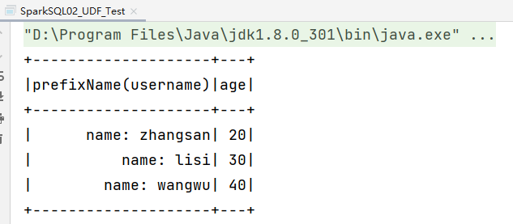
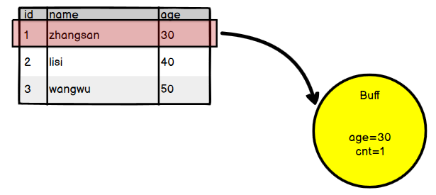
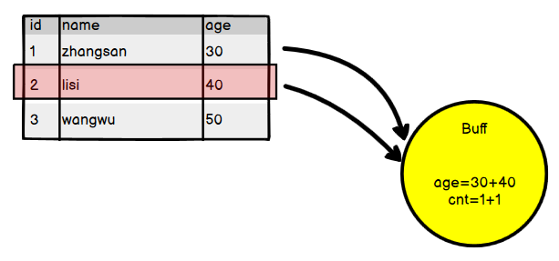
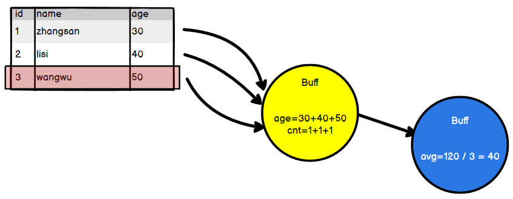
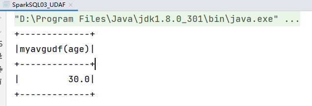
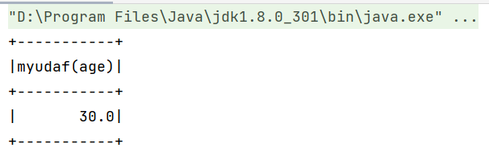

在`SparkSQL`中，用户可以通过`spark.udf`功能添加自定义函数、实现自定义的功能

## 一、UDF

`UDF`，传递进去几个字段的几个值，返回这个字段计算后的结果

比如传递一个`wzq`字符串进去，返回：`name: String`

他的实现很简单，使用`spark.udf.register`进行注册，这个方法需要两个参数：

- 第一个参数：`name`，UDF函数的名称
- 第二个参数：`func`，一个函数，可以传递进去多个字段进行操作，最后返回想要的结果

案例：把`user.json`读入`DataFrame`，创建临时视图，写`sql`，实现一个`prefixName`函数，返回`name: 字段值`

```scala
package com.wzq.bigdata.spark.sql

import org.apache.spark.SparkConf
import org.apache.spark.sql.{DataFrame, SparkSession}

object SparkSQL02_UDF {
  def main(args: Array[String]): Unit = {
    val sparkConf: SparkConf = new SparkConf().setMaster("local[*]").setAppName("SparkSQL")
    val spark: SparkSession = SparkSession.builder().config(sparkConf).getOrCreate()

    val df: DataFrame = spark.read.json("datas/user.json")
    df.createOrReplaceTempView("user")

    /*
      用户自定义函数，使用spark.udf.register注册
        第一个参数：name，自定义函数的名称
        第二个参数：func，函数，可以传递多个字段进行，返回想要的结果
     */
    spark.udf.register("prefixName", (name: String) => {
      "name: " + name
    })

    spark.sql("select age,prefixName(username) from user").show

    spark.close()
  }
}
```

运行结果：



## 二、UDAF

### 1、UDAF执行原理

UDAF，用户自定义聚合函数，下面拿一个计算人员平均年龄的例子来阐述一下这个的执行原理

第一次遍历到第一行，首先会将这行的数据传进一个`buffer`缓冲区，这个缓冲区记录了`age`和`cnt`两个字段，分别代表年龄综合和多少个人



第二次遍历到第二行，传递到`buffer`，age和cnt都应该累加一下



最后一次遍历到最后一行，依旧传递到`buffer`，累加age和cnt，判断完成了表格所有数据的遍历，就把age和cnt传递到下一个地方进行相除



### 2、弱类型实现 <del>UserDefinedAggregateFunction</del>

这种类型是已经过时的方式，所以在idea写这段代码的时候，就会有删除线提示

实现上面的案例：计算员工的平均年龄

使用弱类型实现有以下的步骤：

- 定义一个类实现`UserDefinedAggregateFunction`抽象类
- 重写这个类的8个方法
  - `inputSchema`：输入数据的结构
  - `bufferSchema`：缓冲区数据的结构
  - `dataType`：函数计算结果数据类型
  - `determinist`：函数的稳定性，一般直接返回`true`
  - `initialize`：缓冲区初始化
  - `update`：根据输入的值更新缓冲区数据
  - `merge`：由于是分布式计算，所有缓冲区可能有好多个，这个方法负责缓冲区的合并
  - `evaluate`：计算平均值

实现：

```scala
package com.wzq.bigdata.spark.sql

import org.apache.spark.SparkConf
import org.apache.spark.sql.{DataFrame, Row, SparkSession}
import org.apache.spark.sql.expressions.{MutableAggregationBuffer, UserDefinedAggregateFunction}
import org.apache.spark.sql.types.{DataType, DoubleType, IntegerType, LongType, StructField, StructType}

object SparkSQL03_UDAF {
  def main(args: Array[String]): Unit = {
    val sparkConf: SparkConf = new SparkConf().setMaster("local[*]").setAppName("UDAF")
    val spark: SparkSession = SparkSession.builder().config(sparkConf).getOrCreate()

    val df: DataFrame = spark.read.json("datas/user.json")
    df.createOrReplaceTempView("user")

    spark.udf.register("myAvg", new MyAvgUDF)

    spark.sql("select myAvg(age) from user").show

    spark.close()
  }

  /*
   自定义聚合函数类：计算年龄的平均值
   1、继承UserDefinedAggregateFunction抽象类
   2、实现八个方法
   */
  class MyAvgUDF extends UserDefinedAggregateFunction {
    // 输入数据的结构
    override def inputSchema: StructType = {
      StructType(
        Array(StructField("age", LongType))
      )
    }

    // 缓冲区数据结构
    override def bufferSchema: StructType = {
      StructType(
        Array(
          StructField("sum", LongType),
          StructField("count", LongType)
        )
      )
    }

    // 函数计算结构的返回类型
    override def dataType: DataType = DoubleType

    // 函数的稳定性，一般直接返回true
    override def deterministic: Boolean = true

    // 缓冲区的初始化
    override def initialize(buffer: MutableAggregationBuffer): Unit = {
      buffer.update(0, 0L) // 缓冲区第一个字段索引是0，初始值0L
      buffer.update(1, 0L) // 同上

      // 等价于下面的方式
      // buffer(0) = 0L
      // buffer(1) = 0L
    }

    // 根据输入的值更新缓冲区数据
    override def update(buffer: MutableAggregationBuffer, input: Row): Unit = {
      buffer(0) = input.getLong(0) + buffer.getLong(0)
      buffer(1) = buffer.getLong(1) + 1
    }

    // 缓冲区的合并
    override def merge(buffer1: MutableAggregationBuffer, buffer2: Row): Unit = {
      buffer1(0) = buffer1.getLong(0) + buffer2.getLong(0)
      buffer1(1) = buffer1.getLong(1) + buffer2.getLong(1)
    }

    // 计算最终的结果
    override def evaluate(buffer: Row): Double = {
      buffer.getLong(0).toDouble / buffer.getLong(1)
    }
  }
}
```

结果如下所示：



### 3、强类型实现 Aggregator

上面的写法已经过时了，现在提倡继承`Aggregator`，步骤如下：

- 继承`Aggregator`抽象类，这个类在`org.apache.spark.sql.expressions.Aggregator`包下，不能导错了！这个类需要传入三个泛型
  - `IN`：输入数据的类型
  - `BUF`：缓冲区数据类型
  - `OUT`：输出数据的类型
- 重写6个方法：
  - `zero`：缓冲区的初始化，在spark中只要是`zero`的一般都指初始化
  - `reduce`：根据输入的数据更新缓冲区的数据
  - `merge`：合并缓冲区
  - `finish`：计算结果
  - `bufferEncoder`：缓冲区编码操作，根据结果返回，是一个样例类的话返回`Encoders.product`
  - `outputEncoder`：输出的编码操作，根据结果进行返回，浮点型就返回`Encoders.scalaDouble`

实现：

```scala
package com.wzq.bigdata.spark.sql

import org.apache.spark.SparkConf
import org.apache.spark.sql.expressions.Aggregator
import org.apache.spark.sql._

object SparkSQL04_UDAF {
  def main(args: Array[String]): Unit = {
    val sparkConf: SparkConf = new SparkConf().setMaster("local[*]").setAppName("UDAF")
    val spark: SparkSession = SparkSession.builder().config(sparkConf).getOrCreate()

    val df: DataFrame = spark.read.json("datas/user.json")
    df.createOrReplaceTempView("user")

    spark.udf.register("myAvg", functions.udaf(new MyUDAF))

    spark.sql("select myAvg(age) from user").show

    spark.close()
  }

  case class Buff(var sum: Long, var count: Long)

  class MyUDAF extends Aggregator[Long, Buff, Double] {
    // 缓冲区初始化
    override def zero: Buff = {
      Buff(0L, 0L)
    }

    // 根据输入的数据更新缓冲区的数据
    override def reduce(b: Buff, a: Long): Buff = {
      b.sum += a
      b.count += 1
      b
    }

    // 合并缓冲区
    override def merge(b1: Buff, b2: Buff): Buff = {
      b1.sum += b2.sum
      b1.count += b2.count
      b1
    }

    // 计算最终结果
    override def finish(reduction: Buff): Double = {
      reduction.sum.toDouble / reduction.count
    }

    // 缓冲区编码
    override def bufferEncoder: Encoder[Buff] = Encoders.product

    // 输出编码操作
    override def outputEncoder: Encoder[Double] = Encoders.scalaDouble
  }

}
```

运行后结果：




## 参考资料

- [尚硅谷Spark 3.0.0 学习视频](https://www.bilibili.com/video/BV11A411L7CK)
- [SparkSQL 3.0.0 UDF UDAF 官方文档](https://spark.apache.org/docs/3.0.0/sql-ref-functions-udf-aggregate.html)
