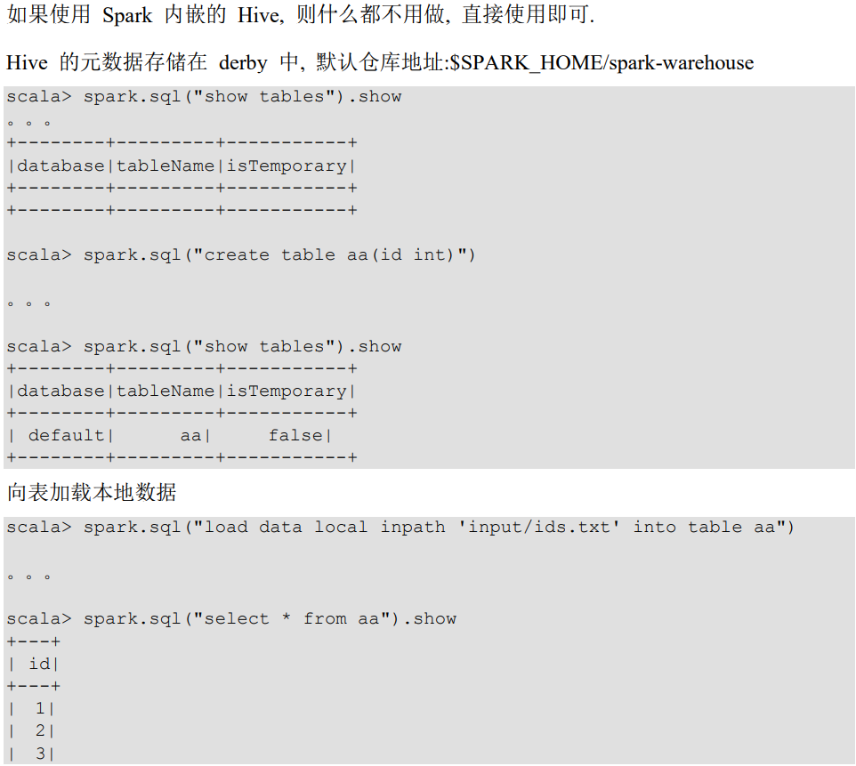
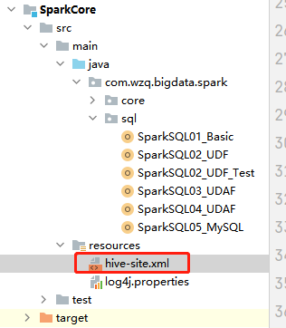

## 一、普通文件的加载和保存


### 1、加载数据

打开一个`spark-shell`，输入`spark.read.`之后按一下`tab`键会出现好多数据加载的方式

```bash
scala> spark.read.
csv   format   jdbc   json   load   option   options   orc   parquet   schema   table   text   textFile
```


这里以几个经典的读取数据方式为例，基本语法：

```scala
// load 通用数据加载方式
spark.read[.format("...")][.option("...")].load("...")

// json 读取json文件
spark.read.json("...")

// csv
spark.read.format("csv").option("seq",";").option("inferSchema","true").option("header","true").load("...")
```

- `format("...")`：指定加载的数据类型，可以是`csv`、`json`、`txt`、`jdbc`等
- `option("...")`：在`jdbc`格式下需要传入jdbc相应的参数，url、user、password、和dbtable等

- `spark.read.load`是加载数据的通用方式，默认情况下只能加载`parquet`格式的数据：


案例：

```bash
# 使用load默认读取parquet格式的数据
scala> spark.read.load("examples/src/main/resources/users.parquet").show
+------+--------------+----------------+                                        
|  name|favorite_color|favorite_numbers|
+------+--------------+----------------+
|Alyssa|          null|  [3, 9, 15, 20]|
|   Ben|           red|              []|
+------+--------------+----------------+

# 读取json格式的数据
# 等同于spark.read.json(path)
scala> spark.read.format("json").load("examples/src/main/resources/people.json").show
+----+-------+
| age|   name|
+----+-------+
|null|Michael|
|  30|   Andy|
|  19| Justin|
+----+-------+

# 也可以按照文件查询，哪种格式的数据只需要在前面加个文件格式就好了
scala> spark.sql("select * from json.`examples/src/main/resources/people.json`").show
22/05/09 19:28:08 WARN HiveConf: HiveConf of name hive.metastore.event.db.notification.api.auth does not exist
+----+-------+
| age|   name|
+----+-------+
|null|Michael|
|  30|   Andy|
|  19| Justin|
+----+-------+

# 读取CSV格式的数据
scala> spark.read.format("csv").option("sep",";").option("inferSchema","true").option("header","true").load("examples/src/main/resources/people.csv").show
+-----+---+---------+
| name|age|      job|
+-----+---+---------+
|Jorge| 30|Developer|
|  Bob| 32|Developer|
+-----+---+---------+
```


### 2、保存数据

`DataFrame.write.save`是保存数据的通用方法：

```scala
DataFrame.write.mode("方式").format("文件格式")[.options("...")].save("路径")
```

- `mode`：指定文件保存的方式，包括追加、覆盖、忽略等：

  | Scala/Java                      | Any Language     | Meaning                    |
  | ------------------------------- | ---------------- | -------------------------- |
  | SaveMode.ErrorIfExists(default) | "error"(default) | 如果文件已经存在则抛出异常 |
  | SaveMode.Append                 | "append"         | 如果文件已经存在则追加     |
  | SaveMode.Overwrite              | "overwrite"      | 如果文件已经存储则覆盖     |
  | SaveMode.Ignore                 | "ignore"         | 如果文件已经存在则忽略     |

- `format("...")`：指定保存的数据类型，包括csv\jdbc\json\orc\parquet和textFile等

- `save("...")`：需要传递保存数据的路径

- `option("...")`：在`jdbc`格式下需要传入JDBC相应参数，url\user\password和dbtable等


案例：

```bash
# 创建一个DataFrame
scala> val df = spark.read.json("examples/src/main/resources/people.json")
df: org.apache.spark.sql.DataFrame = [age: bigint, name: string]

scala> df.show
+----+-------+
| age|   name|
+----+-------+
|null|Michael|
|  30|   Andy|
|  19| Justin|
+----+-------+

# 保存文件
scala> df.write.json("output")

# 再次写入就会保存
scala> df.write.json("output")
org.apache.spark.sql.AnalysisException: path file:/opt/module/spark-local/output already exists.;

# 追加的形式保存文件
scala> df.write.mode("append").json("output")

# 覆盖
scala> df.write.mode("overwrite").json("output")

# 忽略
scala> df.write.mode("ignore").json("output")

# 通用方式保存文件
scala> df.write.mode("overwrite").format("json").save("output")
```


## 二、MySQL 读写

在开始之前，先打开`hadoop102`主机的数据库创建一张表，并导入一些数据：

```sql
create database spark_sql;
use spark_sql;

create table user(
	id int primary key AUTO_INCREMENT,
	name varchar(128),
	age int
);

insert into user (name,age) VALUES ("wzq",12);
insert into user (name,age) VALUES ("wtt",12);
insert into user (name,age) VALUES ("haha",18);
insert into user (name,age) VALUES ("abc",16);
insert into user (name,age) VALUES ("bbb",20);
insert into user (name,age) VALUES ("na",60);
```

这部分在idea里面操作，打开idea项目的`pom.xml`文件，第一步添加`mysql`驱动依赖：

```xml
<dependency>
    <groupId>mysql</groupId>
    <artifactId>mysql-connector-java</artifactId>
    <version>5.1.27</version>
</dependency>
```


操作MySQL表的数据，需要添加`option`

```scala
package com.wzq.bigdata.spark.sql

import org.apache.spark.SparkConf
import org.apache.spark.sql.{DataFrame, SaveMode, SparkSession}

import java.util.Properties

object SparkSQL05_MySQL {
  def main(args: Array[String]): Unit = {
    val sparkConf: SparkConf = new SparkConf().setMaster("local[*]").setAppName("MySQL")
    val spark: SparkSession = SparkSession.builder().config(sparkConf).getOrCreate()

    // 读取MySQL表中的数据
    val df: DataFrame = spark.read.format("jdbc")
      .option("url", "jdbc:mysql://hadoop102:3306/spark_sql")
      .option("driver", "com.mysql.jdbc.Driver")
      .option("user", "root")
      .option("password", "root")
      .option("dbtable", "user")
      .load()

    df.show()

    // 第二种读取数据的方式
    val properties: Properties = new Properties()
    properties.setProperty("user", "root")
    properties.setProperty("password", "root")
    val df1: DataFrame = spark.read.jdbc("jdbc:mysql://hadoop102:3306/spark_sql", "user", properties)
    df1.show()

    // 保存数据
    df.write.format("jdbc")
      .option("url", "jdbc:mysql://hadoop102:3306/spark_sql")
      .option("driver", "com.mysql.jdbc.Driver")
      .option("user", "root")
      .option("password", "root")
      .option("dbtable", "user1")
      .mode(SaveMode.Append)
      .save()

    // 保存数据的第二种方式
    df.write.mode(SaveMode.Append).jdbc("jdbc:mysql://hadoop102:3306/spark_sql", "user2", properties)

    spark.close()
  }
}
```


## 三、Hive 读写

### 1、操作内置Hive



在实际中，基本不用内置的Hive


### 2、外部的Hive

在这部分开始之前应该启动`HDFS`与`Hive`：

```bash
[wzq@hadoop102 spark-local]$ myhadoop.sh start
[wzq@hadoop102 spark-local]$ hiveservices.sh start
[wzq@hadoop102 spark-local]$ hiveservices.sh status
Metastore服务运行正常
HiveServer2服务运行正常
```

Spark连接外部的Hive其实很简单：

- 把`Hive`配置文件目录下的`hive-site.xml`拷贝到`spark`的`conf/`目录下
- 把`MySQL`驱动拷贝到Spark的`jars/`目录下
- 如果访问不到HDFS，则需要把hadoop的`core-site.xml`和`hdfs-site.xml`拷贝Spark的`conf/`目录下即可
- 重启`spark-shell`

```scala
scala> spark.sql("show databases").show
22/05/09 20:10:32 WARN HiveConf: HiveConf of name hive.metastore.event.db.notification.api.auth does not exist
+---------+
|namespace|
+---------+
|  db_hive|
|  default|
|gulivideo|
+---------+

scala> spark.sql("use db_hive").show

scala> spark.sql("show tables").show
+--------+------------------+-----------+
|database|         tableName|isTemporary|
+--------+------------------+-----------+
| db_hive|          bigtable|      false|
| db_hive|         bigtable2|      false|
| db_hive|    bigtable_buck1|      false|
| db_hive|    bigtable_buck2|      false|
| db_hive|          business|      false|
| db_hive|              dept|      false|
| db_hive|          dept_par|      false|
| db_hive|         dept_par2|      false|
| db_hive|         dept_par3|      false|
| db_hive|dept_par_by_deptno|      false|
| db_hive|               emp|      false|
| db_hive|           emp_sex|      false|
| db_hive|         jointable|      false|
| db_hive|       log_parquet|      false|
| db_hive|          log_text|      false|
| db_hive|      log_text_orc|      false|
| db_hive|        movie_info|      false|
| db_hive|       nullidtable|      false|
| db_hive|       person_info|      false|
| db_hive|             score|      false|
+--------+------------------+-----------+
only showing top 20 rows
```

这样就成功的连接到了`Hive`的仓库

如果觉得这样每次都要写`spark.sql("...").show`，Spark为用户提供了两种方式只写sql即可：

```bash
# 方式一：运行spark-sql
[wzq@hadoop102 spark-local]$ bin/spark-sql

# 方式二：beeline的方式
[wzq@hadoop102 spark-local]$ sbin/start-thriftserver.sh
[wzq@hadoop102 spark-local]$ bin/beeline -u jdbc:hive2://hadoop102:10000 -n wzq
```


代码操作Hive，在开始之前，也是首先要导入`Hive`和`MySQL`的依赖，因为Hive的元数据存储在MySQL：

```xml
<dependency>
    <groupId>org.apache.spark</groupId>
    <artifactId>spark-hive_2.12</artifactId>
    <version>3.0.0</version>
</dependency>
<dependency>
    <groupId>org.apache.hive</groupId>
    <artifactId>hive-exec</artifactId>
    <version>3.1.2</version>
</dependency>
<dependency>
    <groupId>mysql</groupId>
    <artifactId>mysql-connector-java</artifactId>
    <version>5.1.27</version>
</dependency>
<dependency>
    <groupId>com.fasterxml.jackson.core</groupId>
    <artifactId>jackson-databind</artifactId>
    <version>2.10.0</version>
</dependency>
<!-- 添加对应的 jackson-core -->
<dependency>
    <groupId>com.fasterxml.jackson.core</groupId>
    <artifactId>jackson-core</artifactId>
    <version>2.10.0</version>
</dependency>
```

还需要把`hive-site.xml`拷贝到`resources`里面



需要注意的是在创建`SparkSession`对象的时候，需要加上`.enableHiveSupport`

然后的操作可以通过`spark.sql("...")`写`HiveQL`


## 参考资料

- [尚硅谷Spark 3.0.0 学习视频](https://www.bilibili.com/video/BV11A411L7CK)
- [Spark 3.0.0 官方文档](https://spark.apache.org/docs/3.0.0/index.html)
- [SparkSQL 数据的加载和保存](https://spark.apache.org/docs/3.0.0/sql-data-sources.html)
