> `Scala = Java++` . Scala基于JVM，和Java完全兼容，同样具有跨平台、可移植性好、方便的垃圾回收等特性。并且Scala比Java更加面向对象，是一门函数式编程语言。Scala对集合类型数据处理有非常好的支持，并且Spark的底层是由Scala编写的，为了学习Spark，Scala是绕不过去的。


## 一、Scala的特点

`Scala`是一门以Java虚拟机（JVM）为运行环境并将面向对象和函数式编程的最佳特性结合在一起的静态类型编程语言。

- `Scala`是一门**多范式**编程语言，`Scala`支持**面向对象和函数式编程**（多范式：多种编程方法，有面向过程、面向对象、泛型、函数式四种程序设计方法）
- `Scala`源代码`.scala`会被编译为`Java`字节码`.class`文件，然后运行于`JVM`之上，并可以调用现有的`Java`类库，实现两种语言的无缝对接
- `Scala`单作为一门语言来看，非常简介高效
- `Scala`**完全面对对象**

## 二、搭建Scala环境

我学习`Scala`的目的实际上是为了学习`Spark`，目前最新的`Spark`版本是`3.2.1`，它依赖的是`Scala 2.12`，所以本blog主要记录`Scala 2.12`版本的学习笔记：


首先确保`Java1.8`安装在了你的电脑，这里不做详细介绍


### 1、安装Scala

我选择安装的是`Scala 2.12.11`版本，链接：https://www.scala-lang.org/download/2.12.11.html，下载`windows`版本的：


下载之后把它解压到你电脑任意一个目录（**注意：不能是中文目录**），接下来就可以去配置环境变量了：


新建一个`SCALA_HOME`，里面填写你的`scala`安装目录，如下图所示：


然后找到`Path`，点击编辑，添加`%SCALA_HOME%\bin`到里面：


配置完成之后可以打开你的`cmd`，输入`scala`，如果打印出版本，并且开始了`scala`程序，就算安装成功：


### 2、idae安装Scala插件


打开`idea->File->Settings->Plugins`，在上面的搜索框输入：`scala`，然后选中如下图所示的内容，点击`Install`就可以了，安装完插件后需要重启`idea`


这样我们就可以在idea里面写scala代码了


### 3、Hello world

打开`idea`，新建一个`maven`项目，现在的目录结构是这样的：

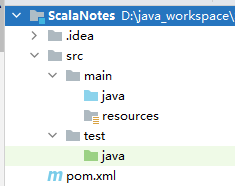

因为Scala是个语言，不需要在pom文件添加什么关于scala的依赖，可以把scala的文件单独写在一个文件夹里面，在main文件夹下面新建一个文件夹，命名为`scala`，然后右键点击这个新目录，把它标记为源代码目录，让这个目录变为蓝色：

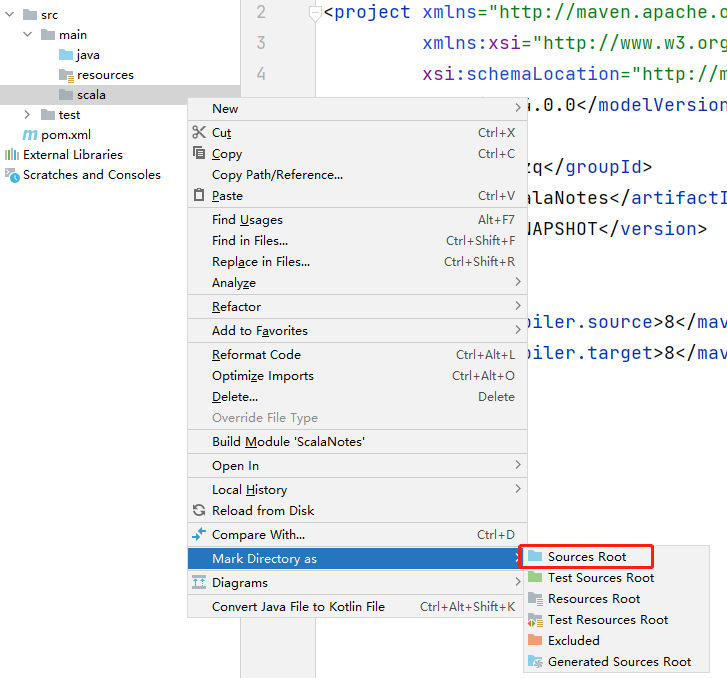


此外，还需要添加Scala的支持，右键单击最上面的目录，选择`Add FrameWork support`，勾选scala：

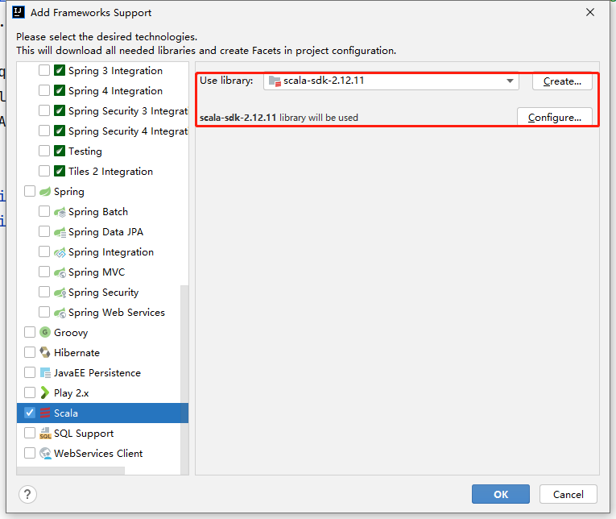


然后就可以创建一个scala文件了，右键单机scala，然后新建一个包`chapter01`，随后新建一个`Object`，命名为`HelloWorld`，在这个新文件里面写scala代码：

```scala
package chapter01

/**
 * object: 关键字，声明一个单例对象，全局只此一份（伴生对象）
 */
object HelloWorld {

  /**
   * main方法，args变量名:Array[String]数据类型， :Unit返回值类型
   * def 方法名称(参数名称: 数据类型): 返回值类型 = { 方法体 }
   */
  def main(args: Array[String]): Unit = {
    // Scala输出
    println("Hello Scala")

    // 可以直接调用Java类库
    System.out.println("Hello Scala from Java")
  }
}
```


## 三、变量和数据类型

### 1、注释

`Scala`的注释和`Java`的注释完全一样，共有三种注释：

- 单行注释

  ```scala
  // 这是一个单行注释
  ```

  

- 多行注释

  ```scala
  /*
  	这是一个多行注释
  */
  ```

  

- 文档注释

  ```scala
  /**
   * 文档注释
   * @param args 残念书
   */
  ```

### 2、变量和常量

所谓常量就是在程序执行的过程中，他的值不会被改变

在`Java`中，是这样定义变量和常量的：

```java
// 变量类型 变量名称 = 初始值
int a = 10;

// final 常量类型 常量名称 = 初始值
final int b = 20;
```


在Scala中，是这样定义的：

```scala
// var 变量名 [: 变量类型] = 初始值
var a : Int = 10
var b = 10

// val 常量名 [: 常量类型] = 初始值
val c : Int = 10
val d = 10
```

> **注意：**带有`[]`的可以省略，因为Scala会自动推断数据类型；能用常量的地方不用变量

声明变量和常量有需要注意的几个地方：

- 声明变量时，类型可以省略，编译器可以做到自动推导数据类型

  ```scala
  var age = 18
  age = 30    // var是变量，值可以被修改
  ```

- 类型确定以后，就不能修改类型，说明`Scala`是一个强类型语言

  ```scala
  var age:Int = 18
  age = "tom" // 错误！
  ```

- 声明变量必须要有初始值

  ```scala
  var name    // 错误！
  var name = "wzq" 	// 正确！
  ```

- 在声明/定义一个变量的时候，可以是呀`var`或者`val`来修饰，`var`修饰的变量可改变，`val`修饰的变量不可改变

  ```scala
  var num1 = 10  // 可变
  num1 = 20	// 正确
  
  val num2 = 20	// 不可变
  num2 = 10	// 错误
  ```

- `var`修饰的对象引用可以改变，`val`修饰的对象则不可改变，但对象的状态（值）却可以改变

  ```scala
  package chapter01
  
  class Student(var name: String,var age: Int) {
    def printInfo(): Unit = {
      println(name + " " + age)
    }
  }
  
  // 伴生对象
  object Student {
  
    def main(args: Array[String]): Unit = {
      val wzq = new Student("wzq", 20)
      wzq.age = 18
      wzq.name = "wtt"
      
      // 但是不可以更改其引用对象
      //wzq = new Student("aaa",10)   // 错误
    }
  }
  ```

  

### 3、标识符的命名规范

标识符就是我们给变量、常量、对象起的名字，在scala中标识符有一定的命名规范，但基本和`Java`一致

- 以字母或者下划线开头，后接字母、数组、下划线

- 以操作符开头，且只包含操作符（`+-*/#!`等）

- 用反引号\` ...\` 可以包括任意字符，即使`Scala`的关键字也可以包含，`Scala`的关键字如下：

  ```scala
  package,import,class,object,trait,extends,with,type,for
  private,protected,abstract,sealed,final,implicit,lazy,override
  try,catch,finally,throw
  if,else,match,case,do,while,for,return,yield
  def,val,var
  this,super
  new
  true,false,null
  ```

例如：

```scala
package chapter02

object Test02_Var {
  def main(args: Array[String]): Unit = {

    // 1、以字母或下划线开头，后街字母、数字、下划线
    var hello: String = "a"
    var Hello: String = "b"
    var 1Hello: String = "c" // 错误，不能以数字开头

    var h-b:String = "d" // 错误，不能使用 -
    var x h:String = "e" // 错误，中间有空格

    var _ab:String = "f"
    var _:String = "g"  //错误，在Scala中_ 下划线被认为是一个方法

    // 以操作符开头，且只包含操作符
    var +- : String = "h"
    var +-1 : String = "i" // 错误，应该只包含操作符

    // 用反引号 `...` 包括任意的字符串，即使是关键字
    var if : String = "j"  // 错误，不能使用关键字
    var `if` : String = "k" // 加反引号就可以了
  }
}
```


### 4、输入与输出

#### 4.1 字符串输出

关于字符串输出，`Scala`共有三种方式，首先定义定义两个变量，作为下面的案例：

```scala
var name:String = "wzq"
var age = 18
```

- 字符串通过`+`拼接，通过`*`复制

  ```scala
  // 1、以 + 号拼接，以 * 号复制
  println(name + " " + age)
  println(name * 5)
  println(name * 5 + " " + age)
  ```

- `printf`，和C语言一模一样，通过`%`匹配值

  ```scala
  // 2、printf
  printf("name : %s , age : %d", name, age)
  ```

- 通过`$`符引用

  ```scala
  // 3、用 $ 符引用，使用`s`可以正常引用
  println(s"${name} ${age}")
  // 用`f`可以跟上%进行匹配
  var num = 18.222
  println(f"${num}%2.2f")
  
  // 多行字符串
  var sql =
    s"""
      |select
      |   name,
      |   age
      |from table
      |where name = ${name} and age = ${age+2}
      |""".stripMargin
  // 多行字符串使用`stripMargin`，可以让多行字符串变的简洁
  // 使用这个函数后，| 作为连接符表示换行，
  println(sql)
  ```

  

#### 4.2 键盘输入 <span style="color:red">StdIn</span>

`Java`处理键盘输入的类是`Scanner`，`Scala`可以调用`Scanner`，也有自己的接受输入类`StdIn`，用法和`Java`类似，直接看个案例吧

```scala
package chapter02

import scala.io.StdIn

object Test04_StdIn {
  def main(args: Array[String]): Unit = {
    // 1、输入字符串
    println("请输入你的姓名：")
    var name = StdIn.readLine()

    // 2、输入整数
    println("请输入你的年龄：")
    var age = StdIn.readInt()

    // 3、输入浮点数
    println("请输入你的薪水：")
    var sal = StdIn.readDouble()

    println(f"name=${name},age=${age},sal=${sal}%2.2f")
  }
}
```


### 5、数据类型:star:

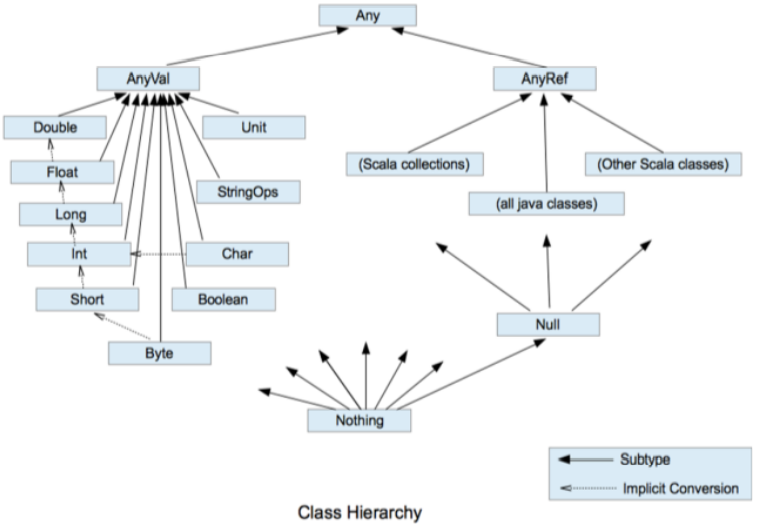

如上图所示：

- `Scala`中一切数据都是对象，都是`Any`的子类
- `Scala`中数据类型分为两大类，分别是数值类型`AnyVal`，引用类型`AnyRef`，**不管是值类型还是引用类型都是对象**
- `Scala`数据类型仍然遵守，低精度的值类型向高精度值类型，自动转换（隐式转换）
- `Scala`中的`StringOps`是对Java中的`String`增强
- `Unit`：对应Java中的`void`，用于方法返回值的位置，表示方法没有返回值。`Unit`是一个数据类型，只有一个对象就是`()`。需要注意的是：`Void`不是数据类型，只是一个关键字
- `Null`是一个类型，只有一个对象就是null。它是所有引用类型`AnyRef`的子类
- `Nothing`，是所有数据类型的子类，主要用在一个函数没有明确返回值时使用，因为这样就可以把抛出的返回值，返回给任何的变量或者函数


接下来逐个看一下数据类型

#### 5.1 整数类型（Byte、Short、Int、Long）

整数类型就是用来存储整数数值的，`Scala`的整数类型主要有以下几类：

| 数据类型                | 描述                    | 范围                                         |
| ----------------------- | ----------------------- | -------------------------------------------- |
| `Byte [1字节]`          | 1字节8位有符号补码整数  | `[-128,127]`                                 |
| `Short [2字节]`         | 2字节16位有符号补码整数 | `[-32768,32767]`                             |
| `Int [4字节]`:star:默认 | 4字节32位有符号补码整数 | `[-2147483648,2147483647]`                   |
| `Long [8字节]`          | 8字节64位有符号补码整数 | `[-9223372036854775808,9223372036854775807]` |

案例：

```scala
package chapter02

object Test05_DataType {
  def main(args: Array[String]): Unit = {
    // 1、Scala各整数类型都有固定的表示范围和字段长度，如果超过就会报错
    var num1:Byte = -128
//    var num2:Byte = 128 // error

    // 2、Scala的默认整数类型是Int，声明Long型，在数值后面必须加 `l`或`L`
    var num3:Long = 127617836L
    var num4:Long = 182781872l
  }
}
```

> Note：声明Long类型，需要在数值后面加`L`或`l`

#### 5.2 浮点类型（Float、Double）

浮点类型就是小数：

| 数据类型                    | 描述                                  |
| --------------------------- | ------------------------------------- |
| `Float [4字节]`             | 4字节32位，IEEE 754标准的单精度浮点数 |
| `Double [8字节]`:star: 默认 | 8字节32位，IEEE 754标准的双精度浮点数 |

案例：

```scala
package chapter02

object Test05_DataType {
  def main(args: Array[String]): Unit = {
	var num1:Double = 12.1214312
    // 声明Float类型，需要在数值后面加f或F
    var num2:Float = 12.121212f
    var num3:Float = 3.1415926F
  }
}
```

> Note：声明Float类型，需要在数值后面加`F`或`f`

#### 5.3 字符类型（Char）

字符类型表示单个字符，一个字节，案例：

```scala
package chapter02

object Test05_DataType {
  def main(args: Array[String]): Unit = {
    // 1、字符变量是用单引号 '' 括起来的单个字符
    var c1 = 'a'  // 自动推断
    var c2:Char = 'b'

    // 2、\t：制表符，一个table
    var c3  = '\t'
    println(s"wzq${c3}18")

    // 3、\n：换行符
    var c4 = '\n'
    println(s"wzq${c4}16")

    // 4、加个 \ 表示转义
    var c5 = '\\'
    var c6 = '\"'
    println(s"大家都说：${c6}这是个斜杆${c5}${c6}")
  }
}
```


#### 5.4 布尔类型（Boolean）

布尔类型，只接受`true`或`false`，占1个字节，这就不用演示了吧？

#### 5.5 Unit类型、Null类型和Nothing类型:star:

| 数据类型  | 描述                                                         |
| --------- | ------------------------------------------------------------ |
| `Unit`    | 表示无值，和其他语言中的`void`等同。用作不反悔任何结果的方法的结果类型。`Unit`只有一个实例值，写成`()` |
| `Null`    | null，`Null`类型只有一个实例值`null`                         |
| `Nothing` | `Nothing`类型在`Scala`的类层级最低端，是任何其他类型的子类型。当一个函数，我们确定没有正常的返回值，可以用`Nothing`来指定返回类型，这样的好处是：可以把返回的值（异常）赋给其他的函数或者变量（兼容性） |

### 6、类型转换

#### 6.1 类型自动转换

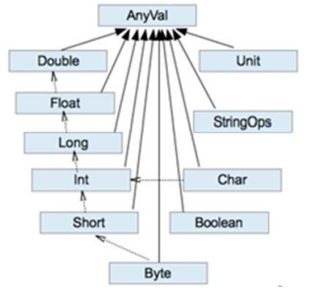

`Scala`会按照上图的**虚线**依次提升变量，这就是自动（隐式）转换，有几点需要注意的地方，直接拿代码来说明，请注意看代码中的注释：

```scala
package chapter02

object Test06_TypeConvert {
  def main(args: Array[String]): Unit = {
    // 1、自动提升原则：有多种类型的数据混合运算时，系统首先将所有数据转换成精度大的那种数值类型，然后再进行计算
    var n1 = 1 + 2.0
    println(n1)

    // 2、把精度大的数值类型赋值给精度小的数值类型时，会报错，反之，进行自动类型转换
    var n2: Double = 1.0
    //    var n3:Int = n2 // 报错

    // 3、(byte,short)和char之间不会相互自动转换
    var n4: Byte = 1
    //    var n5:Char = n4  // 报错
    var n6: Int = n4

    // 4、byte、short、char他们三者可以计算，在计算时首先转换为int类型
    var n7: Byte = 1
    var n8: Char = 1
    var n9: Int = n7 + n8 // 当逐个计算结果类型就是Int
  }
}
```

#### 6.2 强制类型转换

当精度大的数值类型转换为精度小的数值类型时候，需要进行强转：

```
Java: int num = (int)2.5
Scala: var num:Int = 2.7.toInt
```

来看案例：

```scala
package chapter02

object Test06_TypeConvert {
  def main(args: Array[String]): Unit = {
    // 1、将数据由高精度转换为低精度，这就需要使用强制转换
    var n1: Int = 2.5.toInt

    // 2、墙砖符号只针对于最近的操作符有效，使用小括号可以提升优先级
    var n2: Int = 10 * 3.5.toInt + 6 * 1.5.toInt   // 相当于 10 * 3 + 6 * 1 = 36
    var n3: Int = (10 * 3.5 + 6 * 1.5).toInt  // 相当于 44.0.toInt = 44
  }
}
```

`Scala`提供以下转换函数：

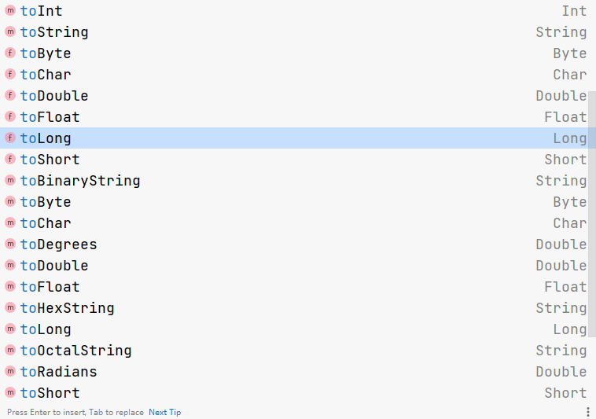


#### 6.3 数值类型和String类型间转换

在开发中经常需要将基本数值类型转换为String，或者将String转换为数值类型

直接来看案例把：

```scala
package chapter02

object Test06_TypeConvert {
  def main(args: Array[String]): Unit = {
    // 1、基本类型转String类型（语法：将基本类型的值+""即可）
    var str1:String = true + ""
    var str2:String = 4.5 + ""
    var str3:String = 100 + ""

    // 2、String类型转基本数值类型（调用相关API）
    var s1:String = "12"
    var n1:Byte = s1.toByte
    var n2:Short = s1.toShort
    var n3:Int = s1.toInt
    var n4:Long = s1.toLong
  }
}
```


> Note：在将String类型转成基本数值类型时，要确保String类型能够转为有效的数据，比如可以把`"123"`转成一个整数，但是不能把`"hello"`转成一个整数
>
> `var n5:Int = "12.6".toInt`会出现`NumberFormatException`异常


## 四、运算符

`Scala`运算符的使用基本和`Java`运算符的使用基本相同，只有个别细节不同，这里比较简单就不做案例演示了

### 1、算术运算符

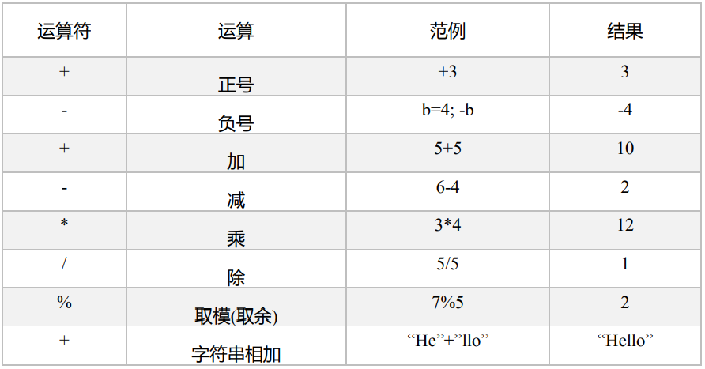

> Note：
>
> - 对于除号`/`，它的整数除和小数除是有区别的：整数之间做除法时，只保留整数部分舍弃小数部分
> - 对一个数取模`a%b`，和Java的取模规则一样

### 2、关系运算符

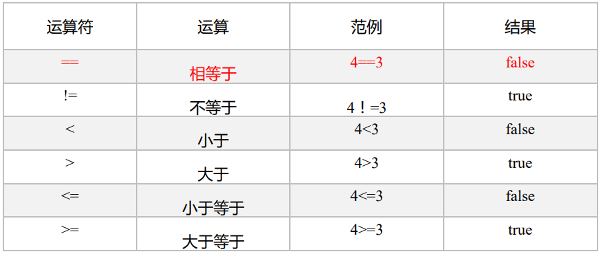

需要注意的是字符串比较`==`Java与Scala的不同

在Java中：

- `==`比较两个变量本身的值，即两个对象在内存中的首地址
- `equals`比较字符串中所包含的内容是否相同

```java
public class TestOperator {
    public static void main(String[] args) {
        String s1 = "hello";
        String s2 = new String("hello");

        boolean b1 = s1 == s2;      // false
        boolean b2 = s1.equals(s2); // true

        System.out.println(b1 + " " + b2);
    }
}
```

但是在`Scala`中，`==`本身就可以判断值是否相同，而`.eq`判断地址是否相同：

```scala
package chapter03

object Test01_Operator {
  def main(args: Array[String]): Unit = {
    val s1:String = "hello"
    val s2:String = new String("hello")

    // 判断值是否相同
    val b1:Boolean = s1 == s2     // true

    // 判断地址是否相同
    val b2:Boolean = s1.eq(s2)    // false

    println(b1 + " " + b2)
  }
}
```


### 3、逻辑运算符

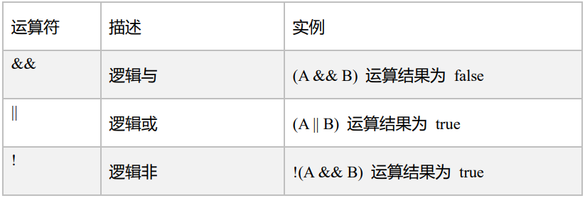


### 4、赋值运算符

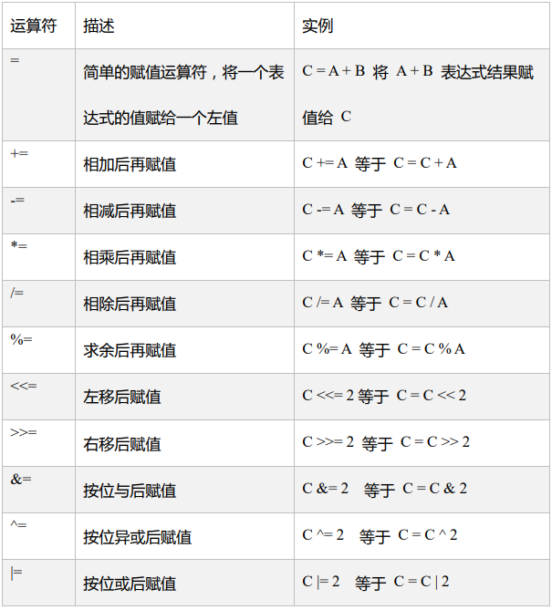

> Scala中没有`++`、`--`，但是可以通过`+=`、`-=`来实现同样的效果

### 5、位运算符

在下表中变量 a = 60，b = 13

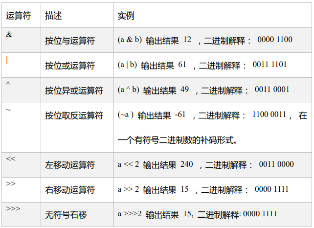

### 6、Scala运算符本质

`Scala`一切面对对象，所以本质上Scala并没有运算符，所有运算符都是方法，以`+`为例

```scala
package chapter03

object Test01_Operator {
  def main(args: Array[String]): Unit = {
    var n1 = 12
    var n2 = 13

    // 1、本质上：
    var n3 = n1.+(n2) // 有个点表示调用 + 方法，然后括号传参

    // 2、但其实为了符合编程习惯，这个点也可以不加
    var n4 = n1 + (n2)

    // 3、当只有一个参数，括号可以省略
    var n5 = n1 + n2
  }
}
```

其实所有其他的操作符都是一样的


## 五、流程控制

### 1、分支控制<span style="color:red">if-else</span>


#### 1.1 if-else基操

分支结构，就是if和else呗，关于分支控制又分为：

- **单分支**，语法：

  ```scala
  if (条件表达式) {
      // 当条件表达式为true，就会执行
      执行代码块
  }
  ```

  案例：输入人的年纪，如果小于20岁，则输出“年轻真好！”

  ```scala
  package chapter04
  
  import scala.io.StdIn
  
  object Test01_if_else {
    def main(args: Array[String]): Unit = {
      println("input age:")
      val age = StdIn.readInt()
      if (age < 20) {
        println("年轻真好！")
      }
    }
  }
  ```

- **双分支**，语法：

  ```scala
  if (条件表达式) {
      执行代码块1
  } else {
      执行代码块2
  }
  ```

  案例：输入人的年纪，如果小于20岁，则输出“年轻真好！”；反之输出“你老了！”

  ```scala
  package chapter04
  
  import scala.io.StdIn
  
  object Test01_if_else {
    def main(args: Array[String]): Unit = {
      println("input age:")
      val age = StdIn.readInt()
      if (age < 20) {
        println("年轻真好！")
      } else {
        println("你老了！")
      }
    }
  }
  ```

- **多分支**，语法：

  ```scala
  if (条件表达式1) {
      执行代码块1
  } else if (条件表达式2) {
      执行代码块2
  } 
  //... 可以添加许多else if
  else {
      执行代码块n
  }
  ```

  案例：输入成绩，如果成绩大于90小于100输出优秀；大于80且小于90输出很好；大于70且小于80输出良好；大于60且小于70输出及格；输入其他的信息则输出不及格

  ```scala
  package chapter04
  
  import scala.io.StdIn
  
  object Test01_if_else {
    def main(args: Array[String]): Unit = {
      println("input score:")
      val score = StdIn.readInt()
      if (score >= 90 && score <= 100) {
        println("优秀！")
      } else if (score >= 80) {
        println("很好！")
      } else if (score >= 70) {
        println("良好")
      } else if (score >= 60) {
        println("几个")
      } else {
        println("不及格")
      }
    }
  }
  ```

- **嵌套分支**，语法：

  ```scala
  if () {
      if () {
          
      } else () {
          
      }
  } else {
      if () {
          
      }
  }
  ```

  案例：如果输入的年龄小于18输出”童年“；如果输入的年龄大于等于18，需要再次判断：如果大于等于18且小于30输出”成年“，反之输出”老年“

  ```scala
  package chapter04
  
  import scala.io.StdIn
  
  object Test01_if_else {
    def main(args: Array[String]): Unit = {
      println("input age:")
      val age = StdIn.readInt()
      if (age < 18) {
        println("童年")
      } else {
        if (age >= 18 && age < 30) {
          println("成年")
        } else {
          println("老年")
        }
      }
    }
  }
  ```


#### 1.2 scala中的if-else是有返回值的！

其实在scala中`if-else`是有返回值的，具体**返回值取决于满足条件的代码体的最后一行**

```scala
package chapter04

import scala.io.StdIn

object Test01_if_else {
  def main(args: Array[String]): Unit = {
    println("input age:")
    val age = StdIn.readInt()
    var res = if (age < 18) {
      "童年"
    } else {
      if (age >= 18 && age < 30) {
        "hello"   // 不会返回
        "成年"
      } else {
        "老年"
      }
    }
    println(res)
  }
}
```

如果分支结构的返回类型不一样，取他们的共同祖先返回

```scala
package chapter04

import scala.io.StdIn

object Test01_if_else {
  def main(args: Array[String]): Unit = {
    println("input age:")
    val age = StdIn.readInt()
    var res = if (age < 18) {
      "童年"
    } else {
      if (age >= 18 && age < 30) {
        "成年"
      } else {
        100
      }
    }
    println(res)
  }
}
```

所以，当逻辑代码**只有一行**的时候，大括号可以省略；就可以做到和Java中的三元运算符一样的效果：

```scala
package chapter04

import scala.io.StdIn

object Test01_if_else {
  def main(args: Array[String]): Unit = {
    println("input age:")
    val age = StdIn.readInt()
    var res = if (age < 18) "童年" else "成年"
    println(res)
  }
}
```

> 分支结构到这里就结束了！在scala中没有`Switch`，他使用一种模式匹配来处理Switch，这个在后面的章节介绍。


### 2、循环控制<span style="color:red">for</span>

`Scala`中的for就和Java中的不太一样了，`Scala`为`for`提供了非常多的特性，这些for循环的特性被称为**for推导式或for表达式**

#### 2.1 范围数据循环（To）

基本语法：

```scala
for ( i <- 1 to 3 ){
    代码执行块
}
```

其中：

- `i`表示循环变量
- 如果加了`to`关键字，那么i将会**从1循环到3**，前后都会遍历到

案例：从1打印到10

```scala
for (i <- 1 to 10) {
  println(i)
}
```


#### 2.2 范围数据循环（Until）

基本语法：

```scala
for (i <- 1 until 3){
    代码执行块
}
```

使用`until`，是前闭合后开的范围，即从 1 遍历到 3-1=2

案例：从1打印到10

```scala
for (i <- 1 until  10 + 1) {
  println(i)
}
```


#### 2.3 循环守卫

基本语法：

```scala
for (i <- 1 to 3 if i != 2){
    代码执行块
}

// 等价于：
for (i <- 1 to 3){
    if(i != 2){
        代码执行块
    }
}
```

循环守卫，即循环保护式（也称条件判断式，守卫）。保护式为true则进入循环体内部，为false则跳过，类似于`continue`

案例：输出1到5中，不等于3的值：

```scala
for (i <- 1 to 5 if i != 3) {
  println(i)
}
```

案例：输出1到10中，所有的偶数

```scala
for (i <- 1 to 10 if i % 2 == 0) {
  println(i)
}
```

其实写这个循环守卫就是：遍历1到10如果 i 对 2取模等于0就执行循环内部代码块 

#### 2.4 循环步长

基本语法：

```scala
for (i <- 1 to 10 by 2) {
    代码执行块
}
```

`by 2`就表示步长，隔这个步数才执行代码块

案例：输出1到10所有的奇数

```scala
for (i <- 1 to 10 by 2) {
  println(i)
}
```

#### 2.5 嵌套循环

在Java中写嵌套循环一般是，一层套一层，在`scala`中，可以这样搞：

```scala
for (i <- 1 to 3 ; j <- 1 to 3){
    代码执行块
}
```

等同于：

```scala
for (i <- 1 to 3){
    for (j <- 1 to 3){
        执行代码
    }
}
```


#### 2.6 引入变量

基本语法：

```scala
// 写成一行，中间使用 ; 分割
for (i <- 1 to 3 ; j = 4 - i){
    代码执行块
}

// 写成多行，for用大括号括起来
for {
    i <- 1 to 3
    j = 4 - i
} {
    代码执行块
}
```

上面的代码等价于：

```scala
for (i <- 1 to 3){
    var j = 4 - i
    代码执行块
}
```


#### 2.7 循环返回值

for也有其返回值，基本语法：

```scala
val res = for (i <- 1 to 10) yield i
```

需要使用`yield`关键字，将遍历过程中处理的结果返回到一个新的`Vector`集合中

案例：将原数据中所有值乘以2，判断二倍后的值能不能被4整除，如果整除返回该数的二倍，反之返回`""`，并把数据返回到一个新的集合中：

```scala
var res = for (i <- 1 to 10) yield {
  if ((i*2) % 4 == 0) i*2 else ""
}
println(res)
```


#### 2.8 倒序打印

如果想倒序一组数据，可以使用`reverse`：

案例：倒叙将一组数存入`res`集合

```scala
var res = for ( i <- 1 to 10 reverse) yield i
println(res)
```

### 3、循环控制<span style="color:red">while和do...while</span>

`while`和`do...while`和Java中一模一样，这里就不在继续介绍了，不过需要注意这俩语句没有返回值


### 4、循环中断

`Scala`中没有`break`和`continue`，是为了更好的适应函数式编程，推荐使用函数式的风格解决break和continue的功能，而不是一个关键字。`Scala`中使用`breakable`控制结构来实现`break`和`continue`功能


共有以下几种方式可以实现退出循环

- 采用异常的方式退出循环

  ```scala
  package chapter04
  
  object Test03_breakAndContinue {
    def main(args: Array[String]): Unit = {
      try {
        for (elem <- 1 to 10) {
          println(elem)
          if (elem == 5) throw new RuntimeException
        }
      } catch {
        case e =>
      }
      println("正常结束循环")
    }
  }
  ```

- 采用`Scala`自带的函数，退出循环

  ```scala
  package chapter04
  
  import scala.util.control.Breaks
  
  object Test03_breakAndContinue {
    def main(args: Array[String]): Unit = {
      Breaks.breakable(
        for (elem <- 1 to 10) {
          println(elem)
          if(elem == 5) Breaks.break()
        }
      )
      println("正常结束循环")
    }
  }
  ```

- 对`break`进行省略

  ```scala
  package chapter04
  
  import scala.util.control.Breaks._
  
  object Test03_breakAndContinue {
    def main(args: Array[String]): Unit = {
      breakable(
        for (elem <- 1 to 10) {
          println(elem)
          if (elem == 5) break
        }
      )
      println("正常结束循环")
    }
  }
  ```


## 六、函数式编程:star:

函数式编程就是解决问题时，将问题分解成一个一个的步骤，将每个步骤进行封装（函数），通过调用这些封装好的步骤，解决问题

例如：请求 -> 用户名、密码 -> 连接JDBC -> 读取数据库

`Scala`语言是一个完全函数式编程语言。万物皆函数。函数的本质可以当作一个值进行传递

### 1、函数基础

#### 1.1 函数基本语法

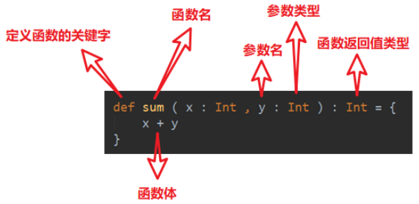

如上图所示，就是这样定义的，可以看到没有`return`，是因为省略了，函数最后一行可以作为返回值返回

案例：定义一个函数，这个函数实现了斐波那契数列的计算：

```scala
package chapter04

object Test04_Function {
  def main(args: Array[String]): Unit = {
    // 斐波那契数列
    def fib(n: Int): Int = {
      if (n == 1 || n == 2) 1 else fib(n - 1) + fib(n - 2)
    }
    println(fib(3))
  }
}
```


#### 1.2 函数和方法的区别

- 为完成某一功能的程序语句的集合，成为函数
- 类中的函数称之为方法
- 函数没有重载和重写的概念；方法可以进行重载和重写
- Scala中函数可以嵌套定义

#### 1.3 函数定义

共有以下几种定义函数的方式：

- 函数1：无参，无返回值
- 函数2：无参，有返回值
- 函数3：有参，无返回值
- 函数4：有参，有返回值
- 函数5：多参，无返回值
- 函数6：多参，有返回值

案例：

```scala
package chapter04

object Test04_Function {
  def main(args: Array[String]): Unit = {
    // 1、无参、无返回值
    def f1(): Unit = {
      println("无参、无返回值")
    }
    f1()

    // 2、无参、有返回值
    def f2(): String = {
      return "无参、有返回值"
    }
    println(f2())

    // 3、有参，无返回值
    def f3(s: String): Unit = {
      println(s)
    }
    f3("abc")

    // 4、有参、有返回值
    def f4(s: String): String = {
      return s
    }
    f4("abc")

    // 5、多参，无返回值
    def f5(age: Int, name: String): Unit = {
      println(s"${age} ${name}")
    }
    f5(12, "abc")

    // 6、多参，有返回值
    def f6(age: Int, name: String): String = {
      return age + name
    }
    println(f6(12, "abc"))
  }
}
```

#### 1.4 函数参数

`Scala`中的参数共有以下几种特性：

- 可变参数
- 如果参数列表中存在多个参数，那么可变参数一般放到最后
- 参数可以有默认值，一般将有默认值的参数放在参数列表的后面
- 带名参数

结合案例看一下这几个特性：

```scala
package chapter04

object Test04_Function {
  def main(args: Array[String]): Unit = {
    // 1、可变参数
    def f1(s: String*): Unit = {
      println(s)
    }
    f1("Hello", "World", "Hello", "Scala") // 这些都是s的值
    f1() // 当然也可以没有值传递

    // 2、如果参数列表中存在多个参数，可变参数一般放在最后
    def f2(name: String, hobby: String*): Unit = {
      println(name + "," + hobby)
    }
    f2("这里是name", "第一个hobby", "第二个hobby")
    f2("这是name") // 当然hobby也可以不加

    // 3、参数默认值，一般情况下，将有默认值的参数放置在参数列表的后面
    def f3(name: String, age: Int = 18): Unit = {
      println(name + "," + age)
    }
    f3("wzq") // 有默认值，可以不加age参数
    f3("wtt", 3) // 也可以覆盖掉默认值

    // 4、带名参数，就是说在调用函数的时候，可以加上参数名进行传值
    f3(name = "wzqwtt", age = 1)
  }
}
```


#### 1.5 函数至简原则:star:

函数至简：能省则省，看一下Scala是怎么省的，都有什么规则

- `return`可以省略，`Scala`会使用函数体的最后一行代码作为返回值
- 如果函数体只有一行代码，可以省略花括号
- 返回值类型如果能够推断出来，那么可以省略 （`:`和返回值类型一起省略）
- 如果有`return`，则不能省略返回值类型，必须指定
- 如果函数明确声明`Unit`，那么即使函数体中使用`return`关键字也不起作用
- `Scala`如果期望是无返回值类型，则可以省略等号
- 如果函数无参，但是声明了参数列表，那么调用时，小括号，可加可不加
- 如果函数没有参数列表，那么小括号可以省略，调用时小括号必须省略
- 如果不关心名称，只关心逻辑处理，那么函数名(def)可以省略


案例：

```scala
package chapter04

object Test04_Function {
  def main(args: Array[String]): Unit = {
    // 0、函数标准写法
    def f0(str: String): String = {
      return str + "haha"
    }
    println(f0("wzq"))

    // 至简原则：能省则省
    // 1、return可以省略，Scala会使用函数体的最后一行代码作为返回值
    def f1(str: String): String = {
      str + ""
    }
    println(f1("wtt"))

    // 2、如果函数体只有一行代码，则可以省略花括号
    def f2(str: String): String = str + "haha"
    println(f2("wzq"))

    // 3、返回值类型如果能够推断出来，那么可以省略 声明返回值的部分
    def f3(str: String) = str + "haha"
    println(f3("wtt"))

    // 4、如果有return，则不能省略返回值类型，必须指定！
    def f4(): String = {
      return "abc"
    }
    println(f4())

    // 5、如果函数明确声明Unit，那么即使函数体中使用return关键字也不起作用
    def f5(): Unit = {
      return "abc" // 不起作用了
    }
    println(f5())

    // 6、Scala如果期望是无返回值类型，则可以省略等号
    // 将无返回值的函数称之为函数
    def f6() {
      "abc"
    }
    println(f6())

    // 7、如果函数无参，但是声明了参数列表，那么调用时，小括号，可加可不加
    def f7() = "wtt"
    println(f7())
    println(f7)  // 可不加

    // 8、如果函数没有参数列表，那么小括号也可以省略，但是调用时候小括号也必须省略
    def f8 = "wzqwtt"
    println(f8)

    // 9、如果不关心名称，只关心逻辑处理，那么函数名(def)可以省略
    def f9 = (x:String) =>{println("wzq")}
    
    def f10(f:String=>Unit) = {
      f("")
    }
    f10(f9)
    println(f10((x:String)=>{println("wzqwtt")}))
  }
}
```


### 2、函数高级

#### 2.1 高阶函数

对于一个函数，可以：定义函数、调用函数；前面已经介绍了怎么定义和怎么调用，但是还有更高阶的用法：

- **函数作为值进行传递**

  ```scala
  package chapter04
  
  object Test05_Lambds {
    def main(args: Array[String]): Unit = {
      def foo(): Unit = {
        println("foo...")
      }
  
      // 1、调用foo函数，把返回值给变量f
      val f = foo
      println(f)
  
      // 2、在被调用foo后面加上 _ 相当于把函数foo()当成一个整体传递给变量
      val f1 = foo _
      f1()
      foo()
    }
  }
  ```

- 函数作为参数进行传递

  ```scala
  package chapter04
  
  object Test05_Lambds {
    def main(args: Array[String]): Unit = {
      // 1、定义一个函数，函数参数还是一个函数签名
      // f表示函数名称；(Int,Int)表示输入的两个Int参数
      // => 表示函数返回值
      def f1(f: (Int, Int) => Int): Int = {
        f(2, 4)
      }
  
      // 2、定义一个函数，参数和返回值类型和f1的输入参数一致
      def add(a: Int, b: Int): Int = a + b
  
      // 3、将add作为参数传递给f1函数
      println(f1(add))
      println(f1(add _))
  
      // 4、也可以传递匿名函数
      println(f1((a: Int, b: Int) => a + b))
    }
  }
  ```

  

#### 2.2 匿名函数

没有名字的函数就是匿名函数，定义如下：

```scala
(x:Int) => {函数体}
```

匿名函数作为参数传递给函数的时候，有几个至简原则，看两个需求吧

**需求1：传递的函数只有一个参数**（函数至简原则，在下面代码中有体现）

```scala
package chapter04

object Test06 {
  def main(args: Array[String]): Unit = {
    // 1、定义一个函数：参数包含数据和逻辑函数
    def operation(arr: Array[Int], op: Int => Int) = {
      for (elem <- arr) yield op(elem)
    }

    // 2、定义逻辑函数
    def op(ele: Int): Int = {
      ele + 1
    }

    // 3、标准函数调用
    val arr = operation(Array(1, 2, 3, 4), op)
    println(arr.mkString(","))

    // =============================================
    // 函数至简原则
    // 4.1 匿名函数
    val arr1 = operation(Array(1, 2, 3, 4), (ele: Int) => {
      ele + 1
    })
    println(arr1.mkString(","))

    // 4.2 使用匿名函数，参数类型可以省略，会根据形参进行自动推断
    val arr2 = operation(Array(1, 2, 3, 4), (ele) => {
      ele + 1
    })
    println(arr2.mkString(","))

    // 4.3 类型省略后，如果只有一个参数，则圆括号可以省略
    // 没有参数或参数超过1，圆括号则不能省略
    val arr3 = operation(Array(1, 2, 3, 4), ele => {
      ele + 1
    })
    println(arr3.mkString(","))

    // 4.4 匿名函数如果只有一行，大括号也可以省略
    val arr4 = operation(Array(1, 2, 3, 4), ele => ele + 1)
    println(arr4.mkString(","))

    // 4.5 如果参数只出现一次，则参数省略且后面的参数可以用 _ 代替
    val arr5 = operation(Array(1, 2, 3, 4), _ + 1)
    println(arr5.mkString(","))
  }
}
```

**需求2：传递两个参数**

```scala
package chapter04

object Test07 {
  def main(args: Array[String]): Unit = {
    // 定义一个函数，传递三个参数分别是两个整数，和一个匿名函数
    // 这个匿名函数可以对a和b作一步操作，返回一个Int值
    def calculator(a: Int, b: Int, op: (Int, Int) => Int): Int = {
      op(a, b)
    }

    // 1、标准匿名函数
    calculator(1, 2, (x: Int, y: Int) => {
      x + y
    })
    println(calculator(1, 2, (x: Int, y: Int) => {
      x - y
    }))

    // 2、如果只有一行可以省略大括号
    println(calculator(1, 2, (x: Int, y: Int) => x + y))
    println(calculator(1, 2, (x: Int, y: Int) => x - y))

    // 3、参数的类型可以省略，会帮助我们进行自动推断
    println(calculator(1, 2, (x, y) => x + y))
    println(calculator(1, 2, (x, y) => x - y))

    //4、如果参数只出现一次，则参数省略且后面参数可以用 _ 代替
    println(calculator(1, 2, _ + _))
    println(calculator(1, 2, _ - _))
  }
}
```


#### 2.3 高阶函数案例

```scala
package chapter04

import scala.collection.mutable.ArrayBuffer

object Test09 {
  def main(args: Array[String]): Unit = {
    val arr: Array[Int] = Array(1, 2, 3, 4, 7, 8, 5, 6, 9)

    // 1、mapper操作，就是把数组中的每个元素进行变化
    def map(arr: Array[Int], op: Int => Int): Array[Int] = {
      for (ele <- arr) yield op(ele)
    }

    println(map(arr, _ + 1).mkString(",")) // +1
    println(map(arr, _ - 1).mkString(",")) // -1
    println(map(arr, _ * 2).mkString(",")) // *2
    println(map(arr, Math.pow(_, 2).toInt).mkString(",")) // ^2

    // 2、filter过滤
    def filter(arr: Array[Int], op: Int => Boolean) = {
      var arr1: ArrayBuffer[Int] = ArrayBuffer[Int]()
      for (elem <- arr if op(elem)) {
        arr1.append(elem)
      }
      arr1.toArray
    }

    println(filter(arr, _ % 2 == 1).mkString(","))

    // 3、reduce聚合
    def reduce(arr: Array[Int], op: (Int, Int) => Int) = {
      var init: Int = arr(0)
      for (elem <- 1 until arr.length) {
        init = op(init, elem)
      }
      init
    }
    val arr2 = reduce(arr,_*_)
    println(arr2)

  }
}
```

#### 2.4 函数柯里化&闭包

**闭包：**如果一个函数，访问到了它的外部变量的值，那么这个函数和他所处的环境，称为闭包

**函数柯里化：**把一个参数列表的多个参数，变成多个参数列表

案例：定义一个函数`func`，它接收一个Int类型的参数，返回一个函数（记作f1）。它返回的函数f1，接受一个String类型的参数，同意返回一个函数（记作f2）。函数f2接受一个Char类型的参数，返回一个Boolean值

要求调用函数`func(0)("")('0')`得到的返回值是false，反之返回true

```scala
package chapter04

object Test08 {
  def main(args: Array[String]): Unit = {
    //闭包
    def func(i: Int): String => (Char => Boolean) = {
      def f1(s: String): Char => Boolean = {
        def f2(c: Char): Boolean = {
          !(i == 0 && s == "" && c == '0')
        }
        f2
      }
      f1
    }

    println(func(0)("")('0'))
    println(func(1)("a")('1'))
    println(func(2)("b")('3'))

    // 简写：
    val func1 = (i: Int) => (s: String) => (c: Char) => !(i == 0 && s == "" && c == '0')
    println(func1(0)("")('0'))
    println(func1(1)("a")('1'))
    println(func1(2)("b")('3'))

    // 柯里化
    def func2(i: Int)(s: String)(c: Char): Boolean = {
      !(i == 0 && s == "" && c == '0')
    }
    println(func2(0)("")('0'))
    println(func2(1)("a")('1'))
    println(func2(2)("b")('3'))
  }
}
```


#### 2.5 控制抽象

- 值调用：把计算后的值传递过去

  ```scala
  package chapter04
  
  object Test12 {
    def main(args: Array[String]): Unit = {
      def foo(a: Int): Unit = {
        println(a)
        println(a)
      }
  
      foo(12)
  
      def f = () => {
        println("f...")
        10
      }
      foo(f())
    }
  }
  ```

- 名调用：把代码块传递过去

  ```scala
  package chapter04
  
  object Test12 {
    def main(args: Array[String]): Unit = {
      def f = () => {
        println("f..")
        10
      }
  
      def foo(a: => Int): Unit = {
        println(a)
        println(a)
      }
  
      // 传递代码块
      foo(f())
      
      foo({
        var sum = 0
        for (elem <- 1 to 10) sum += elem
        sum
      })
  
    }
  }
  ```


案例：实现一个`while`循环：

```scala
package chapter04

import scala.Boolean

object Test11 {
  def main(args: Array[String]): Unit = {
    // 1、常规while
    var n = 10
    while (n >= 1) {
      println(n)
      n -= 1
    }

    // 2、自定义while
    def myWhile(condition: => Boolean): (=> Unit) => Unit = {
      def doLoop(op: => Unit): Unit = {
        if (condition) {
          op
          myWhile(condition)(op)
        }
      }

      doLoop _
    }

    println("=" * 30)
    n = 10
    myWhile(n >= 1)({
      println(n)
      n -= 1
    })

    // 3、简化
    def myWhile1(condition: => Boolean): (=> Unit) => Unit = {
      op => {
        if (condition) {
          op
          myWhile1(condition)(op)
        }
      }
    }

    println("=" * 30)
    n = 10
    myWhile1(n >= 1)({
      println(n)
      n -= 1
    })

    // 3、柯里化
    def myWhile2(condition: => Boolean)(op: => Unit): Unit = {
      if(condition){
        op
        myWhile2(condition)(op)
      }
    }
    println("=" * 30)
    n = 10
    myWhile2(n >= 1)({
      println(n)
      n -= 1
    })

  }
}
```


#### 2.6 惰性加载

当函数返回值被声明为`lazy`时，函数的执行将被推迟，直到我们首次对此取值，该函数才会执行。这种函数称为惰性函数

```scala
package chapter04

object Test10 {
  def main(args: Array[String]): Unit = {
    lazy val res = sum(10, 30)
    println("-----------------")
    println("res = " + res)
  }

  def sum(i: Int, j: Int): Int = {
    println("sum被执行...")
    i + j
  }
}
```

> `lazy`不能修饰var变量


## 七、面向对象

### 1、Scala包

#### 1.1 包的命名以及包的管理风格

基本语法：

```scala
package 包名
```

`scala`的包的作用和Java一样，帮助我们区分相同名字的类、当类很多的时候也可以很好的管理类、控制访问范围等


在`scala`中包的命名只能包含数字、字母、下划线、小圆点，但不能用数字开头，也不能使用关键字。比如：

```scala
demo.class.exec1   // 错误，因为有class关键字
demo.12a   // 错误，数字开头
```

包一般是小写字母+小圆点的命名：

```scala
com.公司名.项目名.业务模块名
```


Scala有两种包的管理风格，一种方式和Java包管理风格相同，每个源文件一个包（**包名和源文件所在路径不要求必须一致**），包名用`"."`进行分割表示包的层级关系，比如：`com.wzq.scala`


另外一种风格是通过嵌套的风格表示层级关系，比如：

```scala
package aaa {
    package bbb {
        package ccc {
            
        }
    }
}
```

第二种方式一个源文件中可以声明多个`package`，子包的类可以直接访问父包中的内容，无需导包，比如：

```scala
package com {

  import com.wzq.Inner // 父包访问子包需要导包

  object Outer {
    val name: String = "out"

    def main(args: Array[String]): Unit = {
      println(Inner.age) // 父包访问子包需要导包
    }
  }

  package wzq {
    object Inner {

      val age: Int = 13

      def main(args: Array[String]): Unit = {
        println(Outer.name) // 子包访问父包不需要导包
      }
    }
  }

}

package wtt {
}
```


#### 1.2 包对象

在Scala中可以为每个包定义一个`同名`的包对象，定义在包对象中的成员，作为其对应包下所有`class`和`object`的共享变量，可以被直接访问，定义：

```scala
package object chapter05 { // 必须和当前包同名
  val shareValue: String = "我是一个共享变量"
  def shareMethon(): Unit = {
    println("我是一个共享方法")
  }
}
```

#### 1.3 导包说明

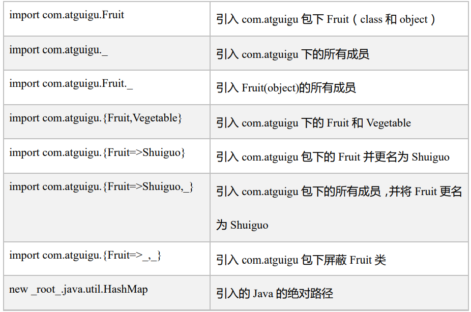

另外，`Scala`中有三个默认的导入：

```scala
import java.lang._
import scala._
import scala.Predef._
```

### 2、类和对象

#### 2.1 定义类

在`Scala`中没有`public`关键字，所有只要创建出来的类都具有公有可见性，即默认就是`public`，另外一个Scala源文件可以包含多个类：

```scala
package chapter05

// 类不声明为public，默认就是public
class Person {

}
// 一个scala源文件可以包含多个类
class Teacher {

}
```


#### 2.2 类的属性

属性是类的组成部分，定义语法：

```scala
@BeanProperty     // 可选，自动生成规范的setXxx/getXxx方法
[修饰符] val 或 var 属性名称 [:类型] = 属性值
```

实操：

```scala
package chapter05

import scala.beans.BeanProperty

class Person1 {
  var name: String = "wzq" // 定义属性
  var age: Int = _ // _表示给属性一个默认值

  @BeanProperty // 自动生成getter和setter方法
  var sex: String = "男"

  // val修饰的属性是不能够赋默认值的，必须显示指定
}

object Person1 {
  def main(args: Array[String]): Unit = {
    val person = new Person1()
    person.name = "xxx"
    println(person.name)
    println(person.age)
    person.setSex("中性")
    println(person.getSex)
  }
}
```

修饰符部分在`封装`章节聊一下吧！

### 3、封装

封装就是把抽象出的数据和对数据的操作封装在一起，数据被保护在内部，程序的其他部分只有通过被授权的操作，才能对数据进行操作。Java中的封装操作如下：

- 将属性进行私有化
- 提供一个公共的set方法，用于对属性赋值
- 提供一个公共的get方法，用于获取属性的值

scala中的public属性，底层实际上是private，并通过get方法和set方法对其进行操作。**所以`Scala`并不推荐将属性设为private，再为其提供public的get和set方法的做法。**但是由于很多Java框架都利用反射调用`getXxx`和`setXxx`方法，有时候为了和这些框架兼容，也会为Scala的属性设置`getXxx`和`setXxx`方法，这里通过`@BeanProperty`实现

#### 3.1 访问权限

在Scala中，有以下关于权限的修饰符：

- Scala中属性和方法的默认访问权限为`public`，但`Scala`中没有`public`关键字
- private为私有权限，只有在类的内部和伴生对象中可用，不推荐使用
- protected为受保护权限，Scala中受保护权限比Java中更严格，同类、子类可以访问，同包无法访问
- private [包名]增加包访问权限，包名下的其他类也可以使用

```scala
package chapter05

class Person2 {
  private var name: String = "wzq" // 私有属性，只有该类和其伴生对象可以访问
  protected var age: Int = 18 // 受保护的属性
  private[chapter05] var sex: String = "男" // 包私有，该包下的所有类可以访问

  def say(): Unit = {
    println(s"person : $name $age $sex")
  }
}

object Person2 {
  def main(args: Array[String]): Unit = {
    val person = new Person2
    person.say()
    println(person.age)
    println(person.name)
  }
}

class Teacher1 extends Person2 {
  def test(): Unit = {
    println(this.age)
    //    println(this.name)  // 因为name私有，所以访问不到
    println(this.age)
  }
}

class Animal {
  // 方法没有参数，括号可以省略
  def test: Unit = {
    println(new Person2().sex)
  }
}
```

#### 3.2 方法

语法：

```scala
def 方法名(参数列表) [:返回类型] = {
    方法体
}
```

案例：

```scala
package chapter05

class Test05 {
  def operator(n1: Int, n2: Int, f: (Int, Int) => Int): Int = {
    f(n1, n2)
  }
}

object Test05 {
  def main(args: Array[String]): Unit = {
    val test = new Test05
    println(test.operator(1, 2, (a: Int, b: Int) => {
      a + b
    }))
    println(test.operator(1, 2, (a: Int, b: Int) => {
      a - b
    }))

    // 简写
    println(test.operator(1, 2, (a, b) => a + b))
    println(test.operator(1, 2, (a, b) => a - b))

    println(test.operator(1, 2, _ + _))
    println(test.operator(1, 2, _ - _))
  }
}
```


#### 3.3 创建对象

语法：

```scala
val | var 对象名 [:类型] = new 类型()
```

其中：

- val修饰对象，不能改变对象的引用（内存地址），但可以改变对象属性的值
- var修饰对象，可以修改对象的应用和修改对象的属性值
- 自动推断变量类型不能多台，所以多台需要显示声明

案例：

```scala
package chapter05

class Test06 {
  var name: String = "wzq"
  val age: Int = 18
}

object Test06 {
  def main(args: Array[String]): Unit = {
    // val修饰对象，不能改变对象的引用，但可以改变对象属性的var修饰的属性值
    val test1 = new Test06 // 没有参数，所以类的小括号也可以省略
    //    test1 = new Test06()  // 报错
    test1.name = "wtt"
    //    test1.age = 19    // 报错，因为age是val属性

    var test2: Test06 = new Test06()
    test2 = new Test06()    // 可以改变引用地址
//    test2.age = 18  // 但依旧不能修改val修饰的属性
  }
}
```

#### 3.4 构造器

和Java一样，Scala构造对象也需要调用构造方法，并且可以有任意多个构造方法，**Scala类的构造器包括：主构造器和辅助构造器**

语法：

```scala
class 类名(形参列表) {		// 主构造器
	类体
    
    def this(形参列表){	
        // 辅助构造器1
    }
    
    def this(形参列表){
        // 辅助构造器2
    }
}
```

其中：

- 辅助构造器，函数名称必须为`this`，可以有多个，编译器通过参数的个数以及类型来区分
- 辅助构造方法不能直接构建对象，必须直接或间接调用主构造方法
- 构造器调用其他另外的构造器，要求被调用的构造器必须提前声明

案例：

```scala
package chapter05

// 如果主构造方法无参数，则()可以省略
//class Test07() {  等于下一行
class Test07 {
  // 这里就直接相当于主构造器执行的语句了
  var name: String = _ // 还记得下划线代表什么吗
  var age: Int = _
  println("主构造器被调用了")

  def this(name: String) {
    this() // 必须要调用主构造器
    this.name = name
    println("辅助构造器1被调用了")
  }

  def this(name: String, age: Int) {
    this(name) // 调用之前的辅助构造器
    this.age = age
    println("辅助构造器2被调用了")
  }

  def printInfo(): Unit = {
    println(s"Test07 $name $age")
  }

}

object Test07 {
  def main(args: Array[String]): Unit = {
    val wzq = new Test07("wzq", 12)
    wzq.printInfo   // 这个方法也可以省略掉括号
  }
}
```


#### 3.5 构造器参数

`Scala`类的主构造器函数的形参包括三种类型：未用任何修饰、var修饰、val修饰

- 未用任何修饰符修饰，这个参数就是一个局部变量
- var修饰参数，可以作为类的成员属性使用，可以修改
- val修饰参数，作为类的只读属性使用，不能修改

```scala
package chapter05

// 可以省略掉 大花括号{}
class Test08(name: String, var age: Int, val sex: String)

object Test08 {
  def main(args: Array[String]): Unit = {
    val test = new Test08("wzq", 12, "男")
    //    test.name   // 这个是访问不到的
    println(test.age)
    //    test.sex = "女"    // val不可修改
  }
}
```


### 4、继承和多态

语法：

```scala
class 子类名 extends 父类名 {类体}
```

- 子类继承父类的属性和方法
- scala是单继承

案例：

```scala
package chapter05

object Test09 {
  def main(args: Array[String]): Unit = {
    val emp = new Emp9("wzq", 12, 1)
  }
}

class Person9(nameParam: String) {
  var name = nameParam
  var age: Int = _
  println("父类主构造器")

  def this(nameParam: String, ageParam: Int) {
    this(nameParam)
    this.age = ageParam
    println("父类辅助构造器")
  }
}

class Emp9(nameParam: String, ageParam: Int) extends Person9(nameParam, ageParam) {
  var empNo: Int = _

  def this(nameParam: String, ageParam: Int, empNoParam: Int) {
    this(nameParam, ageParam)
    this.empNo = empNoParam
    println("子类辅助构造器")
  }
}
```

**动态绑定：**Scala中属性和方法都是动态绑定，而Java中只有方法为动态绑定

```scala
package chapter05

object Test10 {
  def main(args: Array[String]): Unit = {
    val teacher: Teacher10 = new Teacher10
    println(teacher.name)
    teacher.hello

    val person: Person10 = new Teacher10
    println(person.name)
    person.hello
  }
}

class Person10 {
  val name: String = "person10"

  def hello(): Unit = {
    println("hello person")
  }
}

class Teacher10 extends Person10 {
  override val name: String = "Teacher10"

  override def hello(): Unit = {
    println("hello teacher")
  }
}
```


### 5、抽象类

#### 5.1 抽象属性和抽象方法

基本语法：

```scala
// 定义抽象类，abstract关键字
abstract class Person {} 
// 定义抽象属性，一个属性没有初始化，就是抽象属性
val|var name:String
// 定义抽象方法，只声明而没有实现的方法
def hello():String
```

抽象类下面可以写抽象的方法或属性，也可以是具体的，案例：

```scala
package chapter05

object Test11 {
  def main(args: Array[String]): Unit = {
    val teacher = new Teacher11
    teacher.sayHi()
    teacher.sayHello()
  }
}

abstract class Person11 {
  val name: String // 抽象属性
  var age: Int = _ // 也可以有具体的赋值

  // 抽象方法
  def sayHi(): Unit

  // 实现的方法
  def sayHello(): Unit = println(s"hello $age")
}

class Teacher11 extends Person11 {
  override val name: String = "teacher11"

  override def sayHi(): Unit = println(s"hi $name $age")
}
```

有需要注意的几个地方：

- 如果父类为抽象类，那么子类需要将抽象的属性和方法实现，否则子类也要声明为抽象类
- 重写非抽象方法需要用`override`修饰，重写抽象方法可以不加`override`
- 子类调用父类的方法使用`super`关键字
- 子类对抽象属性进行实现，父类抽象属性可以用var修饰；子类对非抽象属性重写，父类非抽象属性不支持var（因为var修饰的可变变量，子类继承后就可以直接使用，没有必要重写）

#### 5.2 匿名子类

和Java一样，可以创建匿名内部类：

```scala
package chapter05

object Test12 {
  def main(args: Array[String]): Unit = {
    val person = new Person12 {
      val name: String = "wzq"
      age = 18

      def sayHi(): Unit = println(s"hi $name")
    }
    person.sayHi()
    person.sayHello()
  }
}

abstract class Person12 {
  val name: String // 抽象属性
  var age: Int = _ // 也可以有具体的赋值

  // 抽象方法
  def sayHi(): Unit

  // 实现的方法
  def sayHello(): Unit = println(s"hello $age")
}
```


### 6、单例对象（伴生对象）

Scala没有`static`关键字，所以没有静态的操作。但是为了能够与Java语言进行交互，就产生了一种特殊的对象来模拟类对象，该对象就是单例对象。若单例对象名与类名一致，则称该单例对象是这个类的伴生对象，这个类中所有“静态”的内容都可以放在它的伴生对象中声明


#### 6.1 单例对象语法

语法：

```scala
object test{
    val name:String = "China"
}
```

案例：

```scala
package chapter05

object Test13 {
  def main(args: Array[String]): Unit = {
    // 伴生对象中的属性和方法都可以通过伴生对象名直接进行访问
    println(Person13.age)
    // name属性则必须要new一个实例
  }
}

class Person13 {
  var name: String = "wzq"
}

// 伴生对象采用object关键字声明，名字应该与类相同
object Person13 {
  var age: Int = 19
}
```

#### 6.2 apply方法

- 通过伴生对象的`apply`方法，可以实现不使用`new`方法创建对象
- 如果想让主构造器变成私有的，可以在`()`之前加上`private`
- `apply`方法可以重载

案例：

```scala
package chapter05

object Test14 {
  def main(args: Array[String]): Unit = {
    var p1 = Person14()
    println(p1.name)
    var p2 = Person14("wtt")
    println(p2.name)
  }
}

class Person14(var name: String)

object Person14 {
  // 空参调用
  def apply(): Person14 = {
    new Person14("wzq")
  }

  // 有参
  def apply(name: String): Person14 = {
    new Person14(name)
  }
}
```

### 7、特质（trait）

#### 7.1 特质基本语法

Scala中用特质的概念代替接口的概念，也就是说：当多个类具有相同的特质时，就可以将这个特质独立出来，采用`trait`关键字声明

Scala 中的 trait 中即可以有抽象属性和方法，也可以有具体的属性和方法，一个类可 以混入（mixin）多个特质。这种感觉类似于 Java 中的抽象类。

声明特质的语法：

```scala
trait 特质名{
    trait 主体
}
```

一个类在使用特质的情况下，也采用`extends`关键字，语法：

```scala
// 没有父类的情况
class 类名 extends 特质1 with 特质2 with 特质3 with....
// 有父类的情况
class 类名 extends 父类 with 特质1 with 特质2 with ...
```

需要说明的是：

- 特质可以同时拥有抽象方法和具体方法
- 一个类可以混入（mixin）多个特质
- 所有的Java接口都可以当作Scala特质使用
- **动态混入：**可灵活的扩展类功能
  - 创建对象时混入trait，而无需使用类混入该trait
  - 如果混入的trait中有未实现的方法，则需要实现

案例：

```scala
package chapter05

object Test15 {
  def main(args: Array[String]): Unit = {
    val teacher1 = new Teacher15
    teacher1.say()
    teacher1.eat()

    // 动态混入
    val teacher2 = new Teacher15 with Sex15 {
      override var sex: String = "男"
    }
    println(teacher2.sex)
  }
}

trait Person15 {
  // 特质可以同时拥有抽象方法和具体方法
  var name: String = _
  // 抽象属性
  var age: Int

  // 声明方法
  def eat(): Unit = println("eat")

  // 抽象方法
  def say(): Unit
}

trait Sex15 {
  var sex: String
}

// 一个类可以实现/继承多个特质
// 所有的Java接口都可以当作Scala特质使用
class Teacher15 extends Person15 with java.io.Serializable {
  override var age: Int = _

  override def say(): Unit = println("say")
}
```


#### 7.2 特质叠加

由于一个类可以混入多个trait，且trait中可以有具体的属性和方法，若混入的特质中具有相同的方法（方法名、参数、返回值均相同），必然会出现继承冲突的问题。冲突分为以下两种：

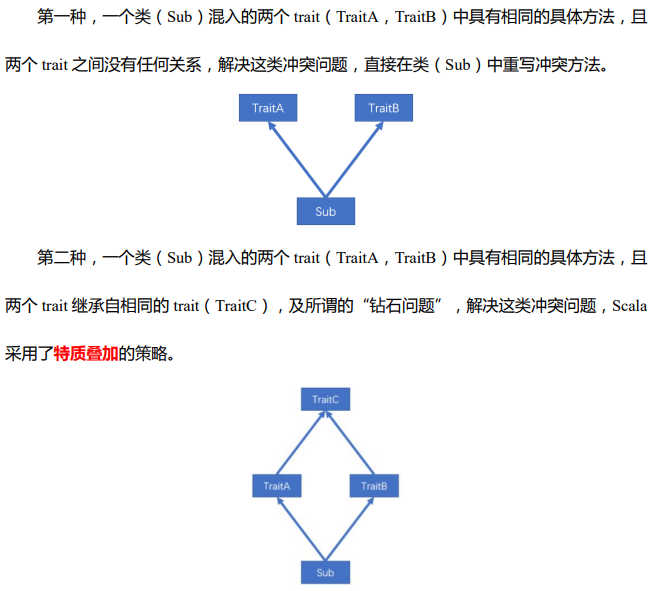

第一种情况：

```scala
trait traitA {
  def testMethod(): Unit = println("Trait A test Method")
}

trait traitB {
  def testMethod(): Unit = println("Trait B test Method")
}

class Sub extends traitA with traitB {
  override def testMethod(): Unit = println("Sub test Method")
}
```

第二种情况：特质叠加

```scala
package chapter05

object Test17 {
  def main(args: Array[String]): Unit = {
    val ball = new MyBall
    println(ball.describe())
  }
}

trait Ball {
  def describe(): String = "ball"
}

trait Color extends Ball {
  val color = "red"
  override def describe(): String = color + "-" + super.describe()
}

trait Category extends Ball {
  val category = "foot"
  override def describe(): String = category + "-" + super.describe()
}

class MyBall extends Category with Color{
  override def describe(): String = "my ball is a " + super.describe()
}
```

输出：

```
my ball is a red-foot-ball
```


> 如果单纯的想调用某个特质中的方法，可以：
>
> ```scala
> super[Category].describe()
> ```

#### 7.3 特质叠加执行顺序

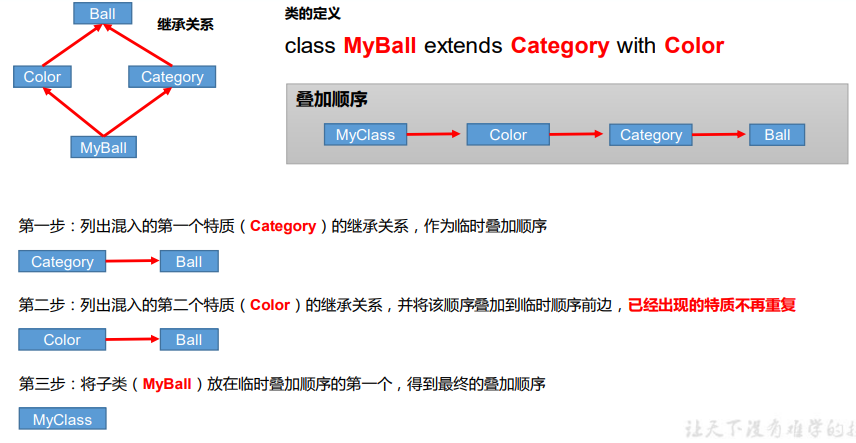

#### 7.4 特质自身类型

自身类型可以实现依赖注入的功能：

```scala
package chapter05

object Test18 extends APP with Dao {
  def main(args: Array[String]): Unit = {
    login(new User("wzq", 19))
  }
}

class User(val name: String, val age: Int)

trait Dao {
  def insert(user: User): Unit = {
    println("insert into table " + user.name)
  }
}

trait APP {
  _: Dao =>

  def login(user: User): Unit = {
    println("login : " + user.name)
    insert(user)
  }
}
```


#### 7.5 特质和抽象类的区别

- 优先使用特质。一个类扩展多个特质是很方便的，但却只能扩展一个抽象类。 
- 如果你需要构造函数参数，使用抽象类。因为抽象类可以定义带参数的构造函数， 而特质不行（有无参构造）。

### 8、扩展


#### 8.1 类型检查和转换

- `obj.isInstanceOf[T]`：判断obj是不是T类型
- `obj.asInstanceOf[T]`：将obj强转成T类型
- `classOf`：获取对象的类名

#### 8.2 枚举类型和应用类

枚举类：需要继承`Enumeration`

应用类：需要继承`App`

案例：

```scala
package chapter05

object Test19 {
  def main(args: Array[String]): Unit = {
    println(Color.RED)
  }
}

object Color extends Enumeration {
  val RED = Value(1,"RED")
  val YELLOW = Value(2,"YELLOW")
  val BLACK = Value(3,"BLACK")
}

object Test extends App{
  println("xxxxxxxxx")
}
```


#### 8.3 Type定义新类型

使用 type 关键字可以定义新的数据数据类型名称，本质上就是类型的一个别名

```scala
package chapter05

object Test20 {
  def main(args: Array[String]): Unit = {
    type MyString = String
    var name:MyString = "wzq"
  }
}
```


## 八、集合 :star:

### 1、集合简介

`Scala`的集合有三大类：序列`Seq`、集`Set`、映射`Map`，所有的集合都扩展来自`Iterable`特质，Scala的集合大致分为：

- 不可变集合：`scala.collection.immutable`，指该集合对象不可修改，每次修改都会返回一个新对象，而不会对原对象进行修改
- 可变集合：`scala.collection.mutable`，可以直接对原对象进行修改，而不会返回新的对象。


#### 1.1 不可变集合继承图

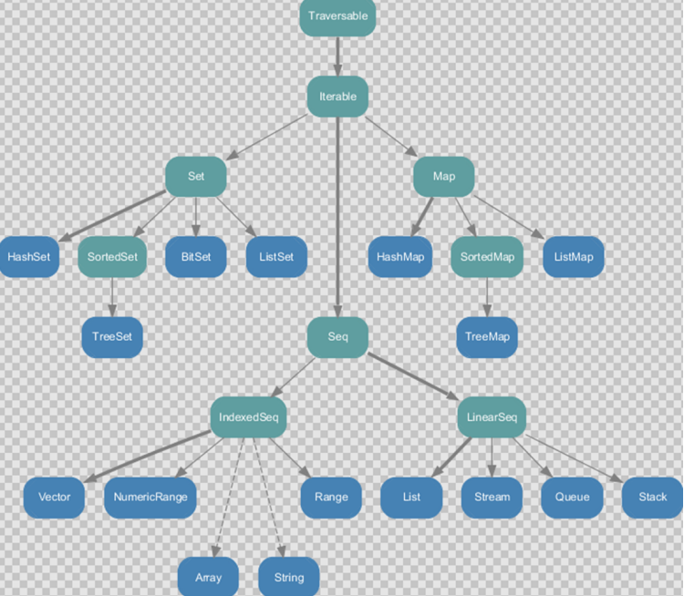

#### 1.2 可变集合继承图

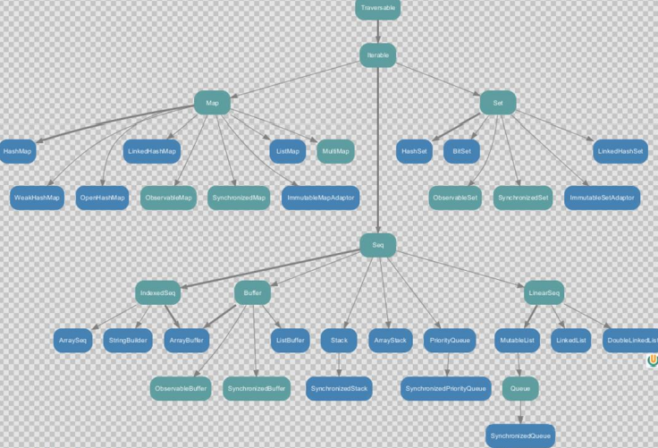

> **一般在使用不可变集合的时候用符号操作，使用可变集合的时候用方法操作**

### 2、数组 

#### 2.1 不可变数组 Array

两种定义不可变数组的方式：

```scala
package chapter06

object Test01 {
  def main(args: Array[String]): Unit = {
    // 1、定义数组的方式，[Int]泛型，(4) 4个元素
    val arr1 = new Array[Int](4)
    // 2、第二种方式，(1,2,3...)直接给数组赋值
    val arr2 = Array(1, 2, 3, 4, 5, 6)
    // 3、第二种方式甚至可以赋值别的类型
    val arr3 = Array(1, 2, "wzq")
    println(arr3(2))
  }
}
```

操作：

```scala
package chapter06

object Test01 {
  def main(args: Array[String]): Unit = {
    // 1、定义数组
    val arr = Array(1, 2, 3, 4, "wzq")
    println(arr.length) // 打印数组长度

    // 2、数组赋值，不可变指的是对象引用地址不变，不是值不可以变
    arr(0) = 18
    // 也可以这样
    arr.update(1,20)    // 第一个参数是位置，第二个要赋的值

    // 3、遍历数组
    println(arr.mkString(",")) // 查看数组，每个数由 , 分割

    // 普通遍历
    for (elem <- arr) {
      println(elem)
    }

    // 简化定义
    def printx(elem: Int): Unit = {
      println(elem)
    }

    arr.foreach(println) // 传递一个函数进去
    arr.foreach((elem) => {
      println(elem)
    })
    arr.foreach(elem => println(elem))
    arr.foreach(println(_))

    arr.foreach(println)
  }
}
```


#### 2.2 可变数组 ArrayBuffer

操作：

```scala
package chapter06

import scala.collection.mutable.ArrayBuffer

object Test02 {
  def main(args: Array[String]): Unit = {
    // 1、定义可变数组ArrayBuffer  [Any]表示类型  (3,2,5)表示初始化的元素值
    val arr = ArrayBuffer[Any](3, 2, 5)
    println(arr.length)

    // 2、遍历数组
    for (elem <- arr) {
      println(elem)
    }
    arr.foreach(println(_))
    arr.foreach(println)

    println("arr.hash=" + arr.hashCode())

    // 3、增加元素
    arr.+=(4) // 向数组最后追加元素
    arr.append(5, 6) // 像数组最后追加元素
    println(arr.mkString(","))

    // 向指定位置插入数组
    arr.insert(0,"wzq","wtt")   // 第一个参数代表要插入的位置，后面可以插入任意个元素
    println(arr.mkString(","))

    // 4、修改元素的值
    arr(1) = "wttwtt"
    println(arr.mkString(","))
    println(arr.length)
  }
}
```


#### 2.3 不可变数组和可变数组的转换

- `arr.toBuffer`：不可变转可变数组，返回结果才是一个可变数组，arr本身没有变化
- `arr.toArray`：可变数组转不可变数组，返回结果才是一个不可变数组，arr本身没有变化

案例：

```scala
package chapter06

import scala.collection.mutable.ArrayBuffer

object Test03 {
  def main(args: Array[String]): Unit = {
    // 1、创建一个空的可变数组
    val arr = new ArrayBuffer[Int]()
    
    // 2、追加值
    arr.append(1,2,3)
    println(arr.mkString(","))
    
    // 3、ArrayBuffer -> Array
    val newArr = arr.toArray    // 返回的结果是一个新的定长的数组集合，arr没变化
    
    // 4、Array -> ArrayBuffer
    val newBuffer = newArr.toBuffer   // 返回的结果是一个新的变长数组，newArr没有变化
    newBuffer.append(1,2,3)
  }
}
```


#### 2.4 多维数组 Array.ofDim

定义：

```scala
val arr = Array.ofDim[Double](3,4)
```

- 其中`(3,4)`就是数组的维度

案例：

```scala
package chapter06

object Test04 {
  def main(args: Array[String]): Unit = {
    // 1、定义一个3行4列的二维数组
    val arr = Array.ofDim[Double](3, 4)
    // 2、赋值
    arr(1)(2) = 88

    // 3、遍历数组
    for (i <- arr) {
      for (j <- i) {
        print(j + " ")
      }
      println()
    }

    arr.foreach(elemArr => {
      elemArr.foreach(elem => print(elem + " "))
      println()
    })

    // 3、定义一个三维数组
    val arr3 = Array.ofDim[Any](3, 3, 3)
  }
}
```


### 3、列表

#### 3.1 不可变 List

- List默认为不可变集合
- 创建一个List（数据有顺序，可以重复）
- 遍历List
- List增加数据
- 集合间合并：将一个整体拆分成一个一个的个体，称为扁平化
- 取指定数据
- 空集合Nil

案例：

```scala
package chapter06


object Test05 {
  def main(args: Array[String]): Unit = {
    // 1、创建一个不可变集合，List，List是一个伴生对象所以可以不用new
    val list1: List[Int] = List(1, 2, 3, 4)
    // 另外一种创建list的方式
    val list2 = 1 :: 2 :: 3 :: 4 :: 5 :: Nil

    // 2、List增加数据，因为是不可变集合，所以赋给了一个新的list集合
    val list3 = 5 :: list1
    println(list3) // 输出5,1,2,3,4
    val list4 = list1 :: 5 :: Nil
    println(list4) // 输出 List(1,2,3,4,5),5

    // 列表头添加元素
    val list5 = list1.+:(1)
    println(list5) // 输出 1,1,2,3,4
    // 列表尾添加元素
    val list6 = list1.:+(10)
    val list7 = list1 :+ 10
    println(list7) // 输出 1,2,3,4,10

    // 3、列表合并
    val list8 = list1 :: list2
    println(list8) // 输出List(1,2,3,4),1,2,3,4,5
    val list9 = list1 ::: list2
    println(list9) // 输出1,2,3,4,1,2,3,4,5
    // 如果反过来：
    val list10 = list2 ::: list1
    println(list10) // 输出1,2,3,4,5,1,2,3,4

    // 4、取指定数据
    println(list1(0))

    // 5、遍历List
    for (elem <- list1) {
      println(elem)
    }
    println(list1.mkString(","))
    list1.foreach(println)
  }
}
```


#### 3.2 可变 ListBuffer

```scala
package chapter06

import scala.collection.mutable.ListBuffer

object Test06 {
  def main(args: Array[String]): Unit = {
    // 1、创建一个可变ListBuffer
    val list1: ListBuffer[Int] = ListBuffer(1, 2, 3, 4)

    // 2、向集合中添加数据
    // 向末尾添加数据
    list1.append(5)
    list1.+=(6) // 等价于 list1 += 6

    // 向中间插入数据
    list1.insert(1, 9, 8, 7, 6) // 向1位置插入 9,8,7,6
    println(list1)

    // 向头添加数据
    list1.prepend(0)
    println(list1)

    // 3、删除数据
    list1.remove(5) // 删除5位置的元素
    list1.-(0) // 这样不修改list1，会创建新的集合
    list1.-=(0) // 这样删除0位置的数据
    //    list1 -= 0
    println(list1)

    // 4、修改数据
    list1(0) = 99
    // 等价于 list1.update(0,99)
    println(list1)

    // 5、合并两个ListBuffer
    list1.++=(ListBuffer(-1, -2, -3))
    // 等价于
    //    list1 ++= ListBuffer(-1, -2, -3)
    // 如果反过来：
    val list2 = ListBuffer(-1, -2, -3) ++= list1

    println(list2)
  }
}
```


### 4、Set 集合 

Set默认不可变，如果使用可变Set，需要这样调用：`mutable.Set`

#### 4.1 不可变Set

Set默认是不可变集合，数据无序，不重复

```scala
package chapter06

object Test07 {
  def main(args: Array[String]): Unit = {
    // 1、定义Set，底层是特质，是伴生对象，所以不需要使用new
    val set1: Set[Int] = Set(1, 1, 2, 3) // 数据不重复，所以实际上存的是1，2，3

    // 2、向Set添加元素
    val set2 = set1.+(4)
    val set3 = set1 + 5
    println(set3)

    // 3、删除元素
    val set4 = set1.-(2)
    val set5 = set1 - 3
    println(set4)

    // 4、合并两个Set
    val set6 = Set(1, 2, 3, 0, 9)
    val set7 = Set(1, 0, 4, 6, 8)
    val set8 = set6.++(set7)
    val set9 = set6 ++ set7
    val set10 = set7 ++ set6 // 其实都一样，因为Set数据无序
    println(set8)
    println(set9)
    println(set10)

    // 5、遍历集合
    for (elem <- set6) {
      println(elem)
    }
    set6.foreach(println)
    println(set6.mkString(","))
  }
}
```


#### 4.2 可变mutable.Set

使用可变Set，需要`mutable.Set`这样定义：

```scala
package chapter06

// 需要import
import scala.collection.mutable

object Test08 {
  def main(args: Array[String]): Unit = {
    // 1、定义可变Set：mutable.Set，伴生对象不需要new
    val set1: mutable.Set[Int] = mutable.Set(1, 2, 3, 4)
    val set2 = mutable.Set(9, 8, 7, 6)
    val set3 = Set(1, 2, 3, 4) // 不声明mutable是不可变集合

    // 2、向集合中添加元素
    set1.+=(5)
    set1 += 5
    println(set1)
    // 当然也可以返回一个新的set
    val set4 = set1 += 6
    println(set4)

    // 3、删除数据
    set1.-=(2)
    set1 -= 2

    // 4、判断集合是否包含某数字
    val flag = set1.contains(5)
    println(flag)

    // 5、合并Set
    set1 ++= set2
    println(set1)

    // 6、遍历
    set1.foreach(println)
    println(set1.mkString(","))
  }
}
```

### 5、Map 集合

Map存储key-value键值对

#### 5.1 不可变 Map

```scala
package chapter06

object Test09 {
  def main(args: Array[String]): Unit = {
    // 1、定义不可变集合Map
    val map1: Map[String, Int] = Map("wzq" -> 1)
    val map2 = Map("wtt" -> 2, "wzq" -> 1)

    // 2、访问数据
    for (elem <- map1.keys) {
      println(elem + "=" + map1.get(elem))
      println(elem + "=" + map1(elem))
    }
    map1.foreach((kv)=>{println(kv)})
    map1.foreach(println)

    // 3、如果key不存在的处理方式
    println(map1.get("aaa").getOrElse(0)) // 如果key=aaa不存在，返回0
    println(map1.getOrElse("aaa", 0))

    // 4、修改数据，传递一个key，修改对应的值
    val map3 = map1.updated("wzq",3)
    println(map3)

    // 5、删除数据
    val map4 = map1.-("wzq")
    val map5 = map1 - "wzq"
  }
}
```

#### 5.2 可变 mutable.Map

```scala
package chapter06

// 需要import

import scala.collection.mutable

object Test10 {
  def main(args: Array[String]): Unit = {
    // 1、定义可变集合
    val map1: mutable.Map[String, Int] = mutable.Map("wzq" -> 1, "wtt" -> 2)
    val map2 = mutable.Map("wzq" -> 5, "wzq" -> 6) // 相同的key，后者覆盖前者
    println(map2)

    // 2、向集合中增加数据
    map1.+=("sxh" -> 0)
    map1 += "sxh" -> 1 // 等价于这个
    map1.put("wzq", 10)

    // 3、依据key删除数据
    map1.remove("sxh")
    map1.-=("wzq", "sxh") // 可以传递多个
    println(map1)

    // 4、修改数据
    map1.update("wtt",15)
    map1("wtt") = 20

    // 5、遍历
    for (elem <- map1.keys) {
      println(elem + "=" + map1.get(elem))
      println(elem + "=" + map1(elem))
    }
  }
}
```


### 6、元组

元组实际上就是一个容器，可以存放各种相同或不同的数据。但是在Scala中元组最大只能有22个元素

```scala
package chapter06

object Test11 {
  def main(args: Array[String]): Unit = {
    // 1、声明一个元组
    val tuple: (Int, String, Boolean) = (18, "wzq", true)

    // 2、访问元组，可以通过元素的顺序号进行访问
    println(tuple._1)
    println(tuple._2)
    println(tuple._3)

    // 3、也可以通过索引
    println(tuple.productElement(0))

    // 4、通过迭代器访问数据
    for (elem <- tuple.productIterator) {
      println(elem)
    }

    // 5、Map中的键值对实际上就是元组，只不过元素的个数为2，称之为对偶
    val map1 = Map("a" -> 1, "b" -> 2, "c" -> 3)
    var map2 = Map(("a", 1), ("b", 2), ("c", 3))
    map1.foreach(kv => {
      println(kv._1 + " " + kv._2)
    })
  }
}
```

### 7、集合常用函数

#### 7.1 基本属性和常用操作

这一部分主要集合的一些基本属性喝常用操作：

- 获取集合长度 length
- 获取集合大小 size
- 循环遍历 foreach
- 迭代器 iterator
- 生成字符串 mkString
- 是否包含 contains

案例：

```scala
package chapter06

object Test12 {
  def main(args: Array[String]): Unit = {
    // 定义集合
    val list = List(1, 2, 3, 4, 5)

    // 1、获取集合长度
    println(list.length)

    // 2、对于一些集合获取不到length，可以获取大小
    println(list.size)
    val set = Set(1, 2, 3, 3)
    //    println(set.length) // 没有这个属性
    println(set.size)

    // 3、循环遍历
    list.foreach(println)

    // 4、迭代器
    for (elem <- list.iterator) {
      println(elem)
    }
    // list索引
    for (elem <- list.indices) {
      println(elem)
    }

    // 5、生成字符串
    println(list.mkString(","))

    // 6、判断是否包含某个元素
    println(list.contains(3))
  }
}
```


#### 7.2 衍生集合

使用下面的函数会生成一个新的集合，所以称为衍生集合：

- 获取集合的头 head
- 获取集合的尾 tail 除了头，剩下的都是尾
- 集合最后一个数据 last
- 集合初始数据（不包含最后一个元素） init
- 集合反转 reverse
- 取前（后）n个元素 take、takeRight
- 去掉前（后）n个元素，drop、dropRight
- 并集，union
- 交集，intersect
- 差集，diff
- 拉链，zip
- 滑窗，sliding

案例：

```scala
package chapter06

object Test13 {
  def main(args: Array[String]): Unit = {
    // 定义List
    val list1 = List(1, 2, 3, 4, 5, 6)

    // 1、获取集合的头
    println(list1.head)

    // 2、获取集合的尾（除了第一个都是尾）
    println(list1.tail)

    // 3、集合最后一个数据
    println(list1.last)

    // 4、集合初始数据（不包含最后一个）
    println(list1.init)

    // 5、反转集合
    println(list1.reverse)

    // 6、取前n个元素
    println(list1.take(3))
    // 后n个
    println(list1.takeRight(3))

    // 7、去掉前n个元素
    println(list1.drop(2))
    println(list1.dropRight(2))

    // 8、并集
    val list2 = List(9, 8, 7, 6)
    println(list1.union(list2))
    println(list2.union(list1))

    // 9、交集
    println(list1.intersect(list2))

    // 10、差集
    println(list1.diff(list2))
    println(list2.diff(list1))

    // 11、拉链，如果两个集合元素个数不同，那么多余的会被省略不用
    println(list1.zip(list2))
    println(list2.zip(list1))

    // 12、滑动窗口
    list1.sliding(2).foreach(println)
    list1.sliding(2,2).foreach(println)  // 第二个参数表示窗口步长
  }
}
```

#### 7.3 集合计算简单函数

- 求和 sum
- 求乘积 product
- 求最大值 max，如果一个集合里面是元组，那么使用maxby指定哪个比
- 求最小值 min，如果一个集合里面是元组，那么使用minby指定哪个比
- 排序，sorted、sortedBy、sortWith

```scala
package chapter06

object Test14 {
  def main(args: Array[String]): Unit = {
    val list = List(1, 2, 3, 4, 5, 6, 7, 8, 9)

    // 1、求和
    var sum = 0
    list.foreach(sum += _)
    println(sum)

    // Scala为我们提供了sum函数
    println(list.sum)

    // 2、乘积
    println(list.product)

    // 3、最大值
    println(list.max)
    // 对于一个集合里面存储的是元组的使用maxby
    val map1 = Map("a" -> 1, "b" -> 2, "c" -> 3, "d" -> 0)
    println(map1.maxBy((kv) => {
      kv._2
    }))
    println(map1.maxBy(_._2))

    // 4、最小值
    println(list.min)
    // 最小值
    println(map1.minBy((kv) => {
      kv._2
    }))
    println(map1.minBy(_._2))

    // 5、排序
    println(list.sorted)  // 默认升序
    println(list.sortBy(_.abs))   // 按照绝对值升序
    println(list.sortWith(_ > _)) // 降序
  }
}
```


#### 7.4 集合计算高级函数:star2:

- 过滤（`filter`）：遍历一个集合从中获取满足指定元素组成一个新的集合
- 映射/转化（`map`）：将集合中的每一个元素映射到某一个函数
- 扁平化（`flatten`）：展开
- 扁平化+映射（`flatMap`）：相当于先进行map操作，再进行flatten操作
- 分组（`group`）：按照指定的规定对集合的元素进行分组
- 简约/规约（`reduce`）：通过指定的逻辑将集合中的数据进行聚合，从而减少数据，最终获取结果
- 折叠（`fold`）：化简得一种特殊情况

案例：

Map方法

```scala
package chapter06

object Test15 {
  def main(args: Array[String]): Unit = {
    val list: List[Int] = List(1, 2, 3, 4, 5, 6, 7, 8, 9)
    val nestedList: List[List[Int]] = List(List(1, 2, 3), List(4, 3, 2), List(1, 9))
    val wordList: List[String] = List("hello world", "hello scala", "hello spark")

    // 1、过滤
    println(list.filter(_ % 2 == 0)) // 只要偶数
    println(list.filter(_ % 2 != 0)) // 只要奇数

    // 2、映射
    println(list.map(_ * 2)) // 元素都乘以2
    println(list.map(x => x * x)) // 平方
    println(list.filter(_ % 2 == 0).map(_ - 1)) // 所有偶数减一

    // 3、扁平化
    println(nestedList.flatten)

    // 4、扁平化 + 映射，先map再flatten
    println(wordList.flatMap(_.split(" ")))

    // 5、分组，比如偶数\奇数分为一组
    println(list.groupBy(_ % 2))
    println(list.groupBy(x => if (x % 2 == 0) "偶数" else "奇数"))
  }
}
```

Reduce方法：

```scala
package chapter06

object Test16 {
  def main(args: Array[String]): Unit = {
    val list = List(1, 2, 3, 4)

    // 将数据两两结合，实现运算规则
    list.reduce((x, y) => (x - y))
    println(list.reduce(_ - _)) // 1 - 2 - 3 - 4
    println(list.reduce(_ + _)) // 1 + 2 + 3 + 4

    // reduce底层调用得是reduceLeft，所以上面得等价于
    println(list.reduceLeft(_ + _))
    println(list.reduceLeft(_ - _))

    // 还有从右往左的操作
    // 4 - 3 - 2 - 1
    println(list.reduceRight(_ - _))
  }
}
```

Fold方法：

```scala
package chapter06

object Test17 {
  def main(args: Array[String]): Unit = {
    val list = List(1, 2, 3, 4)

    // fold方法使用了函数柯里化，存在两个参数列表
    // 第一个参数列表为 初始值
    // 第二个参数列表为 简化规则

    // 1 - 1 - 2 - 3 - 4
    println(list.fold(1)(_ - _))
    println(list.foldRight(10)(_ - _))
  }
}
```

使用Fold实现两个Map的合并：

```scala
package chapter06

import scala.collection.mutable

object Test18 {
  def main(args: Array[String]): Unit = {
    val map1 = mutable.Map("a" -> 1, "b" -> 2, "c" -> 3)
    val map2 = mutable.Map("a" -> 4, "b" -> 5, "c" -> 6)

    val map3: mutable.Map[String, Int] = map1.foldLeft(map2) {
      (map, kv) => {
        val k = kv._1
        val v = kv._2
        map(k) = map.getOrElse(k, 0) + v
        map
      }
    }
    println(map3)
  }
}
```

#### 7.5 普通WordCount案例

需求：统计相同的词出现的次数：


```scala
package chapter06

object Test19 {

  def main(args: Array[String]): Unit = {
    val stringsList: List[String] = List("Hello Scala Hbase kafka", "Hello Scala Hbase", "Hello Scala", "Hello")

    // 1、将这个List的所有词都按照空格分开，并且汇总到一个List
    val wordList: List[String] = stringsList.flatMap(_.split(" "))
    println(wordList)

    // 2、按照单词进行分组
    val wordGroup: Map[String, List[String]] = wordList.groupBy(word => word)
    println(wordGroup)

    // 3、统计每个String对应的Map的length
    val wordMap: Map[String, Int] = wordGroup.map(kv => (kv._1, kv._2.length))
    println(wordMap)

    // 4、根据Map的Int进行降序排序，取前三个
    val resultList: List[(String, Int)] = wordMap.toList.sortWith(_._2 > _._2).take(3)
    println(resultList)
  }
}
```

链式编程写法：

```scala
stringsList.flatMap(_.split(" "))
  .groupBy(word => word)
  .map(kv => (kv._1, kv._2.length))
  .toList
  .sortWith(_._2 > _._2)
  .take(3)
```

#### 7.6 复杂WordCound案例

这次的输入变化了：

```scala
("Hello Scala Spark World", 4),
("Hello Scala Spark", 3),
("Hello Scala", 2),
("Hello", 1)
```

输入的方式变化为了一句话对应出现的次数

解决这个问题的第一种方式：

```scala
package chapter06

object Test20 {
  def main(args: Array[String]): Unit = {
    // 另一种数据格式，已经有了这句话出现了多少次
    val tupleList: List[(String, Int)] = List(
      ("Hello Scala Spark World", 4),
      ("Hello Scala Spark", 3),
      ("Hello Scala", 2),
      ("Hello", 1)
    )

    // 第一种方式，就是把这个数据变成上一个案例的样子，然后调用上面那个方法
    val stringsList: List[String] = tupleList.map(kv => {
      (kv._1 + " ") * kv._2
    })
    println(stringsList)

    val result: List[(String, Int)] = stringsList.flatMap(_.split(" "))
      .groupBy(word => word)
      .map(kv => (kv._1, kv._2.length))
      .toList
      .sortWith(_._2 > _._2)
      .take(3)
    println(result)
  }
}
```

这种方式就是把数据格式转换成了第一种格式的数据，然后再进行wordCound的，占用内存高并且执行时间长

第二种方式：

```scala
package chapter06

object Test20 {
  def main(args: Array[String]): Unit = {
    // 另一种数据格式，已经有了这句话出现了多少次
    val tupleList: List[(String, Int)] = List(
      ("Hello Scala Spark World", 4),
      ("Hello Scala Spark", 3),
      ("Hello Scala", 2),
      ("Hello", 1)
    )

    // 第二种方式
    // 1、直接将上面的数据变成每个单词对应出现次数
    val wordList: List[(String, Int)] = tupleList.flatMap(strings => {
      val stringsList = strings._1.split(" ")
      stringsList.map(word => (word, strings._2))
    })
    println(wordList)

    // 2、将相同的key进行分组
    val wordGroup: Map[String, List[(String, Int)]] = wordList.groupBy(kv => kv._1)
    println(wordGroup)

    // 3、将这个Map的List转换为单词出现多少次
    val wordToInts: Map[String, List[Int]] = wordGroup.map(
      kv => (kv._1, kv._2.map(word => word._2))
    )
    println(wordToInts)

    // 4、统计词频
    val word: Map[String, Int] = wordToInts.map(kv => (kv._1, kv._2.sum))
    println(word)

    // 5、按照value进行降序排序，取前三个
    val result: List[(String, Int)] = word.toList.sortWith(_._2 > _._2).take(3)
    println(result)
  }
}    
```

更简单的写法：

```scala
tupleList.flatMap(kv => kv._1.split(" ").map(word => (word, kv._2)))
    .groupBy(kv => kv._1)
    .map(kv => (kv._1, kv._2.map(word => word._2)))
    .map(kv => (kv._1, kv._2.sum))
    .toList
    .sortWith(_._2 > _._2)
    .take(3)
```


### 8、队列 mutable.Queue

Scala也提供了队列的功能：

```scala
package chapter06

import scala.collection.mutable

object Test21 {
  def main(args: Array[String]): Unit = {
    val que = new mutable.Queue[String]()

    // 入队
    que.enqueue("a","b","c")

    // 出队
    println(que.dequeue())
    println(que.dequeue())
    println(que.dequeue())
  }
}
```


### 9、并行集合

Scala为了充分利用`CPU`，提供了并行集合，用于多核环境的计算

```scala
package chapter06

object Test22 {
  def main(args: Array[String]): Unit = {
    // 得到的是相同的进程ID
    val res1 = (0 to 100).map { case _ => Thread.currentThread.getId }
    println(res1)

    // 不同的进程ID
    val res2 = (0 to 100).par.map{ case _ => Thread.currentThread.getId}
    println(res2)
  }
}
```


## 九、模式匹配 match

### 1、基本语法

Scala中的模式匹配其实就是Java中`switch case`的升级版，一个简单的案例：

```scala
package chapter07

object Test01 {
  def main(args: Array[String]): Unit = {
    var a: Int = 10
    var b: Int = 20
    var operator: Char = 'd'

    var res = operator match {
      case '+' => a + b
      case '-' => a - b
      case '/' => a / b
      case '*' => a * b
      case _ => "else"
    }
    println(res)
  }
}
```

需要注意的是：

- 如果所有case都不匹配，那么就会执行`case _`分支，类似Java的default语句，如果没有`case _`分支，就会抛`MatchError`异常

- 在每个case中不需要使用`break`
- match case 语句可以匹配任意类型，而不只是常量


### 2、模式守卫


如果想要匹配某个范围内的数据，就需要在模式匹配中增加条件守卫：

```scala
package chapter07

object Test02 {
  def main(args: Array[String]): Unit = {
    def abs(x: Int) = x match {
      case i: Int if (i < 0) => -i
      case i: Int if (i >= 0) => i
      case _ => "else"
    }
    println(abs(-5))
    println(abs(5))
    println(abs(0))
  }
}
```


## 参考资料

- [尚硅谷Scala教程](https://www.bilibili.com/video/BV1Xh411S7bP)
- [Scala官网](https://www.scala-lang.org/)
