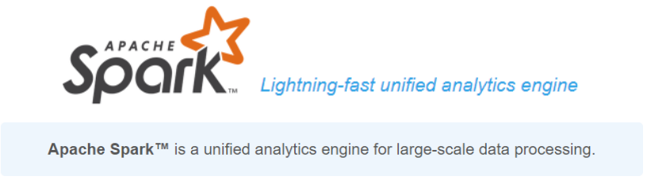
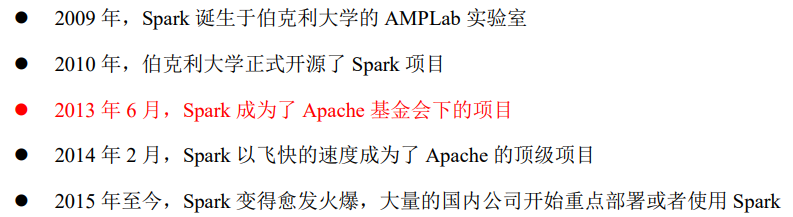
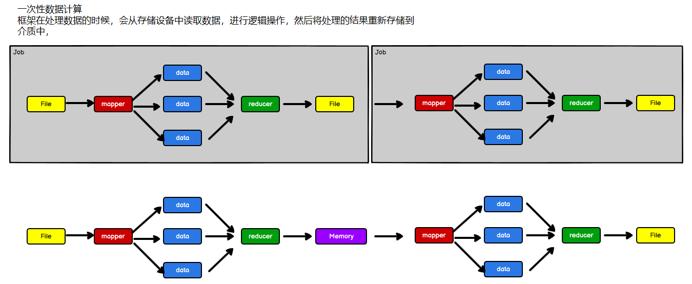
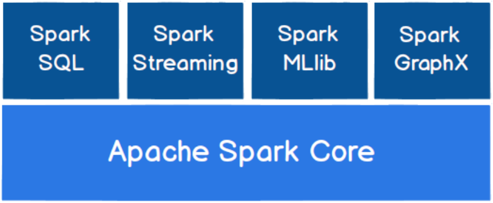
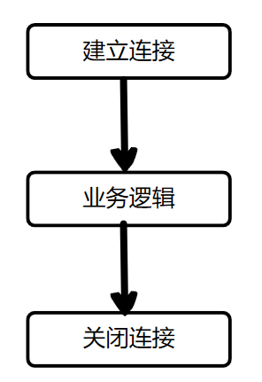
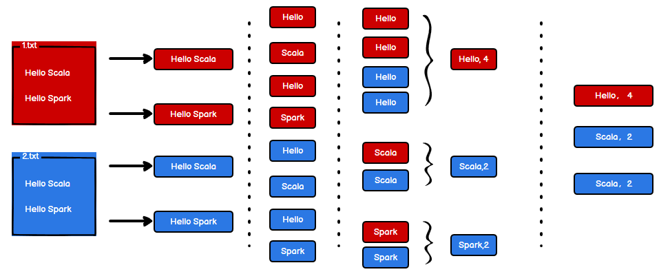
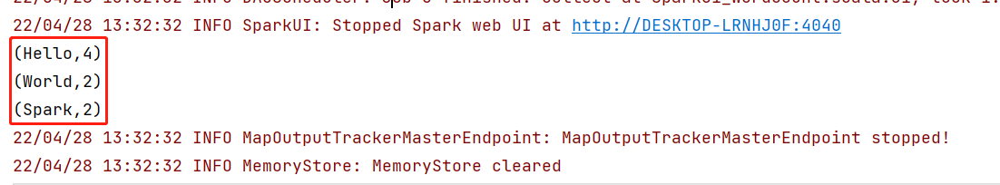
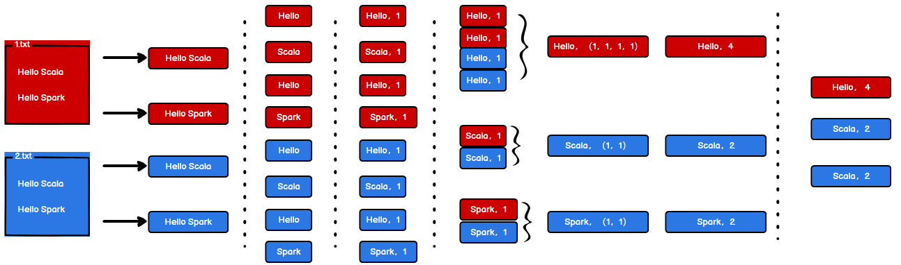
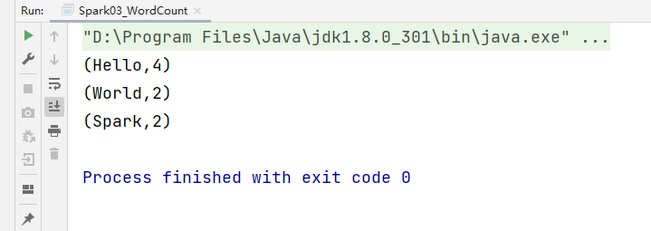

> 终于来到Spark！接下来就通过blog记录自己的学习笔记吧！


## 一、Spark概述

### 1、Spark是什么



`Spark`是一种**基于内存的、通用、可扩展的**大数据分析**计算引擎**，它本身不提供数据的存储功能，只是一个计算引擎。


`Spark`的历史：




`Spark`的特点：

- Spark是一种由Scala语言开发的快速、通用、可扩展的大数据分析引起
- Spark Core中提供了Spark最基础与最核心的功能
- Spark SQL是Spark用来操作结构化数据的组件。通过Spark SQL，用户可以使用SQL或者像Apache Hive版本的SQL方言（HQL）来查询数据
- Spark Streaming 是Spark平台上针对实时数据进行流式计算的组件，提供了丰富的处理数据流的API


### 2、Spark VS Hadoop



- Hadoop MapReduce 由于其设计初衷并不是为了满足循环迭代式数据流处理，因此在多 并行运行的数据可复用场景（如：机器学习、图挖掘算法、交互式数据挖掘算法）中存 在诸多计算效率等问题。所以 Spark 应运而生，Spark 就是在传统的 MapReduce 计算框 架的基础上，利用其计算过程的优化，从而大大加快了数据分析、挖掘的运行和读写速 度，并将计算单元缩小到更适合并行计算和重复使用的 RDD 计算模型。
- 机器学习中 ALS、凸优化梯度下降等。这些都需要基于数据集或者数据集的衍生数据 反复查询反复操作。MR 这种模式不太合适，即使多 MR 串行处理，性能和时间也是一 个问题。数据的共享依赖于磁盘。另外一种是交互式数据挖掘，MR 显然不擅长。而 Spark 所基于的 scala 语言恰恰擅长函数的处理。
- Spark 是一个分布式数据快速分析项目。它的核心技术是弹性分布式数据集（Resilient  Distributed Datasets），提供了比MapReduce 丰富的模型，可以快速在内存中对数据集 进行多次迭代，来支持复杂的数据挖掘算法和图形计算算法。
- **Spark 和Hadoop 的根本差异是多个作业之间的数据通信问题 : Spark 多个作业之间数据 通信是基于内存，而 Hadoop 是基于磁盘。**
- Spark Task 的启动时间快。Spark 采用 fork 线程的方式，而 Hadoop 采用创建新的进程 的方式。
- Spark 只有在 shuffle 的时候将数据写入磁盘，而 Hadoop 中多个 MR 作业之间的数据交 互都要依赖于磁盘交互
- Spark 的缓存机制比 HDFS 的缓存机制高效。

### 3、Spark 核心模块



如上图所示，Spark共有五大模块，分别是：

- `Spark Core`：提供了Spark最基础与最核心的功能，Spark其他的功能如：Spark SQL，Spark Streaming，GraphX，MLib都是在Spark Core的基础上进行扩展的
- `Spark SQL`：是Spark用来操作结构化数据的组件，通过Spark SQL，用户可以使用SQL或者SQL方言来查询数据
- `Spark Streaming`：是Spark平台针对实时数据进行流式计算的组件，提供了丰富的处理数据流的API
- `Spark MLlib`：是Spark提供的一个机器学习算法库
- `Spark GraphX`：面向图计算提供的框架与算法库

## 二、Spark 实现 wordCount 的三种方式

### 1、准备工作

因为之前已经学过Hadoop了，也了解了MapReduce的工作流程，所以在Spark阶段可以任性一点，直接上手了解一下最简单的WordCount程序。使用`idea`进行开发、`Scala`作为编译语言，在开始之前应该确保本地上有`Hadoop`环境、`Scala`环境，如果没有请访问下面的链接安装：

- 本地安装Java

- [Hadoop搭建客户端API环境](https://blog.csdn.net/lesileqin/article/details/115484714)
- [安装Scala环境](http://wzqwtt.club/2022/03/09/scala-xue-xi-bi-ji-yi/)


直接打开`idea`创建一个`Maven`项目，打开`pom.xml`添加下面的依赖：

```xml
<dependencies>
    <dependency>
        <groupId>org.apache.spark</groupId>
        <artifactId>spark-core_2.12</artifactId>
        <version>3.0.0</version>
    </dependency>
</dependencies>
```


然后为这个Maven加上`Scala`环境支持，右键点击项目名，然后点击`Add Framework Support...`，找到`Scala`点击添加即可

紧接着新建一个包，在这个包下面写`Scala`程序


准备数据：新建一个`datas`文件夹，里面放两个文件`1.txt`和`2.txt`，这两个文件的内容一样都是：

```
Hello World
Hello Spark
```

然后就可以开始了

### 2、方式一

在创建的包下面，新建一个Scala的`Object`，在里面写一个`main`方法

因为写的是Spark程序，所以在程序开始之前要建立与Spark环境的连接，在处理完业务逻辑之后要关闭与Spark的连接，所以程序的逻辑应该是这个样子的：



- 与Spark建立连接的对象是`SparkContext()`，这个`SparkContext()`需要传递一个`SparkConf()`的参数，在这个参数里面设置`Master`为`local`，`AppName`为当前的`WordCount`就可以了，意思先不深究，待以后学到慢慢了解
- 中间业务逻辑部分分析流程在下面
- 然后就是关闭连接了，主要是一个`stop()`方法


**业务逻辑部分分析流程：**



分析的流程如上图所示：

- 首先按行读入所有数据
- 因为这些数据都由空格分割，所以可以做一步flatMap将这些行都打散成单个的单词
- 紧接着就是相同的单词做一个分组，按照单词分组后可以得到一个二元组，k对应的是单词，v对应的是这个单词组成的数组
- 下一步就是做一步map操作，将v变成数值
- 最后聚合，就拿到了最终的结果


有了上面的分析，就可以开始写程序了：

```scala
package com.wzq.bigdata.spark.core.wordcount

import org.apache.spark.rdd.RDD
import org.apache.spark.{SparkConf, SparkContext}

object Spark01_WordCount {
  def main(args: Array[String]): Unit = {
    // 1、建立与Spark的连接
    val conf: SparkConf = new SparkConf().setMaster("local").setAppName("WordCount")
    val sc: SparkContext = new SparkContext(conf)

    // 2、业务逻辑
    // 2.1 按行读取数据
    val lines: RDD[String] = sc.textFile("datas")

    // 2.2 将lines每一行打散，按照空格分割
    val words: RDD[String] = lines.flatMap(_.split(" "))

    // 2.3 把单词分组
    val wordGroup: RDD[(String, Iterable[String])] = words.groupBy(words => words)

    // 2.4 转换wordGroup为 <String,Int>，Inte对应的是Iterable[String]的个数
    val wordToInt: RDD[(String, Int)] = wordGroup.map {
      case (word, list) => {
        (word, list.size)
      }
    }

    // 2.5 收集数据
    val result: Array[(String, Int)] = wordToInt.collect().sortWith(_._2 > _._2)
    result.foreach(println)

    // 3、关闭连接
    sc.stop()
  }
}
```

最终结果：



### 3、方式二

方式一没有体现出MapReduce中的Reduce操作，于是在方式二可以加上Reduce的部分

当分割完每个词后，可以在每个词后都加一个数字`1`，代表这个词出现了一次，随后再进行分组，分完组就进行reduce进行聚合就ok啦



过程如上图所示，代码如下：

```scala
package com.wzq.bigdata.spark.core.wordcount

import org.apache.spark.rdd.RDD
import org.apache.spark.{SparkConf, SparkContext}

object Spark02_WordCount {
  def main(args: Array[String]): Unit = {

    // 1、建立与Spark的连接
    val conf: SparkConf = new SparkConf().setMaster("local").setAppName("WordCount")
    val sc: SparkContext = new SparkContext(conf)

    // 2、业务逻辑
    // 2.1 按行读取数据
    val lines: RDD[String] = sc.textFile("datas")

    // 2.2 按照空格分词，并且把每个词都转换为 (word,1)
    val wordToOne: RDD[(String, Int)] = lines.flatMap(_.split(" ")).map(word => (word, 1))

    // 2.3 按照word分组
    val wordGroup: RDD[(String, Iterable[(String, Int)])] = wordToOne.groupBy(kv => kv._1)

    // 2.4 将分组后的数据进行reduce
    val wordToInt: RDD[(String, Int)] = wordGroup.map {
      case (word, list) => {
        list.reduce((t1, t2) => (t1._1, t1._2 + t2._2))
      }
    }

    // 2.5 转换输出
    val result: Array[(String, Int)] = wordToInt.collect().sortWith(_._2 > _._2)
    result.foreach(println)

    // 3、关闭连接
    sc.stop()
  }
}
```

运行结果和上面一样

### 4、方式三

方式三直接使用Spark的API `reduceByKey`：

```scala
package com.wzq.bigdata.spark.core.wordcount

import org.apache.spark.rdd.RDD
import org.apache.spark.{SparkConf, SparkContext}

object Spark03_WordCount {
  def main(args: Array[String]): Unit = {
    // 1、建立与Spark的连接
    val conf: SparkConf = new SparkConf().setMaster("local").setAppName("WordCount")
    val sc: SparkContext = new SparkContext(conf)

    // 2、业务逻辑
    // 2.1 按行读取数据
    val lines: RDD[String] = sc.textFile("datas")

    // 2.2 分割数据并且给每个数据后面都加上一个1
    val wordToOne: RDD[(String, Int)] = lines.flatMap(_.split(" ")).map(word => (word, 1))

    // 2.3 直接使用Spark的reduceByKey API进行聚合
    val wordToCount: RDD[(String, Int)] = wordToOne.reduceByKey(_ + _)

    // 2.4 收集并且输出结果
    val result: Array[(String, Int)] = wordToCount.collect().sortWith(_._2 > _._2)
    result.foreach(println)

    // 3、关闭连接
    sc.stop()
  }
}
```

ok了


## 三、配置log4j

在Spark执行的过程中会出现大量的红字日志，为了控制台看着简洁，可以配置`log4j`屏蔽掉日志信息，在`resources`文件夹下新建一个文件`log4j.properties`，配置以下内容：

```properties
log4j.rootCategory=ERROR, console
log4j.appender.console=org.apache.log4j.ConsoleAppender
log4j.appender.console.target=System.err
log4j.appender.console.layout=org.apache.log4j.PatternLayout
log4j.appender.console.layout.ConversionPattern=%d{yy/MM/dd HH:mm:ss} %p %c{1}: %m%n
# Set the default spark-shell log level to ERROR. When running the spark-shell,the
# log level for this class is used to overwrite the root logger's log level, so that
# the user can have different defaults for the shell and regular Spark apps.
log4j.logger.org.apache.spark.repl.Main=ERROR
# Settings to quiet third party logs that are too verbose
log4j.logger.org.spark_project.jetty=ERROR
log4j.logger.org.spark_project.jetty.util.component.AbstractLifeCycle=ERROR
log4j.logger.org.apache.spark.repl.SparkIMain$exprTyper=ERROR
log4j.logger.org.apache.spark.repl.SparkILoop$SparkILoopInterpreter=ERROR
log4j.logger.org.apache.parquet=ERROR
log4j.logger.parquet=ERROR
# SPARK-9183: Settings to avoid annoying messages when looking up nonexistentUDFs in SparkSQL with Hive support
log4j.logger.org.apache.hadoop.hive.metastore.RetryingHMSHandler=FATAL
log4j.logger.org.apache.hadoop.hive.ql.exec.FunctionRegistry=ERROR
```

配置完成再运行控制台就干净多了：




## 参考资料

- [尚硅谷Spark 3.0.0 学习视频](https://www.bilibili.com/video/BV11A411L7CK)
- [Spark 3.0.0 官方文档](https://spark.apache.org/docs/3.0.0/)

