Spark作为一个数据处理框架的计算引擎，被设计在所有常见的集群环境中运行，主要有以下各种环境：

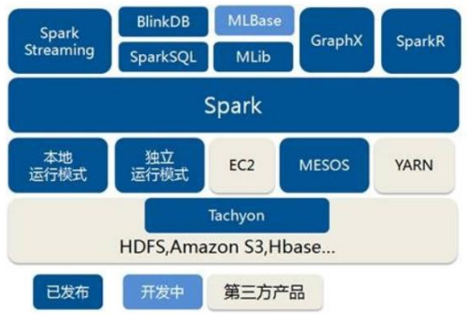


## 一、Local本地模式

`Local`模式就是不需要其他节点资源就可以在本地执行Spark代码的环境，一般用于教学、调试、演示等，之前在IDEA中运行代码的环境称为开发环境，还不太一样

### 1、下载Spark环境

可以到`Spark`官网下载安装包：https://archive.apache.org/dist/spark/spark-3.0.0/

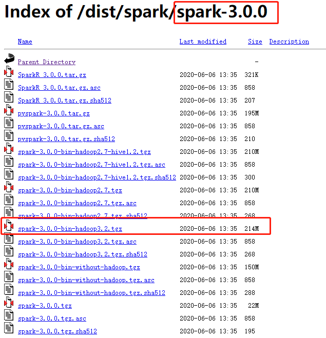

下载`spark-3.0.0-bin-hadoop3.2.tgz`就可以，下载完成之后打开虚拟机`hadoop102`，将这个包上传到`/opt/moudle/`目录下：

```bash
[wzq@hadoop102 software]$ ll | grep spark
-rw-r--r--. 1 wzq wzq 224453229 6月  19 2020 spark-3.0.0-bin-hadoop3.2.tgz
```

解压缩安装包到`/opt/module/`目录，并且改名字：

```bash
[wzq@hadoop102 software]$ tar -zxvf spark-3.0.0-bin-hadoop3.2.tgz -C /opt/module/
[wzq@hadoop102 module]$ cd /opt/module/
[wzq@hadoop102 module]$ mv spark-3.0.0-bin-hadoop3.2/ spark-local
[wzq@hadoop102 module]$ ll | grep spark
drwxr-xr-x. 13 wzq wzq  211 6月   6 2020 spark-local
```

以下是spark的目录结构：

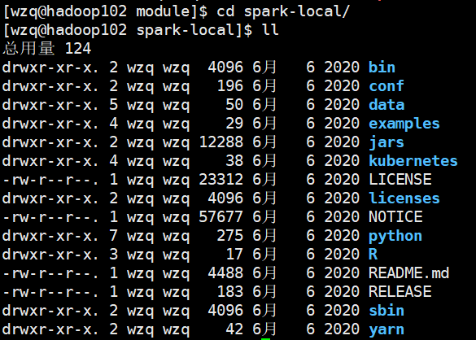

### 2、启动Local环境

然后启动spark-local，进入到spark文件夹，执行以下命令：

```bash
[wzq@hadoop102 spark-local]$ bin/spark-shell
```

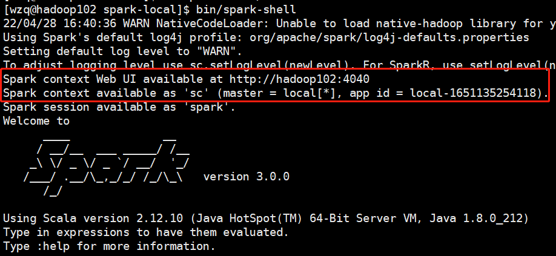

这样就算启动成功了，并且也为我们声明好了Spark上下文环境为`sc`，webUI监控的端口是`4040`

接下来测试一个wordCount程序，首先复制一个对话框，创建一个文件夹，里面放上几条数据：

```bash
[wzq@hadoop102 spark-local]$ cd data/
[wzq@hadoop102 data]$ vim word.txt

# 按下i，输入几行数据
Hello Spark
Hello Scala
# 按下ESC，输入:wq保存退出
```

然后就可以写Spark程序了，在启动完`spark-shell`的窗口写：

```bash
scala> sc.textFile("data/word.txt").flatMap(_.split(" ")).map((_,1)).reduceByKey(_+_).collect().sortWith(_._2>_._2)
```

输出结果：

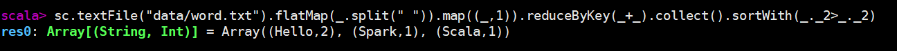

当然也可以启动Spark的监控页面，在本地浏览器访问以下网址：

```
http://hadoop102:4040/
```

打开以后就是这个样子：

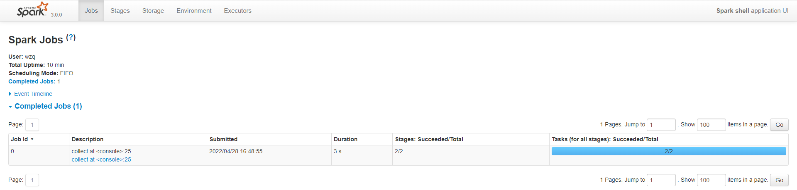


如果要退出本地模式，按下`Ctrl+C`或者输入命令`:quit`即可


### 3、提交应用

打开`spark-shell`之后可以直接执行指令，但是我们不可能在shell里面开发程序，最终还是要在idea里面开发

于是`Spark`为我们提供了一个指令，我们只需要把写好的程序打成jar包，放在Linux上，执行这个指令就可以工作了，比如说：

```bash
[wzq@hadoop102 spark-local]$ bin/spark-submit \
> --class org.apache.spark.examples.SparkPi \
> --master local[2] \
> ./examples/jars/spark-examples_2.12-3.0.0.jar \
> 10
```

> 这个参数什么的，后面再解释

这个指令是提交了一个Spark的案例，计算PI的值，运行完成之后：

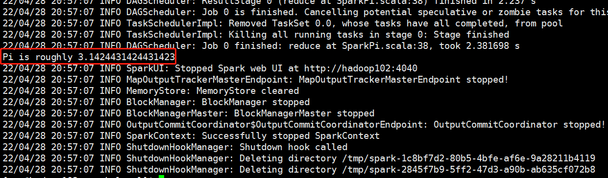

这样`PI`圆周率就计算出来了，读者不用关心值正不正确，快不快就完事儿了！哈哈哈，开玩笑，实际上这个计算PI，是用了某种概率进行计算的，只要迭代的次数多，它的值就会越来越精确。

## 二、Standalone独立部署模式

local模式不能满足工作时候的需求，于是需要将Spark部署在集群上，其中一种部署模式是独立部署`Standalone`模式，指的是没有其他环境只有Spark本身

这种模式是典型的主（`Master`）从（`Slave`）模式，下面来看一看集群部署规划，在以前部署Hadoop的时候，有三台虚拟机，把这三台当作一个集群进行部署，下面是集群部署规划，一个`Master`，三个`Worker`

|       | hadoop102       | hadoop103 | hadoop104 |
| ----- | --------------- | --------- | --------- |
| Spark | Worker `Master` | Worker    | Worker    |

### 1、解压缩文件

进入到`/opt/software`目录，解压缩下载来的Spark安装包：

```bash
[wzq@hadoop102 module]$ cd /opt/software/
[wzq@hadoop102 software]$ tar -zxvf spark-3.0.0-bin-hadoop3.2.tgz -C /opt/module/
# 进入到module目录，修改刚解压缩的spark目录名字
[wzq@hadoop102 software]$ cd /opt/module/
[wzq@hadoop102 module]$ mv spark-3.0.0-bin-hadoop3.2/ spark-standalone
```

### 2、修改配置文件

既然是集群部署，所以需要修改配置文件，进入到`/opt/module/spark-standalone/conf`目录

修改`slaves.templates`文件名为`slaves`，并且在里面添加worker节点，由于我之前做了ip映射规则，这里直接写Linux主机名：

```bash
[wzq@hadoop102 module]$ cd /opt/module/spark-standalone/conf/
[wzq@hadoop102 conf]$ mv slaves.template  slaves
[wzq@hadoop102 conf]$ vim slaves
```

按下`i`编辑该文件，删除`localhost`这一行，添加：

```bash
hadoop102
hadoop103
hadoop104
```

随后修改`spark-env.sh.template`文件名为`spark-env.sh`：

```bash
[wzq@hadoop102 conf]$ mv spark-env.sh.template spark-env.sh
[wzq@hadoop102 conf]$ vim spark-env.sh
```

按下i编辑该文件，在文件末尾添加如下配置

```
export JAVA_HOME=/opt/module/jdk1.8.0_212
SPARK_MASTER_HOST=hadoop102
SPARK_MASTER_PORT=7077
```

> 注意这里的`JAVA_HOME`要设置为自己的JAVA安装目录，以及`MASTER_HOST`要匹配自己的ip或者主机名

插入之后，按下`ESC`输入`:wq`保存退出


下一步就是向其他两台主机分发Spark了：

```bash
[wzq@hadoop102 module]$ pwd
/opt/module
[wzq@hadoop102 module]$ xsync spark-standalone/
```

### 3、启动集群

分发成功以后就可以启动Spark集群了：

```bash
[wzq@hadoop102 module]$ cd /opt/module/spark-standalone/
[wzq@hadoop102 spark-standalone]$ sbin/start-all.sh
```

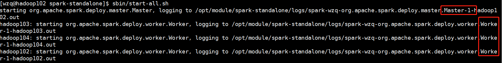

首先启动Master节点，然后启动Worker节点，启动完成可以查看jps进程看一下是否启动成功：

```bash
[wzq@hadoop102 spark-standalone]$ jpsall
=============== hadoop102 ===============
6016 Master
6158 Jps
6095 Worker
=============== hadoop103 ===============
2470 Jps
2397 Worker
=============== hadoop104 ===============
2432 Jps
2353 Worker
```

ok，没毛病，然后查看一下Master资源监控Web UI界面：http://hadoop102:8080/

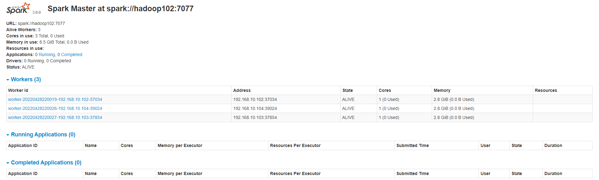


### 4、提交应用

环境准备好了之后就可以提交应用了，还是之前计算`PI`的例子吧：

```bash
[wzq@hadoop102 spark-standalone]$ bin/spark-submit \
> --class org.apache.spark.examples.SparkPi \
> --master spark://hadoop102:7077 \
> ./examples/jars/spark-examples_2.12-3.0.0.jar \
> 10
```

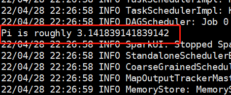

这就运行成功了，代表配置没有错，也可以正常运行，下面来解释一下提交的参数都是什么意思：


在提交应用的时候，一般会同时提交一些参数：

```
bin/spark-submit \
--class <main-class> \
--master <master-url> \
... # other options
<application-jar> \
[application-arguments]
```

| 参数                       | 解释                                                         | 可选值举例                                         |
| -------------------------- | ------------------------------------------------------------ | -------------------------------------------------- |
| `--class`                  | Spark程序中包含主函数的类                                    |                                                    |
| `--master`                 | Spark程序运行的模式（环境）                                  | 模式：`local[*]`、`spark://hadoop102:7077`、`Yarn` |
| `--executor-memory 1G`     | 指定每个`executor`可用内存为1G                               | 符合集群内存配置即可，具体情况具体分析             |
| `--total-executor-cores 2` | 指定所有`executor`使用的cpu核数为2个                         | 符合集群内存配置即可，具体情况具体分析             |
| `--executor-cores`         | 指定每个`executor`使用的cpu核数                              | 符合集群内存配置即可，具体情况具体分析             |
| `application-jar`          | 打包好的应用jar，包含依赖。这个URL在集群中群居可见。比如`hdfs://`共享存储系统，如果是`file:// path`，那么所有的节点都应该包含这个jar |                                                    |
| `application-arguments`    | 传给main()方法的参数                                         |                                                    |


### 5、配置历史服务

由于`Spark-Shell`停止掉以后，集群监控`hadoop102:4040`页面就看不到历史任务的运行情况了，所以开发的时候都会配置**历史服务**记录任务运行情况


第一步，启动`hadoop`，在`hdfs` `\`目录下创建一个目录`directory`：

```bash
[wzq@hadoop102 spark-standalone]$ myhadoop.sh start
```

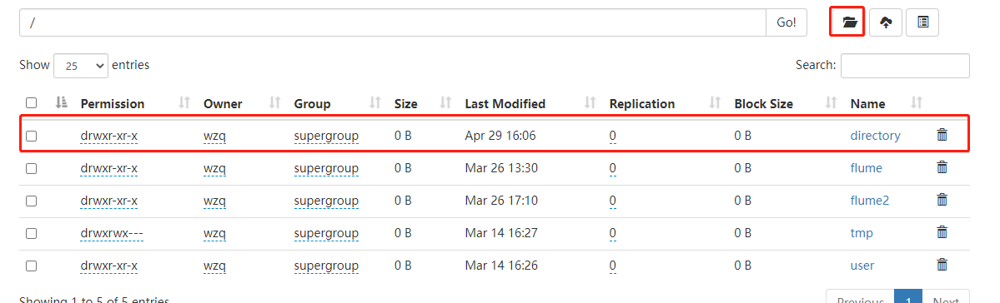

第二步，需要修改`spark-default.conf`文件，配置日志存储路径：

```bash
[wzq@hadoop102 spark-standalone]$ cd conf/
[wzq@hadoop102 conf]$ mv spark-defaults.conf.template spark-defaults.conf
[wzq@hadoop102 conf]$ vim spark-defaults.conf
# 按下i建插入以下配置信息
spark.eventLog.enabled	true
spark.eventLog.dir	hdfs://hadoop102:8020/directory
# 按下ESC，输入:wq保存退出
```

第三步，修改`spark-env.sh`文件，添加日志的配置信息：

```bash
[wzq@hadoop102 conf]$ vim spark-env.sh
# 按下i建插入以下配置信息
export SPARK_HISTORY_OPTS="
-Dspark.history.ui.port=18080 
-Dspark.history.fs.logDirectory=hdfs://hadoop102:8020/directory 
-Dspark.history.retainedApplications=30"
# 按下ESC，输入:wq保存退出
```

参数的含义：

- `history.ui.port=18080`：WEB UI访问的端口号
- `history.fs.logDirectory=hdfs://hadoop102:8020/directory`：指定历史服务器日志存储路径
- `history.retainedApplications=30`：指定保存的Application历史记录的个数，如果超过这个值，旧的应用信息将被删除

第四步，分发配置文件：

```bash
[wzq@hadoop102 conf]$ cd ..
[wzq@hadoop102 spark-standalone]$ pwd
/opt/module/spark-standalone
[wzq@hadoop102 spark-standalone]$ xsync conf/
```

第五步，重新启动集群和历史服务：

```bash
[wzq@hadoop102 spark-standalone]$ sbin/start-all.sh
[wzq@hadoop102 spark-standalone]$ sbin/start-history-server.sh
```

至此，历史服务配置完成，现在重新执行计算PI的任务：

```bash
[wzq@hadoop102 spark-standalone]$ bin/spark-submit \
> --class org.apache.spark.examples.SparkPi \
> --master spark://hadoop102:7077 \
> ./examples/jars/spark-examples_2.12-3.0.0.jar \
> 10
```

执行完成之后，在本地浏览器访问：http://hadoop102:18080/ 即可查看历史服务运行情况：

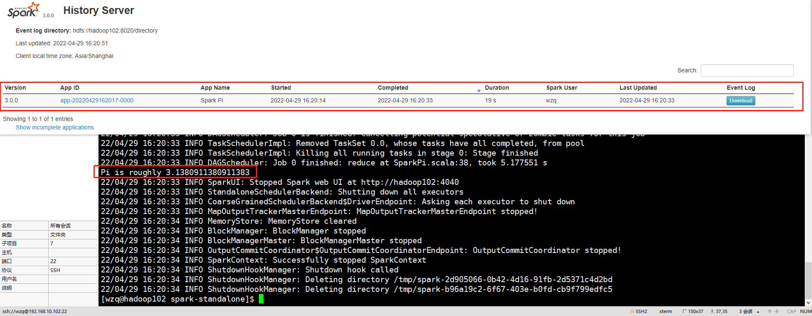


### 6、配置高可用（HA）

现在集群中的Master节点只有一个，但是如果Master所在主机宕机怎么办？针对这个情况，需要在集群中配置多个`Master节点`，一旦处于`ALIVE`状态的`Master`发生故障，处于备用状态的`Master`就自动上位，保证作业可以继续运行，这里的高可用一般采用`Zookeeper`设置，如果你的集群没有`Zookeeper`环境，请参考下面的连接配置：

- [Zookeeper安装本地与分布式环境](http://wzqwtt.club/2022/03/11/zookeeper-ben-di-yu-fen-bu-shi-an-zhuang/)

下表是配置高可用的集群规划：

|       | hadoop102                                                    | hadoop103                                                    | hadoop104                                             |
| ----- | ------------------------------------------------------------ | ------------------------------------------------------------ | ----------------------------------------------------- |
| Spark | <span style="color:red">Master</span> <br><span style="color:blue">Zookeeper</span> <br>Worker | <span style="color:red">Master</span> <br/><span style="color:blue">Zookeeper</span> <br/>Worker | <span style="color:blue">Zookeeper</span> <br/>Worker |

第一步，首先停掉`Spark`集群：

```bash
[wzq@hadoop102 spark-standalone]$ pwd
/opt/module/spark-standalone
[wzq@hadoop102 spark-standalone]$ sbin/stop-all.sh
```

第二步，启动`Zookeeper`集群：

```bash
[wzq@hadoop102 spark-standalone]$ zk.sh start
```

第三步：修改`spark-env.sh`文件，添加如下配置：

```bash
[wzq@hadoop102 spark-standalone]$ vim conf/spark-env.sh
###########################################################
# 按下i建插入以下配置信息
export JAVA_HOME=/opt/module/jdk1.8.0_212
# 注释掉原有的这两行信息
# SPARK_MASTER_HOST=hadoop102
# SPARK_MASTER_PORT=7077

# 添加以下配置信息
SPARK_MASTER_WEBUI_PORT=8989

export SPARK_DAEMON_JAVA_OPTS="
-Dspark.deploy.recoveryMode=ZOOKEEPER 
-Dspark.deploy.zookeeper.url=hadoop102,hadoop103,hadoop104
-Dspark.deploy.zookeeper.dir=/spark"
###########################################################
# 按下ESC，输入:wq保存退出
```

第四步，分发配置文件：

```bash
[wzq@hadoop102 spark-standalone]$ xsync conf/
```


ok，这就已经配置好了，启动集群访问`Hadoop102 Master`节点web页面看一看：

```bash
[wzq@hadoop102 spark-standalone]$ sbin/start-all.sh
```

启动完成之后，当前只有一个`Master`，web访问路径：http://hadoop102:8989/ 可以看到该Master处于`ALIVE`状态

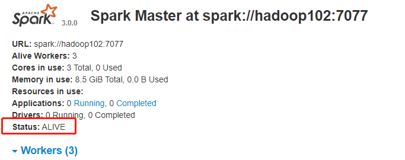


然后单独启动`hadoop103`的这个Master节点，打开`hadoop103`：

```bash
[wzq@hadoop103 ~]$ cd /opt/module/spark-standalone/
[wzq@hadoop103 spark-standalone]$ sbin/start-master.sh
```

打开`hadoop103 Master`节点web页面，http://hadoop103:8989/

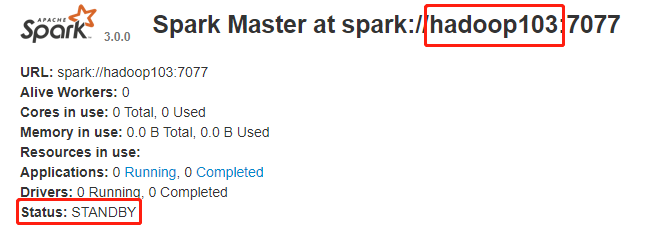

可以看到是`STANDBY`状态

如果现在杀死`hadoop102`的`Master`进程，这里就会变成`ALIVE`状态，可以试一下：

```bash
# 这是在hadoop102上的操作
[wzq@hadoop102 spark-standalone]$ jps
2209 NameNode
3361 HistoryServer
4436 Worker
4564 Jps
2840 JobHistoryServer
2666 NodeManager
4126 QuorumPeerMain
4350 Master
2335 DataNode
# Master节点的进程ID是4350
[wzq@hadoop102 spark-standalone]$ kill -9 4350
```

过了一分钟左右，可以看到`hadoop103`的Master web页面显示Master节点是`ALIVE`状态

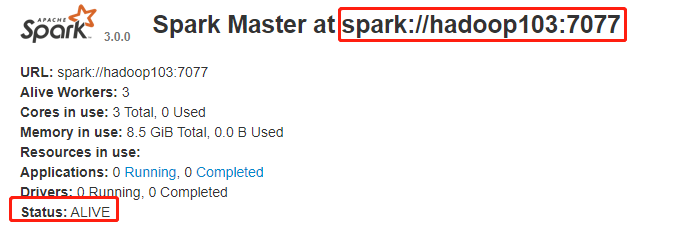


## 三、Yarn模式

国内用的比较多的是`Spark`的`Yarn`模式，接下来配置一下这个模式：

### 1、解压缩安装包

再解压缩一份spark安装包，并且修改目录名称：

```bash
[wzq@hadoop102 software]$ tar -zxvf spark-3.0.0-bin-hadoop3.2.tgz -C /opt/module/
[wzq@hadoop102 software]$ cd /opt/module/
[wzq@hadoop102 module]$ mv spark-3.0.0-bin-hadoop3.2/ spark-yarn
```

### 2、修改配置文件

第一步，修改`hadoop`配置文件`yarn-site.xml`，路径在：

```bash
[wzq@hadoop102 module]$ vim hadoop-3.1.3/etc/hadoop/yarn-site.xml
##############################################################################################
# 按下i键，插入以下配置信息
<!--是否启动一个线程检查每个任务正使用的物理内存量，如果任务超出分配值，则直接将其杀掉，默认是 true -->
<property>
    <name>yarn.nodemanager.pmem-check-enabled</name>
    <value>false</value>
</property>
<!--是否启动一个线程检查每个任务正使用的虚拟内存量，如果任务超出分配值，则直接将其杀掉，默认是 true -->
<property>
    <name>yarn.nodemanager.vmem-check-enabled</name>
    <value>false</value>
</property>
##############################################################################################
# 按下ESC，输入:wq保存退出
```

然后分发这个脚本：

```bash
[wzq@hadoop102 module]$ xsync hadoop-3.1.3/etc/hadoop/
```

然后启动hadoop集群：

```bash
[wzq@hadoop102 module]$ myhadoop.sh start
```


第二步，修改`spark-yarn`底下的`conf/spark-env.sh`添加`JAVA_HOME`和`YARN_CONF_DIR`配置，以及添加日志配置

```bash
[wzq@hadoop102 module]$ cd spark-yarn/conf/
[wzq@hadoop102 conf]$ mv spark-env.sh.template spark-env.sh
[wzq@hadoop102 conf]$ vim spark-env.sh 
#############################################################################
# 按下i键，插入以下配置信息
export JAVA_HOME=/opt/module/jdk1.8.0_212
YARN_CONF_DIR=/opt/module/hadoop-3.1.3/etc/hadoop

export SPARK_HISTORY_OPTS="
-Dspark.history.ui.port=18080 
-Dspark.history.fs.logDirectory=hdfs://hadoop102:8020/directory 
-Dspark.history.retainedApplications=30"
#############################################################################
# 按下ESC，输入:wq保存退出
```

第三步，配置`spark-default.conf`文件，日志存储路径：

```bash
[wzq@hadoop102 conf]$ mv spark-defaults.conf.template spark-defaults.conf
[wzq@hadoop102 conf]$ vim spark-defaults.conf
#############################################################################
# 按下i键，插入以下配置信息
spark.eventLog.enabled true
spark.eventLog.dir hdfs://hadoop102:8020/directory

spark.yarn.historyServer.address=hadoop102:18080
spark.history.ui.port=18080
#############################################################################
# 按下ESC，输入:wq保存退出
```


### 3、测试

首先启动`spark`历史服务：

```bash
[wzq@hadoop102 spark-yarn]$ sbin/start-history-server.sh
```

提交应用：

```bash
[wzq@hadoop102 spark-yarn]$ bin/spark-submit \
> --class org.apache.spark.examples.SparkPi \
> --master yarn \
> --deploy-mode client \
> ./examples/jars/spark-examples_2.12-3.0.0.jar \
> 10
```

ok，执行成功！

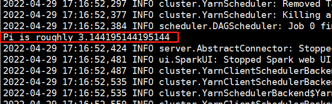

打开历史服务器：http://hadoop103:8088/ 可以看到刚刚执行的一个SparkPI应用

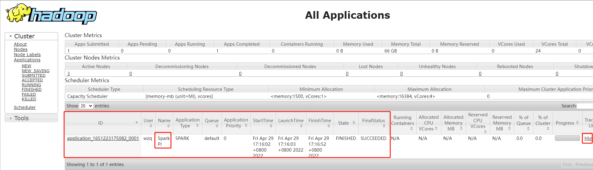

点击最右侧的`History`，即可进入hadoop102的一个监控工作状态的web页面

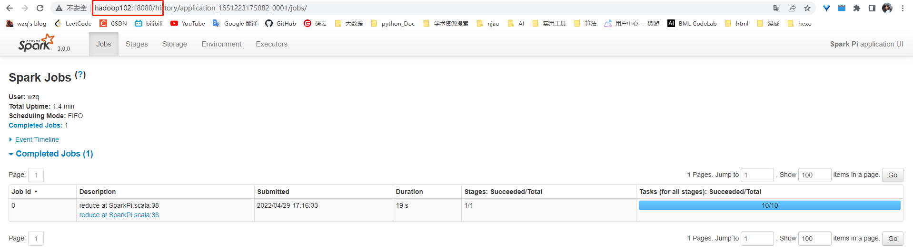


## 四、部署模式对比


## 五、端口号


## 参考资料

- [尚硅谷Spark 3.0.0 学习视频](https://www.bilibili.com/video/BV11A411L7CK)
- [Spark 3.0.0 官方文档](https://spark.apache.org/docs/3.0.0/)

