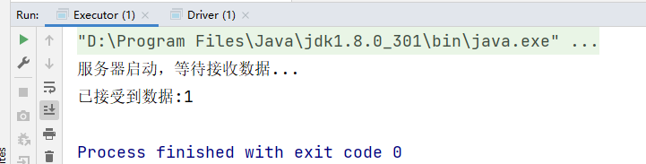
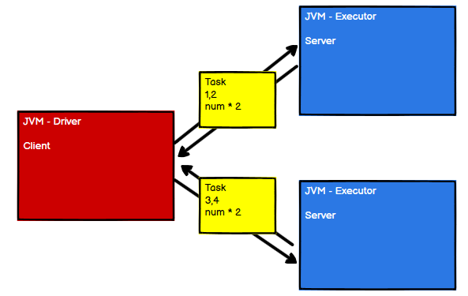
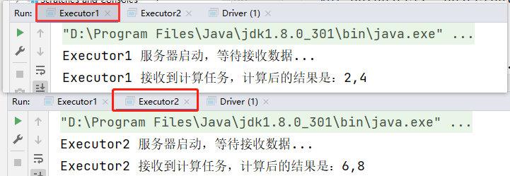

> 为了更好的学习Spark，本blog模拟了分布式计算的细节

## 一、介绍

在大数据生态中一般一个任务是由几台主机协同、分布式的计算的，这篇blog模拟了一下分布式计算

我们知道`Spark`中有`Driver`（负责任务调度的）和`Executor`（负责计算的），这次模拟一下Driver向Executor发送计算任务


首先来看一个Driver和一个Executor的场景：


Driver和Executor相当于两个JVM进程，Executor属于计算节点，所以他就相当于`Server服务端`，那么Driver就相当于`Client客户端`，现在只有一个Driver和一个Executor，先来搭建出来基本的架子

## 二、搭建架子

不搞那么复杂，直接使用Java的网络编程`Socket`包来做好了，打开idea新建一个Maven项目，添加Scala的依赖支持，新建一个包，创建两个`Object`，分别是`Driver`和`Executor`


`Executor`：

```scala
package com.wzq.bigdata.spark.core.test1

import java.io.InputStream
import java.net.{ServerSocket, Socket}

object Executor {
  def main(args: Array[String]): Unit = {
    // Server端
    val server: ServerSocket = new ServerSocket(9999)
    println("服务器启动，等待接收数据...")
    // 接收数据
    val client: Socket = server.accept()

    val in: InputStream = client.getInputStream
    val i: Int = in.read()
    println("已接受到数据:" + i)
	
    // 关闭连接
    in.close()
    client.close()
    server.close()
  }
}
```

`Driver`：

```scala
package com.wzq.bigdata.spark.core.test1

import java.io.OutputStream
import java.net.Socket

object Driver {
  def main(args: Array[String]): Unit = {
    // 客户端
    val client: Socket = new Socket("localhost", 9999)

    // 客户端发送一个信息
    val out: OutputStream = client.getOutputStream

    out.write(1)
    out.flush()
    out.close()

    client.close()
  }
}
```

这是个简单的架子，向本机`localhost 9999端口`发送了一个数字1，先启动`Executor`类，再启动`Driver`类，最终可以输出以下结果：



## 三、发送计算任务

只发送1不行，要模拟的是分布式计算的工作，我们说`Driver`负责资源的调度是不干活的，`Executor`是真正的打工人。但是数据结构（包括数据、要执行的操作之类的）会先发给`Driver`，`Driver`再把任务发送给`Executor`


既然这样，新建一个`Scala`类，这个类就是要进行计算的任务，包括数据与逻辑操作

```scala
package com.wzq.bigdata.spark.core.test1

// 因为要进行网络传输，所以要实现Serializable序列化特质
class Task extends Serializable {
  // 准备数据
  val datas = List(1, 2, 3, 4)
  // 逻辑
  val logic: (Int) => Int = _ * 2
  // 执行计算
  def compute() = {
    datas.map(logic)
  }
}
```


那么`Driver`客户端需要发送的内容就要改一改了，这次发送的要是Task，一个Object

```scala
package com.wzq.bigdata.spark.core.test1

import java.io.{ObjectOutputStream, OutputStream}
import java.net.Socket

object Driver {
  def main(args: Array[String]): Unit = {
    // 客户端
    val client: Socket = new Socket("localhost", 9999)

    // 客户端发送一个信息
    val out: OutputStream = client.getOutputStream
    val outObject: ObjectOutputStream = new ObjectOutputStream(out)

    val task: Task = new Task
    outObject.writeObject(task)   // 发送一个Object
	println("已发送计算任务")
      
    outObject.flush()
    outObject.close()
    client.close()
  }
}
```

同样`Executor`要接收的也应该是一个`Object`，收到之后再进行类型转换：

```scala
package com.wzq.bigdata.spark.core.test1

import java.io.{InputStream, ObjectInputStream}
import java.net.{ServerSocket, Socket}

object Executor {
  def main(args: Array[String]): Unit = {
    // Server端连接
    val server: ServerSocket = new ServerSocket(9999)
    println("服务器启动，等待接收数据...")

    val client: Socket = server.accept()

    val in: InputStream = client.getInputStream
    val objIn: ObjectInputStream = new ObjectInputStream(in)

    // 这边要接收一个Object，Task计算任务
    val task: Task = objIn.readObject().asInstanceOf[Task]
    // 执行计算
    val list: List[Int] = task.compute()
    println("接收到计算任务，计算后的结果是：" + list.mkString(","))

    objIn.close()
    client.close()
    server.close()
  }
}
```

## 四、分布式计算

到目前为止，已经做出了一个发、一个接的功能，但是还没有体现分布式哎，一个大型的任务应该要有好几个`Executor`执行，如下图所示：



也就是说，现在有两个`Executor`了，为了不进行冗余计算，这个Task的数据应该分成两波发送，但是计算的逻辑还是原样不变，一起发送


这时候需要引入一个SubTask，这个里面逻辑、数据都由Task给，然后再分别发给Executor1和2

`SubTask`：

```scala
package com.wzq.bigdata.spark.core.test1

class SubTask extends Serializable {
  // 因为数据不确定，所以这里赋值None，并且可变
  var datas: List[Int] = _
  // 逻辑部分
  var logic: Int => Int = _

  // 计算部分
  def compute() = {
    datas.map(logic)
  }
}
```

`Driver`：

```scala
package com.wzq.bigdata.spark.core.test1

import java.io.{ObjectOutputStream, OutputStream}
import java.net.Socket

object Driver {
  def main(args: Array[String]): Unit = {
    // 客户端
    val client1: Socket = new Socket("localhost", 9999)
    val client2: Socket = new Socket("localhost", 8888)

    // client1发给 Executor1 客户端发送一个信息
    val out1: OutputStream = client1.getOutputStream
    val outObject1: ObjectOutputStream = new ObjectOutputStream(out1)

    val task: Task = new Task // 数据都在这里

    val task1: SubTask = new SubTask
    task1.datas = task.datas.take(2)
    task1.logic = task.logic

    outObject1.writeObject(task1) // 发送一个Object，SubTask
    println("client1 已发送计算任务")
    outObject1.flush()
    outObject1.close()

    // ===========================================================================
    // client2发给 Executor2 客户端发送一个信息
    val out2: OutputStream = client2.getOutputStream
    val outObject2: ObjectOutputStream = new ObjectOutputStream(out2)

    val task2: SubTask = new SubTask
    task2.datas = task.datas.takeRight(2)
    task2.logic = task.logic

    outObject2.writeObject(task2) // 发送一个Object，SubTask
    println("client2 已发送计算任务")
    outObject2.flush()
    outObject2.close()

    // 关闭资源
    client1.close()
    client2.close()
  }
}
```

`Executor1`：

```scala
package com.wzq.bigdata.spark.core.test1

import java.io.{InputStream, ObjectInputStream}
import java.net.{ServerSocket, Socket}

object Executor1 {
  def main(args: Array[String]): Unit = {
    // Server端连接
    val server: ServerSocket = new ServerSocket(9999)
    println("Executor1 服务器启动，等待接收数据...")

    val client: Socket = server.accept()

    val in: InputStream = client.getInputStream
    val objIn: ObjectInputStream = new ObjectInputStream(in)

    // 这边要接收一个Object，Task计算任务
    val task: SubTask = objIn.readObject().asInstanceOf[SubTask]
    // 执行计算
    val list: List[Int] = task.compute()
    println("Executor1 接收到计算任务，计算后的结果是：" + list.mkString(","))

    objIn.close()
    client.close()
    server.close()
  }
}
```

`Executor2`：

```scala
package com.wzq.bigdata.spark.core.test1

import java.io.{InputStream, ObjectInputStream}
import java.net.{ServerSocket, Socket}

object Executor2 {
  def main(args: Array[String]): Unit = {
    // Server端连接
    val server: ServerSocket = new ServerSocket(8888)
    println("Executor2 服务器启动，等待接收数据...")

    val client: Socket = server.accept()

    val in: InputStream = client.getInputStream
    val objIn: ObjectInputStream = new ObjectInputStream(in)

    // 这边要接收一个Object，Task计算任务
    val task: SubTask = objIn.readObject().asInstanceOf[SubTask]
    // 执行计算
    val list: List[Int] = task.compute()
    println("Executor2 接收到计算任务，计算后的结果是：" + list.mkString(","))

    objIn.close()
    client.close()
    server.close()
  }
}
```


计算结果：



至此成功模拟了分布式计算！

## 参考资料

- [尚硅谷Spar 3.0.0 学习视频](https://www.bilibili.com/video/BV11A411L7CK)

