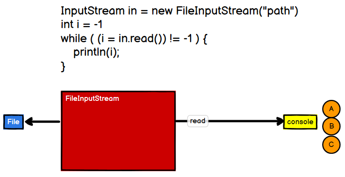
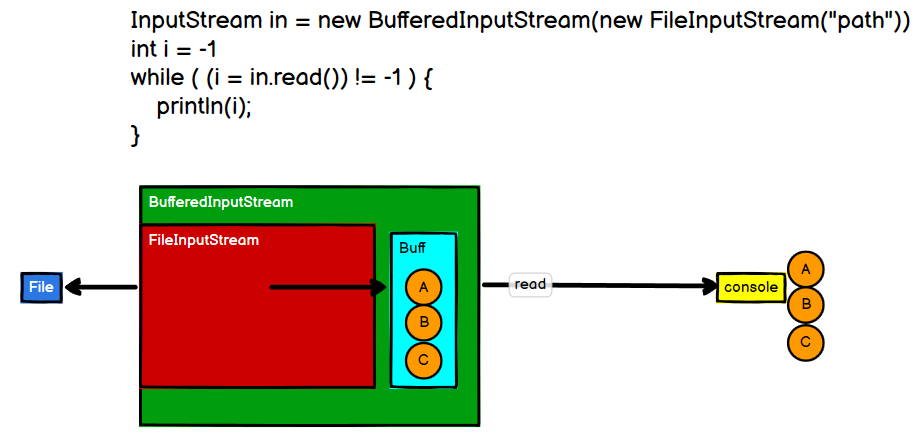
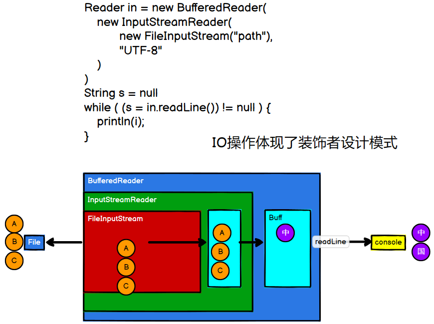
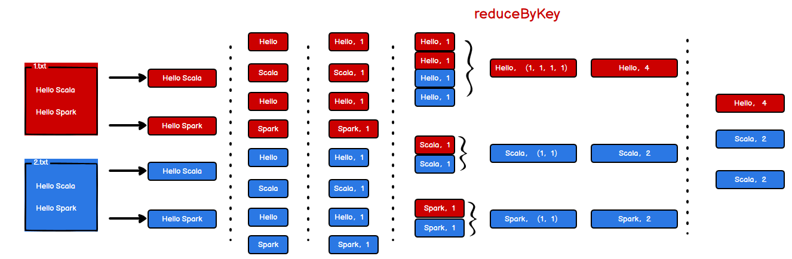
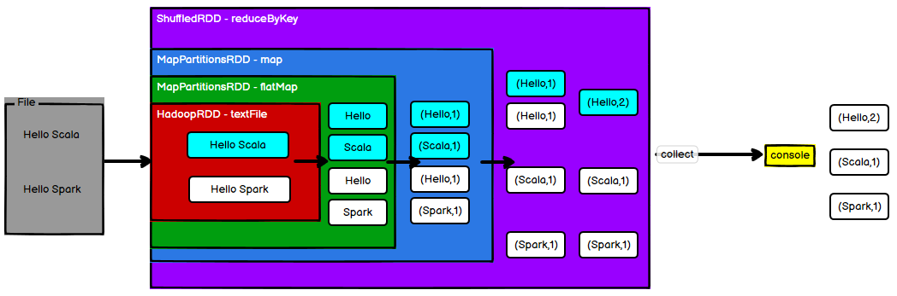

> 这篇Blog将探讨Java IO流和Spark RDD之间的关系

## 一、Java IO流

Java IO流分为字节流和字符流，最简单的一种读取文件的方式如下图所示：

如上图所示，当`FileInputStream`读取文件之后，没有做保存就直接输出给控制台打印了，读取一个字节就输出一个字节，这是最简单的模式

但是这种字节流读文件的速度不够高效，所以又出现了`BufferedInputStream`，如下图所示：

在`FileInputStream`外面嵌套了一层`BufferedInputStream`，当`FileInputStream`读取一个字节之后并没有直接输出给控制台，而是到了`BufferedInputStream`提供的`Buffer`缓冲区，待`Buffer`满了之后，再一次性把缓冲区的字节都交给控制台输出

但这还是字节流啊，我们希望做一个字符流哎，读取一个字节，待能够拼接成一个字符再输出，所以又有了`BufferedReader`，他里面嵌套一个`InputStreamReader`，`InputStreamReader`里面又有一个`FileInputStream`，如下图所示：

`FileInputStream`读取字节之后先交给`InputStreamReader`，这里有个`Buffer`缓冲区，待这个Buffer能够组成一个字符的时候，再交给外层的`BufferedReader`，最后再把一个字符输出的控制台

从上面三种形式的IO流，我们可以发现为了做到某个功能，都是把简单的一些功能叠加在了一起，是一种`装饰者设计模式`，`Spark RDD`正是这种模式，接下来看一下Spark的WordCount是如何叠加`RDD`的

## 二、WordCount RDD工作流程

Spark 实现 WordCount的一种方式如下图所示：

首先使用`textFile`从文件里面按行读取数据，然后使用一个`flatMap`将这些个行按照空格分词，分词之后呢，使用`Map`将每个单词转换为`(单词,1)`的形式，紧接着下一步就是针对刚刚转换的数据，做一个`groupBy`的操作了，按照单词进行分组，分完组之后就是使用`reduceByKey`进行聚合操作，最后再使用`collect`进行收集，就得到了最终结果。本篇`blog`就不展示具体的代码了，[读者可以点击这串字看一下Spark实现WordCount的三种方式以及code](http://wzqwtt.club/2022/04/28/spark-gai-shu-ji-wordcount/#toc-heading-5)

实际上，在使用以上的一些方法的时候，每一个步骤都会生成一个RDD算子，如下图所示：

使用`textFile`按行读取文件的时候生成一个`HadoopRDD`算子，使用这个结果进行`flatMap`的时候再生成一个`MapPartitionsRDD`算子，然后基于这个结果再使用`map`转换数据，再生成一个`MapPartitionsRDD`算法，最后进行`reduceByKey`的时候生成一个`ShuffledRDD`算子，最后`collect`执行收集操作

**可以看到实现WordCount这块也是进行了功能的叠加，与Java IO流非常相似，也属于一种装饰者设计模式**

## 三、IO与RDD之间的关系

- RDD的数据处理方式类似于IO流，也有装饰者设计模式
- RDD的数据只有在调用`collect`方法的时候，才会真正执行业务逻辑操作，是一种懒加载，之前的封装全部都是功能的扩展
- RDD本身不保存数据，但是IO可以临时保存一部分数据

## 参考资料

- [尚硅谷Spark 3.0.0 学习视频](https://www.bilibili.com/video/BV11A411L7CK)

