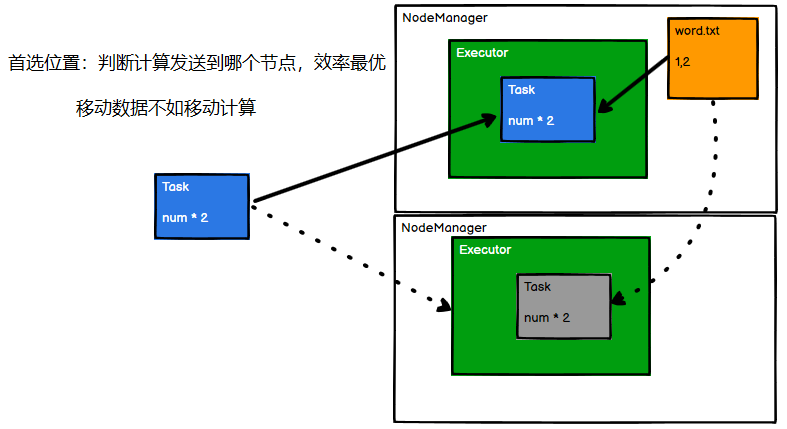
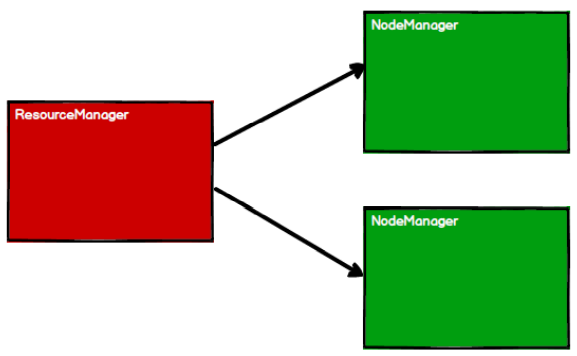
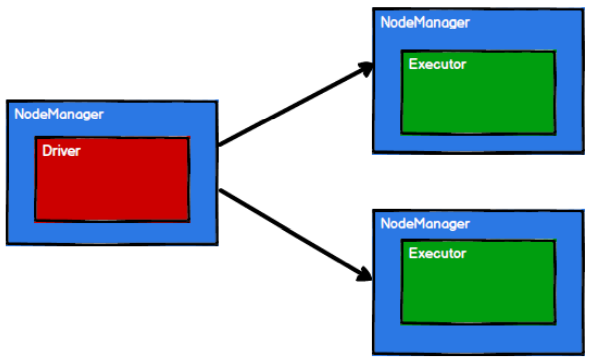
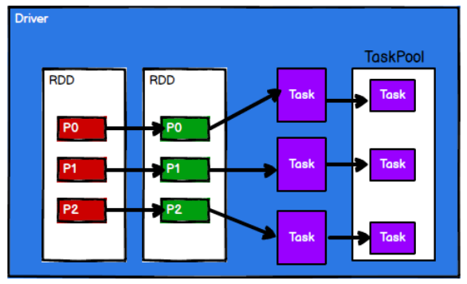
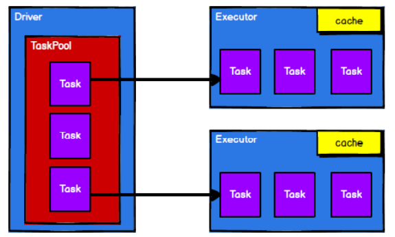

> `Spark`计算框架为了能够进行高并发和高吞吐的数据处理，封装了三大数据结构，用于处理不同的应用场景。三大数据结构分别是：
>
> - `RDD`：弹性分布式数据集
> - `累加器`：分布式共享**只写**变量
> - `广播变量`：分布式共享**只读**变量
>
> 本`blog`先从RDD开始

## 一、什么是RDD

`RDD`（Resilient Distributed Dataset）叫做弹性分布式数据集，是Spark中最基本的数据处理模型。封装RDD的是一个抽象类，它代表一个弹性的、不可变的、可分区、里面元素可以并行计算的集合。有以下特定：

- 弹性
  - 存储的弹性：内存与磁盘的自动切换
  - 容错的弹性：数据丢失可以自动恢复
  - 计算的弹性：计算出错重试机制
  - 分片的弹性：可根据需要重新分片
- 分布式：数据存储在大数据集群的不同节点上
- 数据集：RDD封装了计算逻辑，并不保存数据
- 数据抽象：RDD是一个抽象类，需要子类具体实现
- 不可变：RDD封装了计算逻辑，是不可以改变的，想要改变，只能产生新的RDD，在新的RDD里面封装计算逻辑
- 可分区、并行计算


## 二、核心属性

点开`RDD`源码，它的文档注释里面有这样这样一堆话：

```
* Internally, each RDD is characterized by five main properties:
*
*  - A list of partitions
*  - A function for computing each split
*  - A list of dependencies on other RDDs
*  - Optionally, a Partitioner for key-value RDDs (e.g. to say that the RDD is hash-partitioned)
*  - Optionally, a list of preferred locations to compute each split on (e.g. block locations for
*    an HDFS file)
```

每个RDD有五个都有五个核心属性，分别是：

### 1、分区列表

分区列表（`A list of partitions`），对应下面的一个抽象方法：

```scala
  /**
   * Implemented by subclasses to return the set of partitions in this RDD. This method will only
   * be called once, so it is safe to implement a time-consuming computation in it.
   *
   * The partitions in this array must satisfy the following property:
   *   `rdd.partitions.zipWithIndex.forall { case (partition, index) => partition.index == index }`
   */
  protected def getPartitions: Array[Partition]
```

`RDD`数据结构中存在分区列表，用于执行任务时并行计算，是实现分布式计算的重要属性

### 2、分区计算函数

分区计算函数（`A function for computing each split`），对应下面的一个抽象方法：

```scala
  /**
   * :: DeveloperApi ::
   * Implemented by subclasses to compute a given partition.
   */
  @DeveloperApi
  def compute(split: Partition, context: TaskContext): Iterator[T]
```

这个部分就是Spark在计算的时候首先会分区，这是使用分区函数对每一个分区计算的函数


### 3、RDD之间的依赖关系

RDD之间的依赖关系（`A list of dependencies on other RDDs`），对应下面的一个抽象方法：

```scala
  /**
   * Implemented by subclasses to return how this RDD depends on parent RDDs. This method will only
   * be called once, so it is safe to implement a time-consuming computation in it.
   */
  protected def getDependencies: Seq[Dependency[_]] = deps
```

RDD是最小计算单元，在[上一篇blog](https://wzqwtt.club/2022/04/30/java-io-liu-yu-spark-rdd-de-guan-xi/)中通过对比Java IO流也已经知道了Spark中的RDD实际上就是计算模型的封装，当需求中需要将多个RDD计算模型进行组合的时候，就需要将RDD建立依赖关系


### 4、分区器（可选）

分区器（`a Partitioner for key-value RDDs`），对应下面的抽象方法：

```scala
  /** Optionally overridden by subclasses to specify how they are partitioned. */
  @transient val partitioner: Option[Partitioner] = None
```

当数据为KV类型数据时，可以通过设定分区器自定义数据的分区


### 5、首选位置（可选）

首先位置（`a list of preferred locations to compute each split on (e.g. blocl locations for an HDFS file)`），对应下面的一个抽象方法：

```scala
  /**
   * Optionally overridden by subclasses to specify placement preferences.
   */
  protected def getPreferredLocations(split: Partition): Seq[String] = Nil
```

计算数据时，可以根据计算节点的状态选择不同的节点位置进行计算



如上图所示，假设一个Task将要被分配给一个Executor进行计算，其中一个Executor所在的主机有对应需要处理的文件，那么会首先选择发给这台主机进行计算，因为可以不用传输数据；如果发送给了下一个Executor进行计算，那么对应的数据就要经过网络传输传输到另一台主机，如果这个数据文件很大，那么效率就出现了问题。**移动数据不如移动计算！**

## 三、执行原理

从计算的角度来讲，数据处理过程中需要计算资源（内存 & CPU）和计算模型（逻辑）。执行时，就需要将计算资源和计算模型进行协调和整合。

`Spark`框架在执行时，先申请资源，然后再将应用程序的数据处理逻辑分解成一个一个的计算任务。然后将任务发到已经分配资源的计算节点上，按照指定的计算模型进行数据计算，最终拿到计算结果。


RDD是Spark框架中用于数据处理的核心模型，在Yarn环境中，RDD的工作原理是这样的：

第一步，启动Yarn集群环境



第二步，Spark申请资源创建调度节点和计算节点



第三步，Spark框架根据需求将计算逻辑根据分区划分成不同的任务，这一步在Driver阶段完成



第四步，调度节点将任务根据节点状态发送到对应的计算节点进行计算




从上面可以看到RDD在整个流程中主要用于将逻辑进行封装，并生成Task发送给Executor节点执行计算。


## 参考资料

- [尚硅谷Spark 3.0.0 学习视频](https://www.bilibili.com/video/BV11A411L7CK)
- [Spark 3.0.0 官方文档](https://spark.apache.org/docs/3.0.0/)

