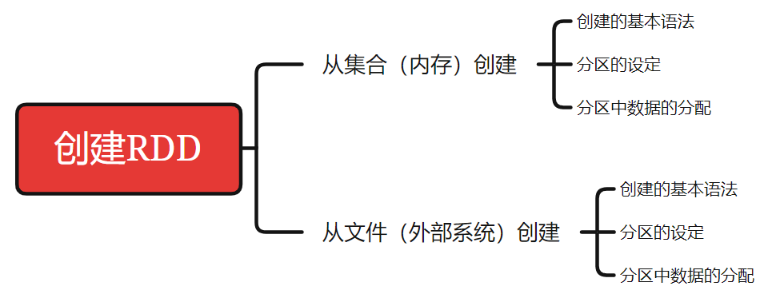
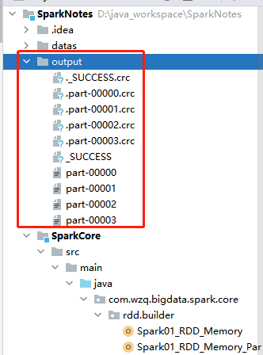
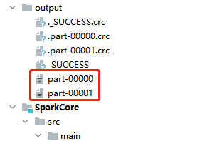
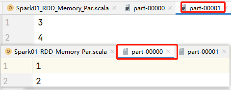
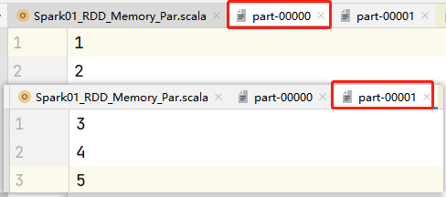
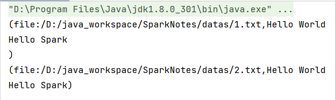
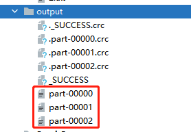

> 下图就是本篇Blog的脉络，分别记录了从集合中创建、从文件中创建的基本语法、分区的设定以及分区中的数据是如何分配的




## 一、从集合（内存）中创建

### 1、基本语法

打开idea，创建一个Maven项目，然后导入依赖新建一个包，再新建一个Scala Object

写Spark的代码，第一步必须建立与Spark的连接，第二步是业务逻辑的处理，最后一步是关闭与Spark的连接；所以基本的架子就如下面的代码所示：

```scala
package com.wzq.bigdata.spark.core.rdd.builder

import org.apache.spark.{SparkConf, SparkContext}

object Spark01_RDD_Memory {
  def main(args: Array[String]): Unit = {
    // 1、准备环境
    // local[*] 当前系统最大可用核数，不写就是单线程单核
    // AppName 应用名字
    val sparkConf: SparkConf = new SparkConf().setMaster("local[*]").setAppName("RDD")
    val sc: SparkContext = new SparkContext(sparkConf)

    // 2、业务逻辑

    // 3、关闭环境
    sc.stop()
  }
}
```

#### 1.1 parallelize

然后是从集合中创建RDD，第一个创建RDD的方法是`parallelize`（下面是源码）：

```scala
def parallelize[T: ClassTag](
    seq: Seq[T],
    numSlices: Int = defaultParallelism): RDD[T] = withScope {
    assertNotStopped()
    new ParallelCollectionRDD[T](this, seq, numSlices, Map[Int, Seq[String]]())
}
```

共有两个参数：

- `seq: Seq[T]`：一个集合，所以我们创建的时候可以写传递一个Seq的实现类，也可以写Seq本身
- `numSlices: Int`：一个整数，表示分区的数量，有默认值`defaultParallelism`，可以不传递，这个在后面的章节具体介绍

所以有了这个方法就可以创建一个RDD了，替换基本架子的第二个业务逻辑部分：

```scala
package com.wzq.bigdata.spark.core.rdd.builder

import org.apache.spark.rdd.RDD
import org.apache.spark.{SparkConf, SparkContext}

object Spark01_RDD_Memory {
  def main(args: Array[String]): Unit = {
    // 1、准备环境
    // local[*] 当前系统最大可用核数，不写就是单线程单核
    // AppName 应用名字
    val sparkConf: SparkConf = new SparkConf().setMaster("local[*]").setAppName("RDD")
    val sc: SparkContext = new SparkContext(sparkConf)

    // 2、创建RDD
    // 从内存中创建RDD，将内存中集合的数据作为数据的处理源
    val seq: Seq[Int] = Seq(1, 2, 3, 4)
    val rdd: RDD[Int] = sc.parallelize(seq)

    // 只有触发collect方法，RDD才会执行
    rdd.collect().foreach(println)

    // 3、关闭环境
    sc.stop()
  }
}
```

#### 1.2 makeRDD:star:

`parallelize`这个方法可以创建RDD，还有一个方法也可以创建，这个方法就是：`makeRDD`：

```scala
def makeRDD[T: ClassTag](
    seq: Seq[T],
    numSlices: Int = defaultParallelism): RDD[T] = withScope {
    // 调用了parallelize方法
    parallelize(seq, numSlices)
}
```

这个`makeRDD`比这个`parallelize`好记多了，在这个方法里面就是调用了`parallzlize`，Spark工程师可能也觉得这个p开头的单词太长了太难记了吧，所以给我们又贡献了一个`makeRDD`方法，它的使用和`parallzlize`一模一样：

```scala
package com.wzq.bigdata.spark.core.rdd.builder

import org.apache.spark.rdd.RDD
import org.apache.spark.{SparkConf, SparkContext}

object Spark01_RDD_Memory {
  def main(args: Array[String]): Unit = {
    // 1、准备环境
    // local[*] 当前系统最大可用核数，不写就是单线程单核
    // AppName 应用名字
    val sparkConf: SparkConf = new SparkConf().setMaster("local[*]").setAppName("RDD")
    val sc: SparkContext = new SparkContext(sparkConf)

    // 2、创建RDD
    // 从内存中创建RDD，将内存中集合的数据作为数据的处理源
    val seq: Seq[Int] = Seq(1, 2, 3, 4)
    //    val rdd: RDD[Int] = sc.parallelize(seq)
    val rdd: RDD[Int] = sc.makeRDD(seq)

    // 只有触发collect方法，RDD才会执行
    rdd.collect().foreach(println)

    // 3、关闭环境
    sc.stop()
  }
}
```

### 2、分区的设定

在上面创建RDD的基本语法的时候，分别要传递两个参数，第一个参数是集合，第二个参数是需要设定分区的数量，不设置就是默认值

更改最后输出到控制台的方法`collect`为`saveAsTextFile`，这个方法代表将计算结果输出到文件里面：

```scala
package com.wzq.bigdata.spark.core.rdd.builder

import org.apache.spark.rdd.RDD
import org.apache.spark.{SparkConf, SparkContext}

object Spark01_RDD_Memory_Par {
  def main(args: Array[String]): Unit = {
    // 1、准备环境
    // local[*] 当前系统最大可用核数，不写就是单线程单核
    // AppName 应用名字
    val sparkConf: SparkConf = new SparkConf().setMaster("local[*]").setAppName("RDD")
    val sc: SparkContext = new SparkContext(sparkConf)

    // 2、创建RDD
    val rdd: RDD[Int] = sc.makeRDD(List(1, 2, 3, 4))

    // 将计算结果输出到文件，这个路径是从项目根目录开始算的，可以写绝对也可以写相对路径
    rdd.saveAsTextFile("output")

    // 3、关闭环境
    sc.stop()
  }
}
```

执行这段代码，结果如下图所示：



看`part-00..`开头的这些文件，可以看到默认给我分了四个区，也许读者的代码最后生成了8个区、16个区等等，那是因为它的默认值是根据电脑CPU核的数量分的……我的电脑不太争气，只有四个核，所以分了四个区

一路点开源码，也可以看到这个分区默认值是通过`spark.default.parallelism`设置的

```scala
  override def defaultParallelism(): Int =
    scheduler.conf.getInt("spark.default.parallelism", totalCores)
```

于是，咱们自己可以设置这个参数来指定分区数量，也可以在`makeRDD`的第二个参数设置分区数：

```scala
package com.wzq.bigdata.spark.core.rdd.builder

import org.apache.spark.rdd.RDD
import org.apache.spark.{SparkConf, SparkContext}

object Spark01_RDD_Memory_Par {
  def main(args: Array[String]): Unit = {
    // 1、准备环境
    // local[*] 当前系统最大可用核数，不写就是单线程单核
    // AppName 应用名字
    val sparkConf: SparkConf = new SparkConf().setMaster("local[*]").setAppName("RDD")
    // 可以在这里设置，也可以在下面设置
    // sparkConf.set("spark.default.parallelism", "2")
    val sc: SparkContext = new SparkContext(sparkConf)

    // 2、创建RDD
    val rdd: RDD[Int] = sc.makeRDD(List(1, 2, 3, 4), 2)

    // 将计算结果输出到文件，这个路径是从项目根目录开始算的，可以写绝对也可以写相对路径
    rdd.saveAsTextFile("output")

    // 3、关闭环境
    sc.stop()
  }
}
```



### 3、分区数据的分配

现在咱们就要好奇一下，从集合创建RDD，它的分区中的数据是如何分配的了，咱们这次是把分区设置成了2，可以看一下最后生成的结果文件都是个啥：



其中一个分了`1,2`，第二个分赔了`3,4`；好像很均匀的样子，如果我们把集合数据设置成了5个会怎么样呢？



可以看到，第一个分了`1,2`，第二个分了`3,4,5`，哎嘿，那为什么不是第一个分了`1,2,3`，第二个分了`4,5`呢？点开源码看一看吧！

```scala
  def slice[T: ClassTag](seq: Seq[T], numSlices: Int): Seq[Seq[T]] = {
    if (numSlices < 1) {
      throw new IllegalArgumentException("Positive number of partitions required")
    }
    // Sequences need to be sliced at the same set of index positions for operations
    // like RDD.zip() to behave as expected
    def positions(length: Long, numSlices: Int): Iterator[(Int, Int)] = {
      (0 until numSlices).iterator.map { i =>
        val start = ((i * length) / numSlices).toInt
        val end = (((i + 1) * length) / numSlices).toInt
        (start, end)
      }
    }
    seq match {
      case r: Range =>
		// ... 这部分代码我删掉了
      case nr: NumericRange[_] =>
		// ... 这一部分我也删掉了
      case _ =>
        val array = seq.toArray // To prevent O(n^2) operations for List etc
        positions(array.length, numSlices).map { case (start, end) =>
            array.slice(start, end).toSeq
        }.toSeq
    }
  }
```

查到这点源代码，来看一看他是怎么分配的吧！

首先进入到这个方法会先判断设置的`numSlices`小于1吗？如果小于1那肯定是报错了，因为不能连一个分区都没有吧！然后映入眼帘的是一个方法里面的方法，先不看，继续往下

这下来到了一个关于我们传递进去的集合`Seq`的一个模式匹配，其中前两个是关于随机的一些类型匹配，我删掉了，直接看默认匹配到的最后一段code

在这里，首先将seq转换为了`array`，然后把数组的长度和分区的数量传递进了`positions`方法，就是刚刚那个方法中的方法，来看一看吧！

现在传递进去的数组是`[1,2,3,4,5]`，数组长度等于5，分区的数量设置为了2，进入到`positions`方法，有一个从0到分区数量（不包含）的迭代，在这个迭代里面用了map进行转换，分别返回开始位置和结束位置：

```
0	1 循环迭代
i = 0 =>
	start = (0 * 5) / 2 = 0
	end = ((0 + 1) * 5) / 2 = 2
	返回 (0,2)
i = 1 =>
	start = (1 * 5) / 2 = 2
	end = ((1 + 1) * 5) / 2 = 5
	返回 (2,5)
```

也就是说这个方法帮我们划分了每个分区中的数据对应集合中的位置，分别是(0,2)，(2,5)，然后再这里面划分集合，都遵循左闭右开的原则，于是两个分区，第一个分区对应的是：`1,2`，第二个分区就是`3,4,5`

## 二、从文件（外部系统）中创建

### 1、基本语法 

#### 1.1 textFile

从文件中读取数据可以使用`textFile`方法：

```scala
def textFile(
    path: String,
    minPartitions: Int = defaultMinPartitions): RDD[String] = withScope {
    assertNotStopped()
    hadoopFile(path, classOf[TextInputFormat], classOf[LongWritable], classOf[Text],
               minPartitions).map(pair => pair._2.toString).setName(path)
}
```

这个方法接收两个参数：

- `path: String`：文件的路径

  - 可以写本地路径，默认以当前环境的根路径为基准，可以写相对路径也可以写绝对路径

  - 可以写远程文件路径，比如`HDFS`：

    ```scala
    sc.textFile("hdfs://hadoop102:8020//text.txt")
    ```

- `minPartitions: Int = defaultMinPartitions`：分区数，可以不设置，有默认值

所以，有了个这，就可以写代码了：

```scala
package com.wzq.bigdata.spark.core.rdd.builder

import org.apache.spark.rdd.RDD
import org.apache.spark.{SparkConf, SparkContext}

object Spark02_RDD_File {
  def main(args: Array[String]): Unit = {
    // 1、准备环境
    // local[*] 当前系统最大可用核数，不写就是单线程单核
    // AppName 应用名字
    val sparkConf: SparkConf = new SparkConf().setMaster("local[*]").setAppName("RDD")
    val sc: SparkContext = new SparkContext(sparkConf)

    // 2、创建RDD
    // 从文件中创建RDD，将文件中数据作为数据的处理源
    // textFile() 以行为单位读取数据
    val rdd: RDD[String] = sc.textFile("datas")

    rdd.collect().foreach(println)

    // 3、关闭环境
    sc.stop()
  }
}
```

#### 1.2 wholeTextFiles

这个是以文件为单位读取数据，返回结果是一个元组，第一个值代表的是文件路径，第二个代表文件里的内容：

```scala
package com.wzq.bigdata.spark.core.rdd.builder

import org.apache.spark.rdd.RDD
import org.apache.spark.{SparkConf, SparkContext}

object Spark02_RDD_File {
  def main(args: Array[String]): Unit = {
    // 1、准备环境
    // local[*] 当前系统最大可用核数，不写就是单线程单核
    // AppName 应用名字
    val sparkConf: SparkConf = new SparkConf().setMaster("local[*]").setAppName("RDD")
    val sc: SparkContext = new SparkContext(sparkConf)

    // 2、创建RDD
    // 从文件中创建RDD，将文件中数据作为数据的处理源
    val rdd: RDD[(String, String)] = sc.wholeTextFiles("datas")

    rdd.collect().foreach(println)

    // 3、关闭环境
    sc.stop()
  }
}
```

结果：



### 2、分区的设定

从文件中创建RDD，以`textFile`方法为主，他也有两个参数，第一个路径，第二个分区数：

```scala
package com.wzq.bigdata.spark.core.rdd.builder

import org.apache.spark.rdd.RDD
import org.apache.spark.{SparkConf, SparkContext}

object Spark02_RDD_File {
  def main(args: Array[String]): Unit = {
    // 1、准备环境
    // local[*] 当前系统最大可用核数，不写就是单线程单核
    // AppName 应用名字
    val sparkConf: SparkConf = new SparkConf().setMaster("local[*]").setAppName("RDD")
    val sc: SparkContext = new SparkContext(sparkConf)

    // 2、创建RDD
    // 从文件中创建RDD，将文件中数据作为数据的处理源
    val rdd: RDD[String] = sc.textFile("datas/1.txt", 2)

    rdd.saveAsTextFile("output")

    // 3、关闭环境
    sc.stop()
  }
}
```

结果如下图所示：



居然有三个分区？可是设置了两个呀？这是怎么回事？这里是借鉴了Hadoop分区的方法，按照文件的字节数划定分区，遵循`1.1原则`，这个大家可以去看一下Hadoop


## 参考资料

- [尚硅谷Spark 3.0.0 学习视频](https://www.bilibili.com/video/BV11A411L7CK)
- [Spark 3.0.0 官方文档](https://spark.apache.org/docs/3.0.0/)

