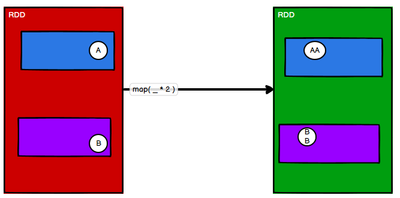
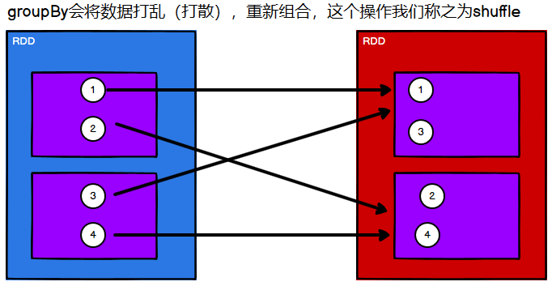
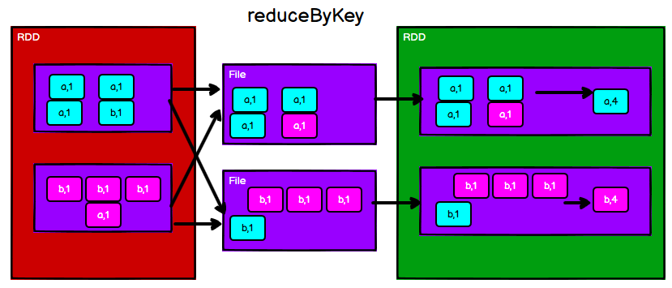
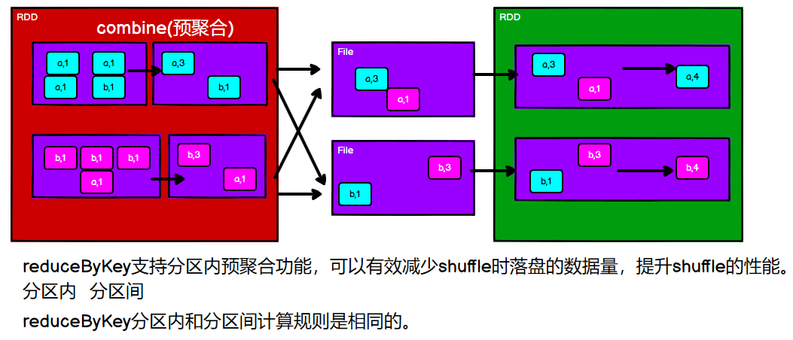
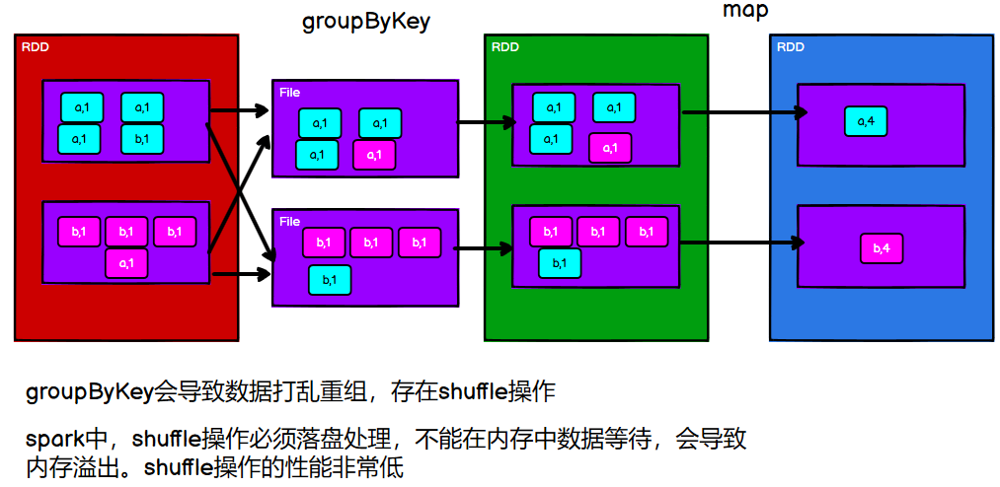
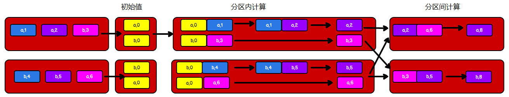
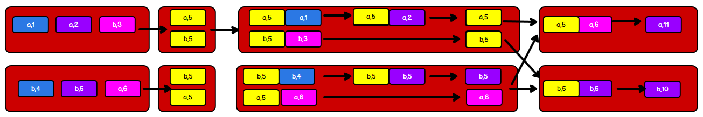
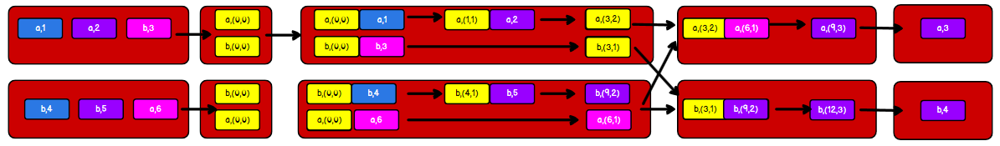
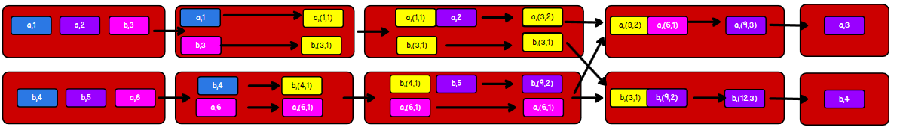
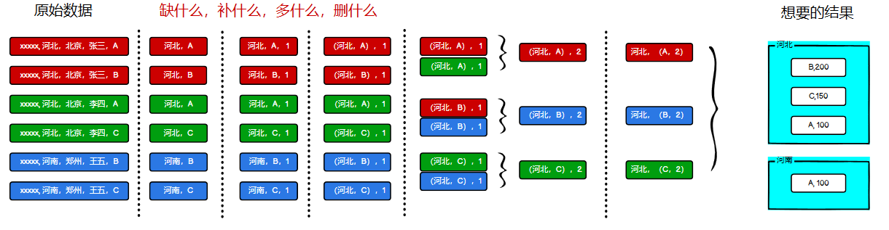

Spark RDD的算子主要分为两个方面：转换算子和行动算子，如下图所示：


所有转换算子都是一种`懒加载`的方式，只有执行行动算子，程序才会真正的开始工作！

本blog主要整理了Spark RDD常用的一些转换算子的速查手册，以及对应每个算子的一个使用方法和其注意事项

## 一、速查手册

| 方法                                    | 含义                                                         |
| --------------------------------------- | ------------------------------------------------------------ |
| `map(func)`                             | 将要处理的数据**逐条**进行映射转换，可以是值的转换，也可以是类型的转换 |
| `mapPartitions(func)`                   | 类似于Map，但是以分区为单位处理数据，func传递的参数应该是一个迭代器 |
| `mapPartitionsWithIndex(func)`          | 类似于上面的操作，可以获取处理数据分区号，func传递两个参数（`分区号`,`迭代器`） |
| `flatMap(func)`                         | 将处理的数据进行扁平化后再进行映射处理                       |
| `glom()`                                | 将同一个分区的数据直接转换为相同类型的内存数组进行处理       |
| `groupBy(func)`                         | 将数据按照指定的规则进行分组                                 |
| `filter(func)`                          | 按照某种规则进行过滤，func的返回值必须为true或false          |
| `sample(withReplacement,fraction,seed)` | 根据指定的规则从数据集中抽取数据                             |
| `distinct()`                            | 将数据集中重复的数据去重                                     |
| `coalesce(par,shuffle)`                 | 缩小分区，默认没有shuffle                                    |
| `repartition(par)`                      | 扩大分区，也可以缩小，默认有shuffle                          |
| `sortBy(func,asc=true)`                 | 按照func规则排序，默认升序，第二个参数设置为false即为降序    |
| `intersection()`                        | 交集                                                         |
| `union()`                               | 并集                                                         |
| `subtract()`                            | 差集                                                         |
| `zip()`                                 | 拉链                                                         |
| `partitionBy(Partitioner)`              | 按照指定的`Partitioner`进行分区                              |
| `reduceByKey(func)`                     | 相同的key的value进行聚合操作                                 |
| `groupByKey()`                          | 将数据源的数据根据key对value进行分组                         |
| `aggregateByKey`                        | 指定分区内外计算规则                                         |
| `foldByKey`                             | 如果分区内外计算规则一致，用`foldByKey`替代                  |
| `combineByKey`                          | 可以将第一个值作为初始值传入，然后指定分区内外的计算规则     |
| `join`                                  | 将相同的key连接在一起                                        |
| `cogroup`                               | 连接相同的key，组合他们的value                               |

## 二、使用方法及注意事项

还记得写Spark程序的步骤吗？

- 建立与Spark的连接
- 业务逻辑
- 关闭连接

根据这个步骤，我们可以写一个架子：

```scala
package com.wzq.bigdata.spark.core.rdd.operator.transform
import org.apache.spark.rdd.RDD
import org.apache.spark.{SparkConf, SparkContext}
object demo {
  def main(args: Array[String]): Unit = {
    // 1、建立连接
    val conf: SparkConf = new SparkConf().setMaster("local[*]").setAppName("Operator")
    val sc: SparkContext = new SparkContext(conf)

    // 2、业务逻辑

    // 3、关闭连接
    sc.stop()
  }
}
```

由于本blog内容比较多，篇幅有限，所以下面的代码只会贴出来`2、业务逻辑`部分！

`RDD`根据数据处理方式的不同将算子整体上分为：`Value`类型、`双Value`类型、`Key-Value`类型，接下来看一看吧

### 1、Value类型

#### 1.1 map

函数签名：

```scala
def map[U: ClassTag](f: T => U): RDD[U]
```

传递一个函数，这个函数针对集合的每个数据进行转换。将要处理的数据**逐条**进行映射转换，可以是值的转换，也可以是类型的转换。

案例：

```scala
// 2、业务逻辑
val rdd: RDD[Int] = sc.makeRDD(List(97, 98, 99, 100))

// 值的转换，将每个值 * 2
val rdd1: RDD[Int] = rdd.map(_ * 2)
// 类型的转换，将每个值转换为Char类型
val rdd2: RDD[Char] = rdd.map(_.toChar)

// 先透露一个行动算子：collect，收集数据
rdd1.collect().foreach(println)
rdd2.collect().foreach(println)
```

#### 1.2 mapPartitions

函数签名：

```scala
def mapPartitions[U: ClassTag](
    f: Iterator[T] => Iterator[U],
    preservesPartitioning: Boolean = false): RDD[U]
```

它接收的是一个迭代器，它将待处理的数据以分区为单位发送到计算节点进行处理，这里的处理可以进行任意的处理

案例：

```scala
val rdd: RDD[Int] = sc.makeRDD(List(97, 98, 99, 100), 2)
// 需要传递的是一个迭代器
val newRDD: RDD[Char] = rdd.mapPartitions(
  iter => {
    iter.map(_.toChar)
  }
)
newRDD.collect().foreach(println)
```

> 这里要区分一下`map`和`mapParitions`的区别：
>
> - 数据处理的角度：Map算子是分区内一个一个的数据执行，相当于串行。而mapPartitions算子是以分区为单位进行批处理操作
> - 功能的角度：Map算子主要目的将数据源中的数据进行转换和改变。但是不会减少或增多数据。MapPartitions算子需要传递一个迭代器，返回一个迭代器，没有要求元素的个数保持不变，所以可以增加或减少数据
> - 性能的角度：Map算子因为类似于串行操作，所以性能较低，而mapPartitions算子类似于批处理，所以性能较高。但是mapPartitons算子会长时间占用内存，那么这样会导致内存可能不够用，出现内存溢出错误。所以在内存有限的情况下，不推荐使用


#### 1.3 mapPartitionsWithIndex

函数签名：

```scala
def mapPartitionsWithIndex[U: ClassTag](
    f: (Int, Iterator[T]) => Iterator[U],
    preservesPartitioning: Boolean = false): RDD[U]
```

将待处理的数据以分区为单位发送到计算节点进行处理，这里的处理可以进行任意的处理，可以增加也可以减少，在处理的时候可以获取当前分区索引

案例：

```scala
val rdd: RDD[Int] = sc.makeRDD(List(97, 98, 99, 100), 2)

// mapPartitionsWithIndex可以获取当前的分区索引
// 这里的小功能是获取第1号分区的数据
val newRDD: RDD[Int] = rdd.mapPartitionsWithIndex(
  // index 表示分区号，iter 是一个迭代器表示分区里面的数据
  (index, iter) => {
    if (index == 1) {
      iter
    } else {
      Nil.iterator
    }
  }
)
newRDD.collect().foreach(println)
```

#### 1.4 flatMap

函数签名：

```scala
def flatMap[U: ClassTag](f: T => TraversableOnce[U]): RDD[U]
```

将处理的数据进行扁平化然后做映射处理，所以该算子也称为扁平映射

案例：

```scala
// 如果数据类型不一致，可以使用模式匹配，把所有的数据转换成List
val rdd: RDD[Any] = sc.makeRDD(List(
  List(1, 2), List(3, 4), 5
))

val newRDD: RDD[Any] = rdd.flatMap(
  data => {
    data match {
      case list: List[_] => list
      case dat => List(dat)
    }
  }
)
newRDD.collect().foreach(println)
```

```scala
val rdd: RDD[String] = sc.makeRDD(List("Hello Spark", "Hello Scala"))
rdd.flatMap(_.split(" ")).collect().foreach(println)
```


#### 1.5 glom

函数签名：

```scala
def glom(): RDD[Array[T]]
```

将同一个分区的数据直接转换为相同类型的内存数组进行处理，分区不变

案例：

```scala
val rdd: RDD[Int] = sc.makeRDD(List(1, 2, 3, 4), 2)

// 把分区内的数据变成一个数组
val glomRDD: RDD[Array[Int]] = rdd.glom()

glomRDD.collect().foreach(data => println(data.mkString(",")))
```

```scala
// 求各个分区内最大值的和
// 两个分区: [1,2] [3,4]
// 两个分区的最大值: [2],[4]
// 和: 6
val glomRDD: RDD[Array[Int]] = rdd.glom()
val maxRDD: RDD[Int] = glomRDD.map(
  array => array.max
)
println(maxRDD.collect().sum)
```

> 这里有个概念：**分区不变**，和前面的几个map一样，都具有分区不变的特性，是啥意思呢？看下图：
>
> 
>
> 就是说：如果已经分好区，在执行这几个算子的时候，这些数据还会在原有的分区内进行转换，不会发生一个数据从一个分区到另一个分区的情况，这就是分区不变。**相对于分区不变，还有一个分区可变，是shuffle，后面会慢慢提到**

#### 1.6 groupBy

函数签名：

```scala
def groupBy[K](f: T => K)(implicit kt: ClassTag[K]): RDD[(K, Iterable[T])]
```

将数据按照指定的规则进行分组，分区默认不变，但分区内的数据会变化（打乱重新组合`Shuffle`），在极限的情况下，数据可能会被分到同一个分区

案例：

1、偶数一组，奇数一组

```scala
// 2、业务逻辑
val rdd: RDD[Int] = sc.makeRDD(List(1, 2, 3, 4), 2)

val groupRDD: RDD[(String, Iterable[Int])] = rdd.groupBy(
  data => {
    if (data % 2 == 0) "偶数" else "奇数"
  }
)

groupRDD.collect().foreach(println)
```

2、将`List("Hello","Spark","Scala","HBase","Azkaban")`根据单词首字母进行分组：

```scala
// 2、业务逻辑
val rdd: RDD[String] = sc.makeRDD(List("Hello","Spark","Scala","HBase","Azkaban"))
// charAt(0)：字符串的首字母
val groupRDD: RDD[(Char, Iterable[String])] = rdd.groupBy(_.charAt(0))
groupRDD.collect().foreach(println)
```

3、获取服务器日志`apache.log`中每个时间段访问量

该文件数据格式：

```
IP地址	         日期                      方式 路径
83.149.9.216 - - 17/05/2015:10:05:00 +0000 GET /presentations/logstash-monitorama-2013/images/redis.png
```

```scala
val rdd: RDD[String] = sc.textFile("datas/apache.log")

// 将数据转换为 (hour,1)的格式
val hourRDD: RDD[(String, Int)] = rdd.map(
  line => {
    // 按照空格分词
    val words: Array[String] = line.split(" ")
    // 解析时间数据为Date对象
    val date: Date = new SimpleDateFormat("dd/MM/yyyy:HH:mm:ss").parse(words(3))
    // 只拿取hour字段
    val hour: String = new SimpleDateFormat("HH").format(date)
    (hour, 1)
  }
)

// 按照hour进行分组
val groupRDD: RDD[(String, Iterable[(String, Int)])] = hourRDD.groupBy(_._1)

// 使用map转换数据
val resRDD: RDD[(String, Int)] = groupRDD.map {
  case (hour, iter) => {
    (hour, iter.size)
  }
}

resRDD.collect().foreach(println)
```

如果不想起这么多变量名字，可以这样写：

```scala
sc.textFile("datas/apache.log")
  .map(
    line => {
      val time: String = line.split(" ")(3)
      val date: Date = new SimpleDateFormat("dd/MM/yyyy:HH:mm:ss").parse(time)
      val hour: String = new SimpleDateFormat("HH").format(date)
      (hour,1)
    })
  .groupBy(_._1)
  .map{
    case (hour,iter) => (hour,iter.size)
  }
  .collect()
  .foreach(println)
```

> 但是使用`groupBy`存在`Shuffle`过程，分区内的数据会根据指定的规则打乱重组，以奇偶数为例：
>
> 
>
> 奇数的会被分到一个分区，偶数的会分到另一个分区
>
> 但值得注意的是：**分组和分区又没有必然的联系**

#### 1.7 filter

函数签名：

```scala
def filter(f: T => Boolean): RDD[T]
```

将数据按照指定的规则进行筛选过滤，符合规则的数据留下，不符合的数据丢弃

当数据进行筛选过滤后，分区不变，但是分区内的数据可能不均衡，生产环境下，可能会发生数据倾斜

案例：

1、过滤所有偶数，保留奇数：

```scala
val rdd: RDD[Int] = sc.makeRDD(List(1, 2, 3, 4), 2)
// filter过滤数据，传递的规则是要保留的数据
val filterRDD: RDD[Int] = rdd.filter(_ % 2 != 0)
filterRDD.collect().foreach(println)
```

2、从服务器日志`apache.log`中获取`2015年5月17日`的请求路径

```scala
val rdd: RDD[String] = sc.textFile("datas/apache.log")

// 保留开头是17/05/2015的这些数据
val filterRDD: RDD[String] = rdd.filter(
  line => {
    line.split(" ")(3).startsWith("17/05/2015")
  }
)
// 转换数据格式，只保留时间和请求路径
val resRDD: RDD[(String, String)] = filterRDD.map(
  line => {
    val words: Array[String] = line.split(" ")
    (words(3), words(words.length - 1))
  }
)
resRDD.collect().foreach(println)
```


#### 1.8 sample

函数签名：

```scala
def sample(
    withReplacement: Boolean,
    fraction: Double,
    seed: Long = Utils.random.nextLong): RDD[T]
```

根据指定的规则从数据集中抽取数据

案例：

```scala
val rdd: RDD[Int] = sc.makeRDD(List(1, 2, 3, 4))

/*
  抽取数据不放回（伯努利算法）
  具体实现：根据种子和随机算法算出一个数和第二个参数设置机率比较，
          小于第二个参数要，大于的不要
  第一个参数：抽取的数据是否放回，false：不放回
  第二个参数：抽取的几率，范围在[0,1]之间
  第三个参数：随机数种子，默认值是当前时间
 */
rdd.sample(false, 0.5, 42).collect().foreach(println)
rdd.sample(false, 0.5).collect().foreach(println)

/*
  抽取数据放回（泊松算法）
  第一个参数：抽取的数据是否放回，true：放回，false：不放回
  第二个参数：重复数据的几率，返回大于等于0，表示每个元素被期望抽取到的次数
  第三个参数：随机数种子，默认当前时间
 */
rdd.sample(true, 2).collect().foreach(println)
rdd.sample(true, 2, 42).collect().foreach(println)
```

#### 1.9 distinct

函数签名：

```scala
def distinct(): RDD[T]
def distinct(numPartitions: Int)(implicit ord: Ordering[T] = null): RDD[T]
```

将数据集中重复的数据去重：

```scala
val rdd: RDD[Int] = sc.makeRDD(List(1, 2, 3, 4, 1, 3, 5, 6))

// 去重
rdd.distinct().collect().foreach(println)
rdd.distinct(2).collect().foreach(println)
```

#### 1.10 coalesce和repartition

`coalesce`和`repartition`函数签名：

```scala
// 缩减分区
def coalesce(numPartitions: Int, shuffle: Boolean = false,
             partitionCoalescer: Option[PartitionCoalescer] = Option.empty)
            (implicit ord: Ordering[T] = null)
            : RDD[T]
// 扩大分区：实际上调用了coalesce方法
def repartition(numPartitions: Int)(implicit ord: Ordering[T] = null): RDD[T] = withScope {
    coalesce(numPartitions, shuffle = true)
}
```

根据数据量缩减分区，用于大数据过滤之后，提高小数据集的执行效率。当Spark程序中存在过多小任务的时候，可以通过`coalesce`方法，收缩合并分区，减少分区的个数，减小任务调度成本

案例：

```scala
val rdd: RDD[Int] = sc.makeRDD(List(1, 2, 3, 4), 4)

/*
  默认第二个参数是false，不会把分区数据打乱重新组合
  如果不重新组合缩减分区可能会导致数据不均衡，出现数据倾斜
  如果想让数据均衡，可以进行shuffle处理，即设置第二个参数为false
 */
rdd.coalesce(2,true).saveAsTextFile("output1")
// 默认不shuffle，第二个参数为false
rdd.coalesce(2).saveAsTextFile("output2")
// 增大分区，会将数据重新打乱，即有shuffle
rdd.repartition(6).saveAsTextFile("output3")
```

#### 1.11 sortBy

函数签名：

```scala
def sortBy[K](
    f: (T) => K,
    ascending: Boolean = true,
    numPartitions: Int = this.partitions.length)
	(implicit ord: Ordering[K], ctag: ClassTag[K]): RDD[T]
```

该操作用于排序数据。在排序之前，可以将数据通过f函数进行处理，之后按照f函数处理的结果进行排序，默认为升序。排序后新产生的RDD的分区数与原RDD的分区数一致。但是中间存在shuffle过程

案例：

```scala
val rdd: RDD[Int] = sc.makeRDD(List(1, 6, 2, 9, 3, 0, 4), 2)

// 降序，设置第二个参数为false
rdd.sortBy(num=>num,false).collect().foreach(println)
// 默认升序
rdd.sortBy(num=>num).collect().foreach(println)
```


### 2、双Value类型

这部分就是两个`RDD`之间的操作，比较简单，直接合在一块：

```scala
// 双Value类型
val rdd1: RDD[Int] = sc.makeRDD(List(1, 2, 3, 4))
val rdd2: RDD[Int] = sc.makeRDD(List(3, 4, 5, 6))

// 交集、并集、差集要求两个RDD数据类型一致

// 交集 : [3,4]
val rdd3: RDD[Int] = rdd1.intersection(rdd2)
println(rdd3.collect().mkString(","))

// 并集 : [1,2,3,4,3,4,5,6]
val rdd4: RDD[Int] = rdd1.union(rdd2)
println(rdd4.collect().mkString(","))

// 差集 : [1,2]
val rdd5: RDD[Int] = rdd1.subtract(rdd2)
println(rdd5.collect().mkString(","))

// 数据类型可以不一致
// 拉链 : [1-3,2-4,3-5,4-6]
val rdd6: RDD[(Int, Int)] = rdd1.zip(rdd2)
println(rdd6.collect().mkString(","))
```

但需要注意一下`zip`方法，**以下的操作会报错！**

```scala
// 双Value类型
val rdd1: RDD[Int] = sc.makeRDD(List(1, 2, 3, 4), 2)
val rdd2: RDD[Int] = sc.makeRDD(List(3, 4, 5, 6), 4)

// 会发生错误，两个数据源要求分区数量保持一致
// Can't zip RDDs with unequal numbers of partitions: List(2, 4)
println(rdd1.zip(rdd2).collect().mkString(","))

val rdd3: RDD[Int] = sc.makeRDD(List(1, 2, 3, 4,5,6), 2)
val rdd4: RDD[Int] = sc.makeRDD(List(3, 4, 5, 6), 2)

// 会发生错误，两个数据源要求分区中数据数量保持一致
// Can only zip RDDs with same number of elements in each partition
println(rdd3.zip(rdd4).collect().mkString(","))
```


### 3、Key-Value类型

#### 3.1 partitionBy

函数签名：

```scala
def partitionBy(partitioner: Partitioner): RDD[(K, V)]
```

将数据按照指定的`Partitioner`重新进行分区，Spark中有两个实现的`Partitioner`，分别是`HashPartitioner`和`RangePartitioner`，默认使用哈希的分区器

案例：

```scala
val rdd: RDD[Int] = sc.makeRDD(List(1, 2, 3, 4), 4)

// 转换为key-Value类型
val mapRDD: RDD[(Int, Int)] = rdd.map((_, 1))
// 将数据按照指定的Partitioner重新进行分区
val parRDD: RDD[(Int, Int)] = mapRDD.partitionBy(new HashPartitioner(2))
parRDD.saveAsTextFile("output")
```

#### 3.2 reduceByKey

函数签名：

```scala
def reduceByKey(func: (V, V) => V): RDD[(K, V)]
def reduceByKey(func: (V, V) => V, numPartitions: Int): RDD[(K, V)] 
```

可以根据相同的key对Value进行聚合，中间存在shuffle操作，因此方法的重载可以指定分区的数量。分区内分区间的计算规则是一样的

案例：

```scala
val rdd: RDD[(String, Int)] = sc.makeRDD(List(
  ("a", 1), ("a", 2), ("a", 3), ("b", 4)
))
// 相同的key的数据的Value的聚合操作，两两聚合
rdd.reduceByKey((x: Int, y: Int) => {
  x + y
}).collect().foreach(println)

// 如上面的数据，("b",4)，只有一个key，它不参与reduceByKey聚合
// 也就是说，在reduceByKey中如果key的数据只有一个，不参与运算
rdd.reduceByKey(
  (x: Int, y: Int) => {
    println(s"x = ${x} , y = ${y}")
    x + y
  }
).collect()
```

> 下图就是`reduceByKey`的一个流程
>
> 
>
> 因为要聚合，所以为了保证数据不丢失，在计算的时候会有落盘的操作，这里面也有shuffle的过程，待所有数据都准备好相同的key的value再进行聚合操作
>
> 但是这样做效率比较低，因为所有的数据都要落盘，**所以有一个预聚合的操作**，即在落盘之前先进行分区内的预聚合的操作，减少数据落盘的数量，然后再进行下面的操作，具体过程如下图所示：
>
> 

#### 3.3 groupByKey

函数签名：

```scala
def groupByKey(): RDD[(K, Iterable[V])]
def groupByKey(numPartitions: Int): RDD[(K, Iterable[V])]
def groupByKey(partitioner: Partitioner): RDD[(K, Iterable[V])] 
```

将数据源的数据根据key对value进行分组

案例：

```scala
val rdd: RDD[(String, Int)] = sc.makeRDD(List(
  ("a", 1), ("a", 2), ("a", 3), ("b", 4)
))

rdd.groupByKey().collect().foreach(println)
println("=" * 30)
rdd.groupByKey(2).collect().foreach(println)
println("=" * 30)
rdd.groupByKey(new HashPartitioner(2)).collect().foreach(println)
```

> 这中间也存在shuffle，下面的图片表示将相同的key的value分在一起然后又进行了一步map的操作：
>
> 
>
> 这里要注意`groupByKey`和`reduceByKey`的区别！


#### 3.4 aggregateByKey

函数签名：

```scala
def aggregateByKey[U: ClassTag](zeroValue: U, partitioner: Partitioner)(seqOp: (U, V) => U,
      combOp: (U, U) => U): RDD[(K, U)]
```

将数据按照不同的规则进行分区内和分区间计算，也就是说：分区内和分区间的计算规则不一样

`aggregateByKey`存在函数柯里化，有两个参数列表：

- 第一个参数列表需要传递一个参数，表示为初始值，主要用于当碰见第一个key的时候和value进行分区内计算
- 第二个参数列表需要传递两个函数：
  - 第一个函数表示分区内计算规则
  - 第二个函数表示分区间计算规则

案例：

分区内求最大值，分区间将每个分区的最大值相加：

```scala
val rdd: RDD[(String, Int)] = sc.makeRDD(List(
  ("a", 1), ("a", 2), ("b", 3),
  ("b", 4), ("b", 5), ("a", 6)
), 2)

val aggRDD: RDD[(String, Int)] = rdd.aggregateByKey(0)(
  (x, y) => math.max(x, y),   // 第一个参数表示：分区内的计算规则
  (x, y) => x + y             // 第二个参数表示：分区间的计算规则
)

aggRDD.collect().foreach(println)
```

具体执行流程如下图所示：




这里有个`初始值`的概念，初始值对结果的影响很大，比如把初始值设置为`5`：




换一个案例：求相同key的value数据的平均值

```scala
val rdd: RDD[(String, Int)] = sc.makeRDD(List(
  ("a", 1), ("a", 2), ("b", 3),
  ("b", 4), ("b", 5), ("a", 6)
), 2)

// (0,0)，第一个表示值，第二个表示次数
val newRDD: RDD[(String, (Int, Int))] = rdd.aggregateByKey((0, 0))(
  (t, v) => {
    (t._1 + v, t._2 + 1)
  },
  (t1, t2) => {
    (t1._1 + t2._1, t1._2 + t2._2)
  }
)

newRDD.mapValues{
  case (num,cnt) => {
    num / cnt
  }
}.collect().foreach(println)
```



#### 3.5 foldByKey

如果分区内外计算规则一致，则可以使用`foldByKey`代替`aggregateByKey`，函数签名：

```scala
def foldByKey(
    zeroValue: V,
    partitioner: Partitioner)(func: (V, V) => V): RDD[(K, V)]
```

案例：相加

```scala
val rdd: RDD[(String, Int)] = sc.makeRDD(List(
  ("a", 1), ("a", 2), ("b", 3),
  ("b", 4), ("b", 5), ("a", 6)
), 2)

rdd.foldByKey(0)(_+_).collect().foreach(println)
```

#### 3.6 combineByKey

现在都是手动指定初始值的，然而初始值对结果的影响非常大，于是可以使用`combineByKey`，函数签名：

```scala
def combineByKey[C](
    createCombiner: V => C,
    mergeValue: (C, V) => C,
    mergeCombiners: (C, C) => C): RDD[(K, C)]
```

案例：

```scala
val rdd: RDD[(String, Int)] = sc.makeRDD(List(
  ("a", 1), ("a", 2), ("b", 3),
  ("b", 4), ("b", 5), ("a", 6)
), 2)

// 需要三个参数
// 第一个参数：将相同key的第一个数据进行结构的转换，实现操作
// 第二个参数：分区内计算规则
// 第三个参数：分区间计算规则
val newRDD: RDD[(String, (Int, Int))] = rdd.combineByKey(
  v => (v, 1),		// 指定初始值为第一组数据
  (t: (Int, Int), v) => {
    (t._1 + v, t._2 + 1)
  },
  (t1: (Int, Int), t2: (Int, Int)) => {
    (t1._1 + t2._1, t1._2 + t2._2)
  }
)
```

即：



#### 3.7 join、leftOuterJoin、rightOuterJoin

函数签名：

```scala
def join[W](other: RDD[(K, W)], partitioner: Partitioner): RDD[(K, (V, W))]

def leftOuterJoin[W](
    other: RDD[(K, W)],
    partitioner: Partitioner): RDD[(K, (V, Option[W]))]

def rightOuterJoin[W](other: RDD[(K, W)], partitioner: Partitioner)
	: RDD[(K, (Option[V], W))]
```

这其实就是和SQL的join一样了，不做过多解释：

```scala
val rdd1: RDD[(String, Int)] = sc.makeRDD(List(
  ("a", 1), ("b", 2), ("c", 3)
))

val rdd2: RDD[(String, Int)] = sc.makeRDD(List(
  ("a", 4), ("b", 5), ("c", 6)
))

// key的类型应该相同
// join：两个不同数据源的数据，相同的key的value会连接在一起，形成元组
//      如果两个数据源中key没有匹配上，那么数据不会出现在结果中
//      如果两个数据源中key有多个相同的，会依次匹配，可能会出现笛卡尔乘积，数据量指数性增长
val joinRDD: RDD[(String, (Int, Int))] = rdd1.join(rdd2)
joinRDD.collect().foreach(println)

// ---------------------------------------------------------------------------------------
val rdd1: RDD[(String, Int)] = sc.makeRDD(List(
  ("a", 1), ("b", 2), ("c", 3)
))

val rdd2: RDD[(String, Int)] = sc.makeRDD(List(
  ("a", 4), ("b", 5)
))

rdd1.leftOuterJoin(rdd2).collect().foreach(println)
rdd1.rightOuterJoin(rdd2).collect().foreach(println)
```


#### 3.8 cogroup

函数签名：

```scala
def cogroup[W](other: RDD[(K, W)], partitioner: Partitioner)
	: RDD[(K, (Iterable[V], Iterable[W]))]
```

连接相同的key，组合他们的value

案例：

```scala
val rdd1: RDD[(String, Int)] = sc.makeRDD(List(
  ("a", 1), ("a", 2), ("c", 3)
))

val rdd2: RDD[(String, Int)] = sc.makeRDD(List(
  ("a", 1), ("c", 2), ("c", 3)
))

rdd1.cogroup(rdd2).collect().foreach(println)
```

## 三、综合案例

需求：统计出每一个省份每个广告被点击数量的Top3

数据格式：时间戳，省份，城市，用户，广告；中间空格分割

分析：



code：

```scala
// 2、业务逻辑
val rdd: RDD[String] = sc.textFile("datas/agent.log")

// 2.1 时间戳,省份,城市,用户,广告 => ((省份,广告),1)
val mapRDD: RDD[((String, String), Int)] = rdd.map(
  line => {
    val words = line.split(" ")
    ((words(1), words(4)), 1)
  }
)

// 2.2 ((省份,广告),1) => ((省份,广告),sum)
val reduceRDD: RDD[((String, String), Int)] = mapRDD.reduceByKey(_ + _)

// 2.3 ((省份,广告),sum) => (省份,(广告,sum))
val mapRDD1: RDD[(String, (String, Int))] = reduceRDD.map {
  case ((pro, ad), sum) => (pro, (ad, sum))
}

// 2.4 (省份,(广告,sum)) => (省份,【(广告A,sumA),(广告B,sumB)...】)
val groupRDD: RDD[(String, Iterable[(String, Int)])] = mapRDD1.groupByKey()

// 2.5 sum字段降序排序取前3名
val resRDD: RDD[(String, List[(String, Int)])] = groupRDD.mapValues(
  iter => {
    iter.toList.sortWith(_._2 > _._2).take(3)
  }
)

resRDD.collect().foreach(println)
```

也可以这样写：

```scala
sc.textFile("datas/agent.log")
  .map(line => {
    val words: Array[String] = line.split(" ")
    ((words(1), words(4)), 1)
  })
  .reduceByKey(_ + _)
  .map {
    case ((pro, ad), sum) => (pro, (ad, sum))
  }
  .groupByKey()
  .mapValues(iter => {
    iter.toList.sortWith(_._2 > _._2).take(3)
  })
  .collect()
  .foreach(println)
```


## 参考资料

- [尚硅谷Spark 3.0.0 学习视频](https://www.bilibili.com/video/BV11A411L7CK)
- [Spark 3.0.0 官方文档](https://spark.apache.org/docs/3.0.0/)
- [Spark 3.0.0官方文档转换算子](https://spark.apache.org/docs/3.0.0/rdd-programming-guide.html#transformations)

