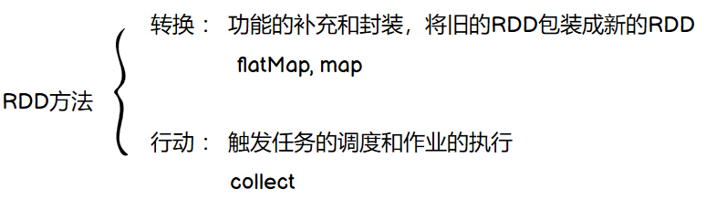

Spark RDD的算子主要分为两个方面：转换算子和行动算子，如下图所示：



所有转换算子都是一种`懒加载`的方式，只有执行行动算子，程序才会真正的开始工作！

[关于RDD转换算子的介绍，请点击这行字前往链接！](http://wzqwtt.club/2022/05/03/spark-zhuan-huan-suan-zi-su-cha-shou-ce-yi-ji-an-li-jie-xi/)

本blog主要整理了Spark RDD常用的一些行动算子的速查手册，以及对应每个算子的一个使用方法和其注意事项


## 一、速查手册

| 方法                              | 含义                                                         |
| --------------------------------- | ------------------------------------------------------------ |
| `reduce(func)`                    | 聚集RDD中的所有元素，先聚合分区内，再聚合分区间              |
| `collect()`                       | 将不同分区的数据按顺序采集到Driver端内存中，形成数组         |
| `count()`                         | 数据源中数据的个数                                           |
| `countByKey()`                    | 统计数据源中每种key的个数                                    |
| `countByValue()`                  | 统计数据源中value出现的次数                                  |
| `first()`                         | 取数据源中第一个数据                                         |
| `take(n)`                         | 取数据源中前n个数据                                          |
| `takeOrdered(n,[ordering])`       | 返回该RDD按照某种规则排序后的前n个数据                       |
| `aggregate(zeroValue)(func,func)` | 分区的数据通过初始值和分区内的数据进行聚合，然后再和分区间进行聚合 |
| `fold(zeroValue)(func)`           | 如果分区内外计算规则一致，用fold方法                         |
| `saveAsTextFile(path)`            | 将数据按照分区保存为text文件                                 |
| `saveAsObjectFile(path)`          | 将数据按照分区保存为object                                   |
| `saveAsSequenceFile(path)`        | 仅接受KV数据类型的数据，将数据按照分区保存Sequence文件       |
| `foreach(func)`                   | 在Executor端遍历RDD，即分布式遍历RDD                         |

## 二、案例

因为比较简单，所以这块直接写到一个代码块：

```scala
package com.wzq.bigdata.spark.core.rdd.operator.action

import org.apache.spark.rdd.RDD
import org.apache.spark.{SparkConf, SparkContext}

object Spark01_action {
  def main(args: Array[String]): Unit = {
    // 1、建立连接
    val sc: SparkContext = new SparkContext(new SparkConf().setMaster("local[*]").setAppName("action"))

    // 2、业务逻辑
    val rdd: RDD[Int] = sc.makeRDD(List(1, 2, 3, 4))

    // TODO 行动算子：触发作业(Job)执行的方法
    // 底层调用 runJob 方法

    // 2.1 collect
    rdd.collect().foreach(println)

    // 2.2 reduce
    val res1: Int = rdd.reduce(_ + _)

    // 2.3 count
    val res2: Long = rdd.count()

    // 2.4 first
    val res3: Int = rdd.first()
    val rdd1: RDD[(String, Int)] = sc.makeRDD(List(
      ("a", 1), ("a", 1), ("c", 3)
    ))
    val res4: (String, Int) = rdd1.first()

    // 2.5 take
    val res5: Array[Int] = rdd.take(2)
    val res6: Array[(String, Int)] = rdd1.take(2)

    // 2.6 takeOrdered
    val res7: Array[Int] = rdd.takeOrdered(2)

    // 2.7 aggregate
    val res8: Int = rdd.aggregate(0)(_ + _, _ + _)

    // 2.8 fold
    val res9: Int = rdd.fold(0)(_ + _)

    // 2.9 countByKey\countByValue
    val res10: collection.Map[String, Long] = rdd1.countByKey()
    val res11: collection.Map[(String, Int), Long] = rdd1.countByValue()

    // 2.10 save相关
    val rdd2: RDD[Int] = sc.makeRDD(List(1, 2, 3, 4), 2)
    rdd2.saveAsTextFile("output1")
    rdd2.saveAsObjectFile("output2")
    rdd1.saveAsSequenceFile("output3")

    // 2.11 foreach
    rdd.collect().foreach(println) // 比较不同
    rdd.foreach(println) // 分布式打印，可能顺序不一样

    // 3、关闭连接
    sc.stop()
  }
}
```


## 参考资料

- [尚硅谷Spark 3.0.0 学习视频](https://www.bilibili.com/video/BV11A411L7CK)
- [Spark 3.0.0 官方文档](https://spark.apache.org/docs/3.0.0/)
- [Spark 3.0.0官方文档行动算子](https://spark.apache.org/docs/3.0.0/rdd-programming-guide.html#actions)

