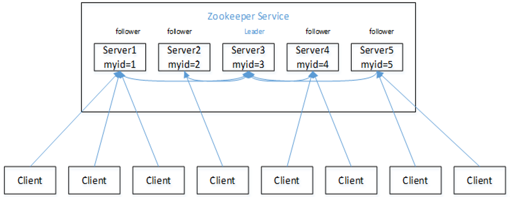
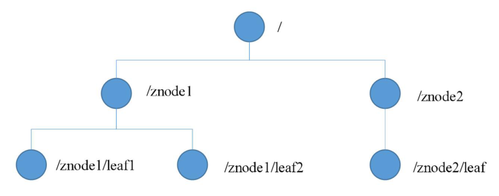
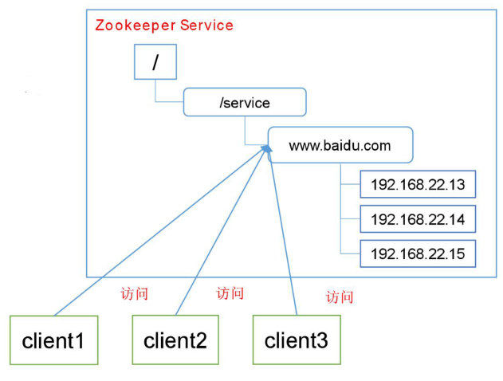
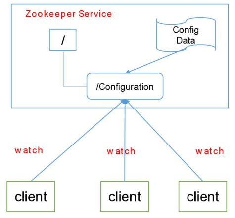
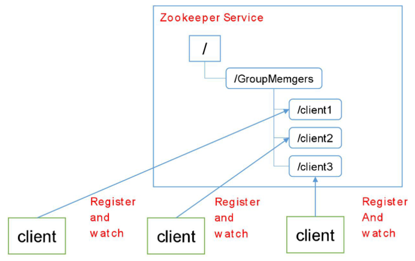
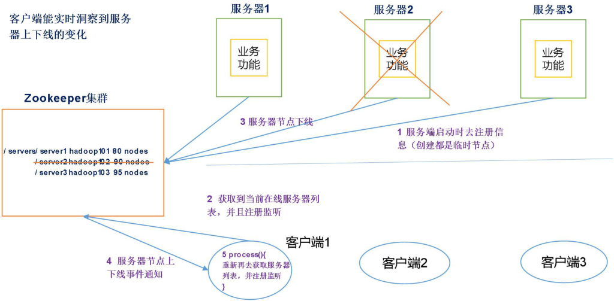
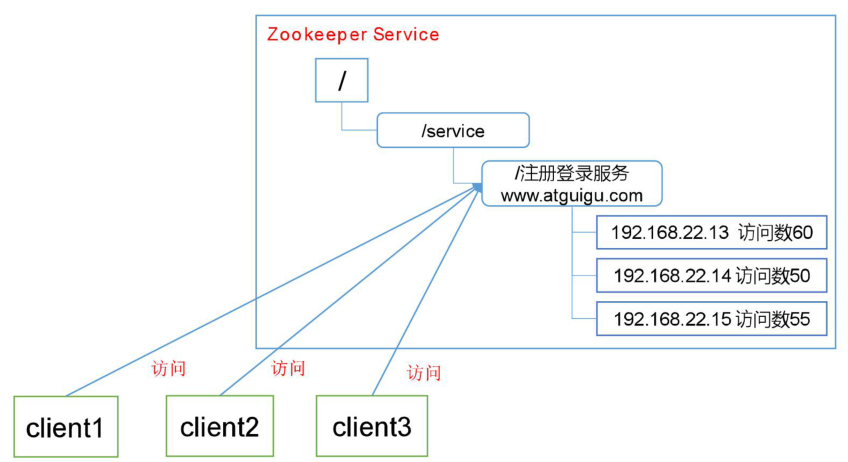
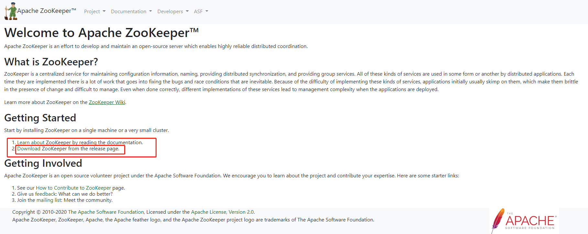
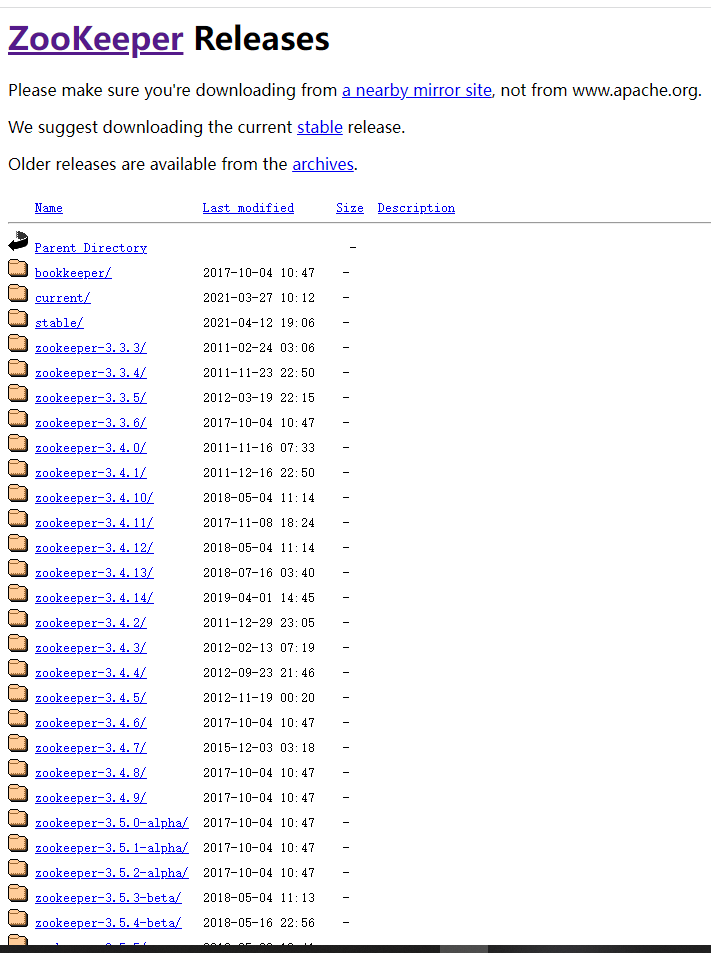

> `Zookeeper`是Apache的一个开源的、分布式的、为分布式应用提供协调服务的项目。它基于观察者模式设计，负责存储和管理大家都关心的数据，接受观察者的注册，一旦发现数据的状态发现变化，Zookeeper就将负责通知已经在Zookeeper上注册的观察者做出相应的反应。总而言之：**Zookeeper = 文件系统 + 通知机制**

## 一、Zookeeper特点

如上图所示，总结`Zookeeper`的特点：

- 是一个领导者（`Leader`），多个跟随者（`Follower`）组成的集群，如上图所示`Server3`是`Leader`，其他主机都是`Follower`
- 集群只要**半数以上**节点存活，`Zookeeper`集群就可以正常工作；比如`Server1`与`Server2`挂掉了，但是还有三台主机存活，所以`Zookeeper`就可以正常工作，`Zookeeper`适合部署在奇数台服务器
- 全局数据一致，每个`Server`都会保存一份相同的数据副本，`Client`无论链接哪个`Server`都能拿到一样的数据
- 来自同一个`Client`的更新请求按照请求发送顺序依次执行
- 一次数据更新要么全部成功，要么全部失败，是一个大事务
- 它具有实时性，在一定时间范围内，`Client`能读到最新的数据

## 二、Zookeeper数据结构

`Zookeeper`的数据模型的结构和`Linux`的文件系统类似，都是树形结构，每个节点都可以是一个`ZNode`

注意：每一个ZNode默认能够存储`1MB`的数据，每个`ZNode`都可以通过其路径唯一标识

## 三、Zookeeper应用场景

### 1、统一命名服务

在分布式环境下，经常需要对应用或者服务进行统一命名，便于识别：

比如说：如果想访问`www.baidu.com`，这个服务部署在了多台服务器上，`Zookeeper`具有负载均衡的功能，它可以路由到下面的任意一个主机

### 2、统一配置管理

在分布式环境下，配置文件同步非常常见：

- 一般要求一个集群中，所有的配置信息都是一致的
- 对配置文件进行修改后，希望能够快速的同步到各个主机上去

配置管理可以交给`Zookeeper`实现：

- 可将配置信息写入`Zookeeper`的一个`ZNode`上
- 各个客户端服务器监听这个`ZNode`
- 一旦`ZNode`中的数据被修改，`Zookeeper`将会通知各个客户端服务器

### 3、统一集群管理

`Zookeeper`可实现实时监控节点的状态变化：

- 可将节点信息写入`Zookeeper`上的一个`ZNode`
- 监听这个`ZNode`可以获取它的实时状态变化

### 4、服务器动态上下线

服务器启动的时候会去注册信息，客户端这时候能获取到在线服务器列表并且注册监听，之后客户端可以接受到服务器节点上下线的通知；如果服务器下线，客户端也知道了服务器下线了

### 5、软负载均衡

在`Zookeeper`中可以记录每台服务器的访问数，让访问数最少的服务器去处理最新的请求

## 四、如何下载？

下载一个东西最好到他的官网，`Zookeeper`的官网地址是：https://zookeeper.apache.org/

打开这个页面之后，贴的都是最新的软件版本，如果要下载其他版本，点击如下图的链接，即可到达下载页面：

在这里可以下载任意版本的`Zookeeper`

## 五、参考资料

- [Zookeeper官网](https://zookeeper.apache.org/)

- 尚硅谷B站学习视频

  
