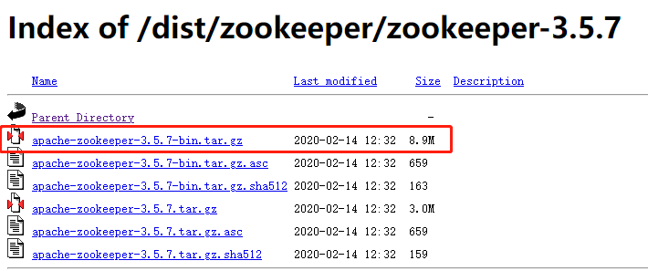
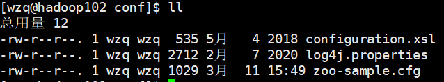
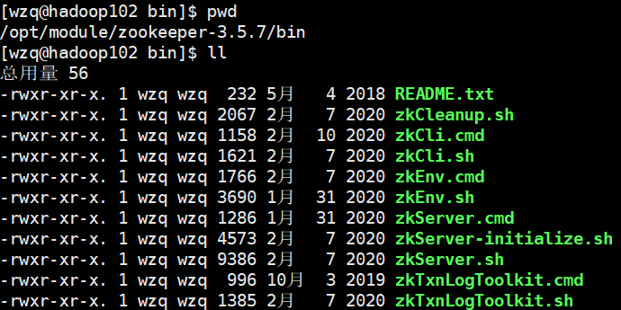
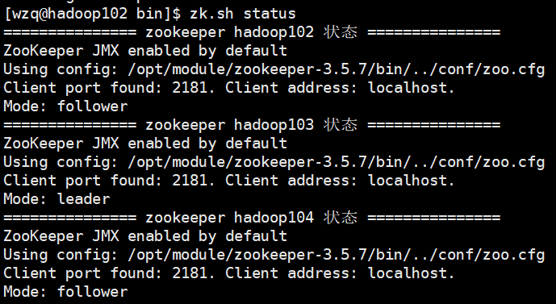
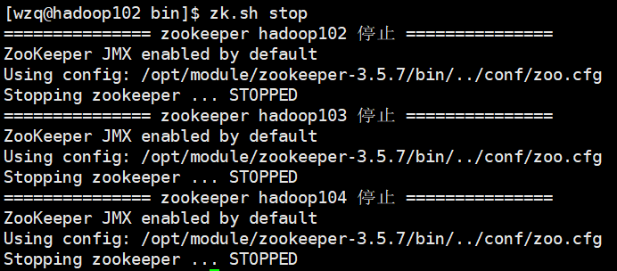

> 在上一篇Blog中介绍了`Zookeeper`是个什么东西，本篇Blog主要记录了`Zookeeper`是如何安装在本地虚拟机和如何进行分布式安装的。


## 一、本地模式安装部署

### 1、安装Zookeeper

`Zookeeper`是用`Java`语言写的，所以首先你要确保你的主机有`Java`，这里不再赘述


从[`Zookeeper`官网](https://archive.apache.org/dist/zookeeper/)上下载安装包，选择当前一个比较稳定的版本`3.5.7`，下载完成之后上传到虚拟机中，




我把它上传到了`\opt\software\`文件夹下，接下来解压一下这个文件并把它放到`\opt\moudle`：

```bash
tar -zxvf apache-zookeeper-3.5.7-bin.tar.gz -C /opt/module/
```

接下来改个名字：

```bash
mv apache-zookeeper-3.5.7-bin.tar.gz zookeeper-3.5.7
```


其实这样就算安装好了，但是我们需要改一些配置

### 2、配置解读

想要做一些配置，就需要了解配置文件，`Zookeeper`的配置文件存放在：`zookeeper-3.5.7/conf/`文件夹下：




其中`zoo-sample.cfg`文件就是配置文件，把它改个名字：

```bash
mv zoo-sample.cfg zoo.cfg
```

如下图所示，该文件共有以下这几个配置


这几个配置的意思如下：

- `tickTime=2000`：通信心跳数，`Zookeeper`服务器与客户端心跳时间，单位是毫秒。每个`tickTime`时间就会发送一个心跳

- `initLimit=10`：LF初始通信时限，LF就是Leader和Follower，集群中的`Follower`跟随者服务器与`Leader`领导者服务器之间初始连接时能容忍的最多心跳数（`tickTime数量`），用它来限定集群中`Zookeeper`服务器连接到`Leader`的时限

- `syncLimit=5`：LF同步通信时限，这是Leader与Follower之间最大响应时间单位，假如响应超过`syncLimit*tickTime`，Leader就认为Follower去世了，就从服务器列表中删掉Follower

- `dataDir`：数据文件目录+数据持久化路径，主要用于保存`Zookeeper`中的数据，我们仅修改这一项，因为默认的路径是`\tmp\zkDir`，这是系统的`tmp`路径主要用于存放临时数据，Linux会定期清除，所以我们自己创建一个文件。并修改此配置

  ```bash
  # 创建一个文件夹，就放在zk安装包内
  mkdir /opt/module/zookeeper-3.5.7/zdData
  
  # 修改配置
  vim /opt/module/zookeeper-3.5.7/conf/zoo.cfg
  
  # 只修改其中 dataDir这一块：
  dataDir=/opt/module/zookeeper-3.5.7/zdData
  ```

- `clientPort=2181`：客户端连接端口


### 3、基本操作

其实这样就算搭建成功了，试一下`Zookeeper`的基本功能

启动`Zookeeper`的脚本都在`zk.../bin`目录下：




有以下几个常用命令：


- 启动`Zookeeper`：

  ```bash
  [wzq@hadoop102 zookeeper-3.5.7]$ bin/zkServer.sh start
  # 查看是否启动成功，有QuorumPeerMain就算启动成功了
  [wzq@hadoop102 zookeeper-3.5.7]$ jps
  4020 Jps
  4001 QuorumPeerMain
  ```

- 查看`Zookeeper`状态：

  ```bash
  [wzq@hadoop102 zookeeper-3.5.7]$ bin/zkServer.sh status
  ZooKeeper JMX enabled by default
  Using config: /opt/module/zookeeper-3.5.5/bin/../conf/zoo.cfg
  Mode: standalone
  
  # standalone表示本地模式运行
  ```

- 启动客户端：

  ```bash
  [wzq@hadoop102 zookeeper-3.5.7]$ bin/zkCli.sh
  ```

- 退出客户端：

  ```bash
  [zk: localhost:2181(CONNECTED) 0] quit
  ```

- 停止`Zookeeper`：

  ```bash
  [wzq@hadoop102 zookeeper-3.5.7]$ bin/zkServer.sh stop
  ```

## 二、分布式安装部署

`Zookeeper = Zoo keeper`动物园管理员，这是因为像一些大数据框架的logo都是动物，比如Hadoop是大象，Hive是小蜜蜂，等等等。所以`Zookeeper`作为集群管理工具，起的这个名字可以说是非常形象了，现在开始把它搭建在集群上。

本篇blog是根据以前搭建的Hadoop集群搭建的，搭建Hadoop集群请访问：

- [1、搭建模板虚拟机](https://blog.csdn.net/lesileqin/article/details/115396712)
- [2、克隆虚拟机](https://blog.csdn.net/lesileqin/article/details/115397591)
- [3、安装Java、Hadoop以及集群分发](https://blog.csdn.net/lesileqin/article/details/115398618)
- [4、配置集群](https://blog.csdn.net/lesileqin/article/details/115402954)
- [5、配置历史服务器、日志聚集](https://blog.csdn.net/lesileqin/article/details/115420664)
- [6、编写集群统一启动停止脚本以及查看所有服务器Java进程脚本](https://blog.csdn.net/lesileqin/article/details/115426329)


### 1、配置服务器编号

首先要在之前创建的`zkData`下创建一个文件，名字必须为：`myid`

```bash
vim /opt/module/zookeeper-3.5.7/zkData/myid

# 按i进入插入模式，输入2，按下ESC输入:wq保存退出
```


接下来进行文件分发，把`hadoop102`的`zookeeper`分发到`103和104`：

```bash
xsync /opt/module/zookeeper-3.5.7
```

到`hadoop103和104`中，分别改`myid`为`3和4`

这个`myid`文件就是服务器编号，需要注意的是，必须使用`VIM`使用别的可能会导致乱码

### 2、配置zoo.cfg文件


`myid`配置好之后需要在`zoo.cfg`下注册，`Zookeeper`在启动的时候会读取此文件，配置其他主机的语句格式是这样的：

```bash
server.A=B.C.D
```

其中：

- A：一个数字，表示这是这是第几号服务器，与`myid`文件的数字必须对应
- B：服务器的ip地址
- C：服务器与集群中的Leader交换信息的端口
- D：万一集群中的Leader服务器挂了，需要通过这个端口重新选举一个新的Leader，这个端口就是用来执行选举的端口

打开`zoo.cfg`文件，在最下面添加如下配置：

```bash
server.2=hadoop102:2888:3888
server.3=hadoop103:2888:3888
server.4=hadoop104:2888:3888
```

做一下集群分发：

```bash
xsync /opt/module/zookeeper-3.5.7/conf/zoo.cfg
```


### 3、编写Zookeeper集群启停脚本

如果要启动Zookeeper集群的话，需要在每一台主机输入`bin/zkServer.sh start`去打开，但是这样太麻烦了，所以可以编写一个启停脚本：

```bash
vim /home/wzq/bin/zk.sh
```

进入之后按下`i`，复制以下脚本到zk.sh：

```bash
#!/bin/bash

case $1 in
"start"){
	for i in hadoop102 hadoop103 hadoop104
	do
		echo =============== zookeeper $i 启动 ===============
		ssh $i "/opt/module/zookeeper-3.5.7/bin/zkServer.sh start"
	done
}
;;
"stop"){
	for i in hadoop102 hadoop103 hadoop104
	do
		echo =============== zookeeper $i 停止 ===============
		ssh $i "/opt/module/zookeeper-3.5.7/bin/zkServer.sh stop"
	done
}
;;
"status"){
	for i in hadoop102 hadoop103 hadoop104
	do
		echo =============== zookeeper $i 状态 ===============
		ssh $i "/opt/module/zookeeper-3.5.7/bin/zkServer.sh status"
	done
}
;;
esac
```

按下`esc`输入`:wq`保存退出，接下来更改该文件的权限：

```bash
chmod 777 zk.sh
```


试用一下，启动：


查看状态：



可以看到`hadoop103`是Leader，其他两台主机是Follower

停止：




当然最后也可以做一下脚本分发：

```bash
xsync /home/wzq/bin/zk.sh
```

## 三、参考资料

- [Zookeeper官网](https://zookeeper.apache.org/)

- 尚硅谷B站学习视频

  

