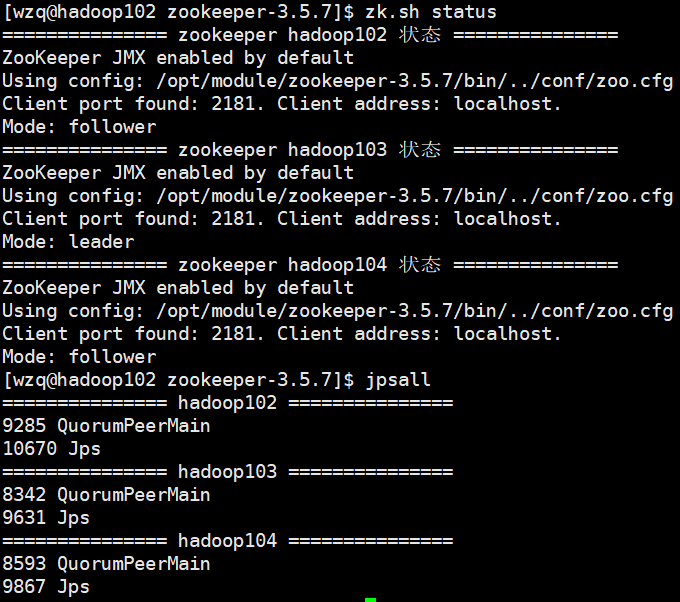
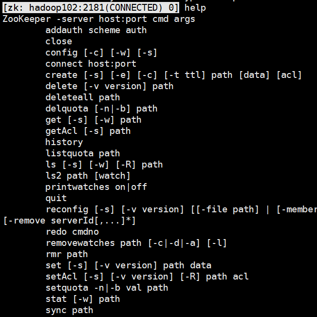
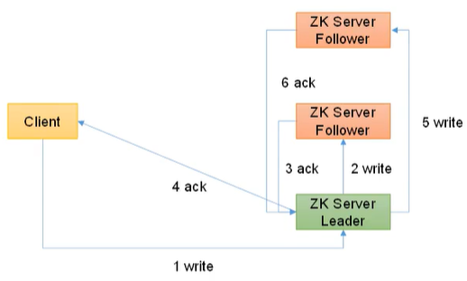
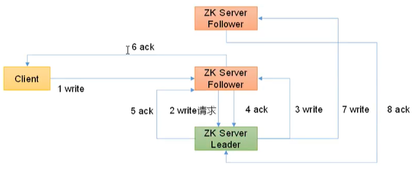

> 在前几篇blog中介绍了什么是Zookeeper，并且安装了Zookeeper分布式环境，本篇Blog就开始学习如何使用Zookeeper了！先学习客户端的命令行操作，再学习API操作。


## 一、客户端命令行操作

操作客户端之前，需要使用上一节编写的`zk启停`脚本启动`zookeeper`集群：

```bash
zk.sh start
```

查看是否启动成功：




### 1、客户端命令概览

进入客户端很简单：

```bash
# 注意路径
[wzq@hadoop102 zookeeper-3.5.7]$ pwd
/opt/module/zookeeper-3.5.7
# 启动客户端
[wzq@hadoop102 zookeeper-3.5.7]$ bin/zkCli.sh
Connecting to localhost:2181
...
[zk: localhost:2181(CONNECTED) 0] 
```

这样就算启动成功了，不过注意到这里是以`localhost`的形式启动客户端的，如果想以远程主机的形式启动zk客户端，可以这样：

```bash
[wzq@hadoop102 zookeeper-3.5.7]$ bin/zkCli.sh -server hadoop102:2181
Connecting to localhost:2181
...
[zk: hadoop102:2181(CONNECTED) 0] 
```


在这里输入`help`可以查看zk客户端提供了哪些命令：




但是能用到的其实就那几个，下表列出了常用的几个命令


| 命令基本语法                           | 作用                         |
| -------------------------------------- | ---------------------------- |
| `ls /`                                 | 查看某节点信息               |
| `ls -s /`                              | 显示某节点详细信息           |
| `get -s /节点名称`                     | 显示某节点详细信息           |
| `create /节点名称/.. "节点信息"`       | 创建永久+不带序号节点        |
| `create -s /节点名称/.. "节点信息"`    | 创建永久+带序号节点          |
| `create -e /节点名称/.. "节点信息"`    | 创建短暂+不带序号节点        |
| `create -e -s /节点名称/.. "节点信息"` | 创建短暂+带序号节点          |
| `set /节点名称/.. "节点信息"`          | 修改某节点信息               |
| `get -w /节点名称`                     | 监听节点值的变化             |
| `ls -w /节点名称`                      | 监听节点路径的变化           |
| `delete /节点名称`                     | 删除某个节点                 |
| `deleteall /节点名称`                  | 删除某个节点及以下所有的节点 |


### 2、案例解析

```bash
# 查看节点信息
[zk: hadoop102:2181(CONNECTED) 3] ls /
[zookeeper]

# 创建一个永久+不带序号的节点
[zk: hadoop102:2181(CONNECTED) 4] create /sanguo "sanguo"
Created /sanguo

# 多路径创建一个永久+不带序号的节点
[zk: hadoop102:2181(CONNECTED) 6] create /sanguo/shuguo "liubei"
Created /sanguo/shuguo

# 拿到一个节点的信息
[zk: hadoop102:2181(CONNECTED) 10] get -s /sanguo/shuguo
liubei
cZxid = 0x30000000b
ctime = Fri Mar 11 21:15:54 CST 2022
mZxid = 0x30000000b
mtime = Fri Mar 11 21:15:54 CST 2022
pZxid = 0x30000000b
cversion = 0
dataVersion = 0
aclVersion = 0
ephemeralOwner = 0x0
dataLength = 6
numChildren = 0

# 创建一个永久带序号的节点
[zk: hadoop102:2181(CONNECTED) 11] create -s /sanguo/weiguo "caocao"
Created /sanguo/weiguo0000000001

# 创建一个短暂的不带序号的节点
[zk: hadoop102:2181(CONNECTED) 12] create -e /sanguo/wuguo "sunquan"
Created /sanguo/wuguo

# 创建一个短暂的带序号的节点
[zk: localhost:2181(CONNECTED) 2] create -e -s /wuguo "sunquan"
Created /wuguo0000000001

# 短暂的节点，在重启之后就无了
[zk: localhost:2181(CONNECTED) 2] quit
[wzq@hadoop102 zookeeper-3.5.7]$ bin/zkCli.sh 
[zk: localhost:2181(CONNECTED) 0] ls /
[sanguo, zookeeper]

# 修改某节点的值
[zk: localhost:2181(CONNECTED) 2] set /sanguo "wzq"
[zk: localhost:2181(CONNECTED) 5] get -s /sanguo
wzq

# 设置监听，在hadoop103上打开一个监听，监听/sanguo的值是否发生变化
[zk: localhost:2181(CONNECTED) 1] get -w /sanguo/shuguo
liubei
# 在hadoop102上修改该值
[zk: localhost:2181(CONNECTED) 6] set /sanguo/shuguo "zgl"
# hadoop103已经监听到了
[zk: localhost:2181(CONNECTED) 2] 
WATCHER::
WatchedEvent state:SyncConnected type:NodeDataChanged path:/sanguo/shuguo

# 设置监听路径
[zk: localhost:2181(CONNECTED) 2] ls -w /sanguo
[shuguo, weiguo0000000001]
# 在hadoop102上创建一个路径
[zk: localhost:2181(CONNECTED) 7] create /sanguo/jinguo "smy"
Created /sanguo/jinguo
# hadoop103已经监听到了
[zk: localhost:2181(CONNECTED) 3] 
WATCHER::
WatchedEvent state:SyncConnected type:NodeChildrenChanged path:/sanguo

# 删除某个节点
[zk: localhost:2181(CONNECTED) 8] delete /sanguo/jinguo
[zk: localhost:2181(CONNECTED) 9] ls /sanguo
[shuguo, weiguo0000000001]

# 删除某个节点及以下所有节点信息
[zk: localhost:2181(CONNECTED) 10] deleteall /sanguo
[zk: localhost:2181(CONNECTED) 11] ls /
[zookeeper]
```

## 二、客户端API操作


### 1、idea搭建本地环境

打开`idea`创建一个`Maven`工程，打开`pom.xml`，添加如下依赖：

```xml
<dependencies>
    <!-- 单元测试 -->
    <dependency>
        <groupId>junit</groupId>
        <artifactId>junit</artifactId>
        <version>RELEASE</version>
    </dependency>
    <!-- log4j日志 -->
    <dependency>
        <groupId>org.apache.logging.log4j</groupId>
        <artifactId>log4j-core</artifactId>
        <version>2.8.2</version>
    </dependency>
    <!-- Zookeeper包 -->
    <dependency>
        <groupId>org.apache.zookeeper</groupId>
        <artifactId>zookeeper</artifactId>
        <version>3.5.7</version>
    </dependency>
</dependencies>
```

在`src/main/resources`文件夹下创建文件：`log4j.properties`，用于打印日志：

```
log4j.rootLogger=INFO, stdout
log4j.appender.stdout=org.apache.log4j.ConsoleAppender
log4j.appender.stdout.layout=org.apache.log4j.PatternLayout
log4j.appender.stdout.layout.ConversionPattern=%d %p [%c] - %m%n
log4j.appender.logfile=org.apache.log4j.FileAppender
log4j.appender.logfile.File=target/spring.log
log4j.appender.logfile.layout=org.apache.log4j.PatternLayout
log4j.appender.logfile.layout.ConversionPattern=%d %p [%c] - %m%n
```

### 2、创建Zookeeper客户端

创建`Zookeeper`客户端需要使用`new Zookeeper()`，需要填的参数有：

- `String connectString`：要连接到哪台zk服务器，可以填写多台，指定IP地址以及相应端口
- `sessionTimeout=2000`：客户端与服务器建立连接所需要的时间，超过该时间则认为连接失败，单位为毫秒
- `Watcher`：监听器，在这里可以new一个对象并重写它的`process`方法，在该方法里面可以获取服务器变化

```java
// 注意：这里逗号周围不能有空格或其他字符
private String connectString = "hadoop102:2181,hadoop103:2181,hadoop104:2181";
private int sessionTimeout = 2000;

private ZooKeeper zkClient;

@Before
public void init() throws IOException {
    zkClient = new ZooKeeper(connectString, sessionTimeout, new Watcher() {
        @Override
        public void process(WatchedEvent watchedEvent) {

        }
    });
}
```


### 3、创建子节点

创建子节点需要使用到`create()`方法，有几个参数：

- `String path`：创建节点到哪个路径
- `byte[] data`：节点携带的信息，必须使用`byte[]`的形式传送数据
- `List<ACL> acl`：节点权限，可以使用zk包自带的`Ids`类
- `CreateMode createMode`：创建什么样的节点，持续还是短暂？带序号还是不带序号的

```java
@Test
public void create() throws InterruptedException, KeeperException {
    zkClient.create("/sanguo", "caocao".getBytes(), ZooDefs.Ids.OPEN_ACL_UNSAFE,CreateMode.PERSISTENT);
}
```


### 4、获取子节点并监听节点变化

获取子节点可以使用`getChildren()`方法：

- `String path`：获取哪个节点的孩子
- `boolean watch`：是否开始监听

```java
@Test
public void getChildren() throws InterruptedException, KeeperException {
    List<String> children = zkClient.getChildren("/", true);
    for (String child : children) {
        System.out.println(child);
 	}
}
```

> Note：可以把监听器写在创建客户端的语句的时候，这样每次发生变化就会打印出来


### 5、判断节点是否存在

判断节点是否存在使用`exists()`方法：

- `String path`：查看哪个节点
- `boolean watch`：是否开启监听

```java
@Test
public void exist() throws InterruptedException, KeeperException {
    Stat stat = zkClient.exists("/sanguo", false);
    System.out.println(stat == null ? "不存在" : "存在");
}
```


## 三、客户端向服务器写数据流程

客户端写入请求直接发送给`Leader`节点：




写入请求发送给了`Follower`节点




## 四、参考资料

- [Zookeeper官网](https://zookeeper.apache.org/)

- 尚硅谷B站学习视频

