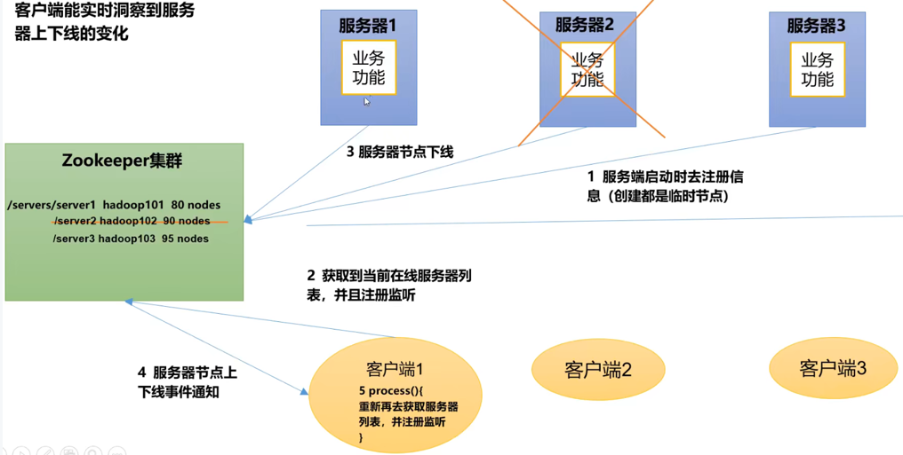
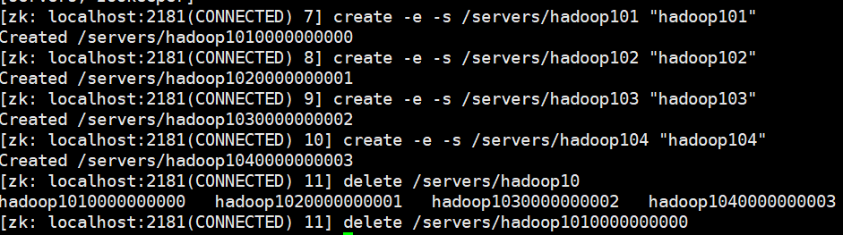
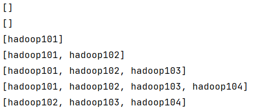

> 前几篇blog介绍了Zookeeper的安装与客户端命令行与API操作，本节将使用Zookeeper的API操作做一个案例，这个案例是：监听服务器动态上下线


## 一、需求分析

某分布式系统中，主节点可以有多台，可以动态上下线，任意一台客户端都能实时感知到主节点服务器的上下线，需求如下图所示：




`Zookeeper`节点存储的方式是：`/servers`，在该分支下可以有：

- `/servers/hadoop101000001`
- `/servers/hadoop102000002`
- `/servers/hadoop103000003`
- `...`

也就说当有一台服务器上线时，就把他存储在`/servers`路径之下


接下来是客户端感知，客户端应该时刻监听节点路径的变化，如果发现变化就说明节点变更了，就打印到控制台

## 二、实现步骤

### 1、首先在服务器上创建一个节点

因为所有服务器都存储在`/servers`路径下，所以该节点在服务器上应该是一个永久且无序号的节点

首先要打开zk服务集群：

```bash
[wzq@hadoop103 ~]$ zk.sh start
[wzq@hadoop103 ~]$ cd /opt/module/zookeeper-3.5.7/
[wzq@hadoop103 zookeeper-3.5.7]$ bin/zkCli.sh 
....
[zk: localhost:2181(CONNECTED) 0] create /servers "servers"
[zk: localhost:2181(CONNECTED) 9] ls /
[servers, zookeeper]
```

这样就算创建好了一个节点， 接下来的步骤就是如果有服务器上线，就执行Java脚本，该脚本接收一个参数（服务器名称），如果执行就在`/servers`下创建一个短暂且带有序号的节点。

### 2、编写Server端代码

为什么创建的节点是短暂且带有序号的节点，这是因为可能服务器名称一样带来的锅，如果该服务器下线那就自动删除该路径呗

代码共分为三个步骤：

- 获得zk连接
- 通过参数在/servers下创建一条路径（所有人都可以访问，短暂且有序号）
- 业务逻辑部分（这里我们只让它进入休眠状态）

```java
package com.wzq.case1Demo;

import org.apache.zookeeper.*;

import java.io.IOException;

public class DistributeServer {


    private ZooKeeper zk;
    // 注意逗号前后不能有空格
    private String connectString = "hadoop102:2181,hadoop103:2181,hadoop104:2181";
    private int sessionTimeout = 2000;

    public static void main(String[] args) throws IOException, InterruptedException, KeeperException {
        DistributeServer server = new DistributeServer();

        // 1、获得zk连接
        server.getConnect();

        // 2、创建路径
        server.createNode(args[0]);

        // 3、具体业务逻辑（睡觉）
        server.business();
    }

    private void business() throws InterruptedException {
        Thread.sleep(Long.MAX_VALUE);
    }

    private void createNode(String hostname) throws InterruptedException, KeeperException {
        zk.create("/servers/" + hostname, hostname.getBytes(), ZooDefs.Ids.OPEN_ACL_UNSAFE, CreateMode.EPHEMERAL_SEQUENTIAL);
        System.out.println(hostname + " is done...");
    }

    private void getConnect() throws IOException {
        zk = new ZooKeeper(connectString, sessionTimeout, new Watcher() {
            @Override
            public void process(WatchedEvent event) {
                // 监听器不写任何东西
            }
        });
    }

}
```

### 3、编写Client端代码

客户端负责监听就好了：

```java
package com.wzq.case1Demo;

import org.apache.zookeeper.KeeperException;
import org.apache.zookeeper.WatchedEvent;
import org.apache.zookeeper.Watcher;
import org.apache.zookeeper.ZooKeeper;

import java.io.IOException;
import java.util.ArrayList;
import java.util.List;

public class DistributeClient {

    private ZooKeeper zk;
    private String connectString = "hadoop102:2181,hadoop103:2181,hadoop104:2181";
    private int sessionTimeout = 2000;

    public static void main(String[] args) throws IOException, InterruptedException, KeeperException {
        DistributeClient client = new DistributeClient();
        // 1、获得zk连接
        client.getConnect();

        // 2、获取所有/servers节点下的孩子
        client.montior();

        // 3、业务逻辑部分（休眠）
        client.business();
    }

    private void business() throws InterruptedException {
        Thread.sleep(Long.MAX_VALUE);
    }

    private void montior() throws InterruptedException, KeeperException {
        List<String> children = zk.getChildren("/servers", true);
        ArrayList<String> list = new ArrayList<>();
        for (String child : children) {
            byte[] data = zk.getData("/servers/" + child, false, null);
            list.add(new String(data));
        }
        System.out.println(list);

    }

    private void getConnect() throws IOException {
        zk = new ZooKeeper(connectString, sessionTimeout, new Watcher() {
            @Override
            public void process(WatchedEvent event) {
                try {
                    montior();
                } catch (InterruptedException e) {
                    e.printStackTrace();
                } catch (KeeperException e) {
                    e.printStackTrace();
                }
            }
        });

    }

}
```


## 三、测试


接下来启动`DistributeClient`，在该类中会一直监听节点路径信息，只要有变化就会打印到控制台：

我们在Linux里面动态的创建几个：



一口气创建了四个，并且删除了一个，看看控制台打印了什么：



可以看到每次发生变动，控制台都会打印，接下来测试一下`DistributeServer`


这个类需要携带一个参数，可以到`idea`右上角的`Edit Configurations...`中添加一个参数，我添加的是`hadoop105`，只要一启动就会在`client`的客户端打印了


## 四、参考资料

- [Zookeeper官网](https://zookeeper.apache.org/)

- 尚硅谷B站学习视频

  
